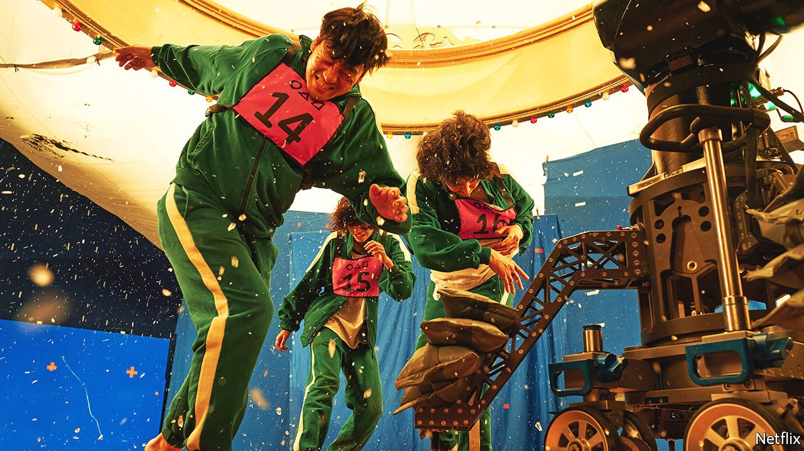
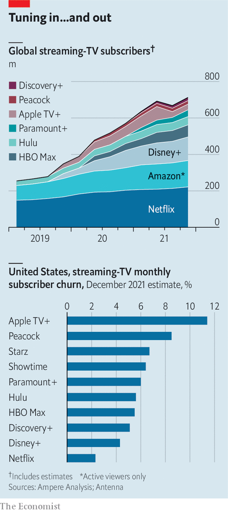

###### To the victors, the scraps

# Disney, Netflix, Apple: is anyone winning the streaming wars? 

##### Investors are terrified that the prize may not be worth it 

 

> Feb 12th 2022 

A TEENAGED GIRL who periodically transforms into a giant panda is the improbable star of “Turning Red”, a coming-of-age movie from Disney due out next month. The world’s biggest media company, which will celebrate its 100th birthday next year, is no adolescent. But Disney is going through some awkward changes of its own as it reorganises its business—worth $260bn—around the barely two-year-old venture of video-streaming.

So far the experiment has been a success. Its streaming operation, Disney+, initially aimed for at least 60m subscribers in its first five years, ending in 2024. It got there in , and now hopes for as many as 260m subscribers by that date. Bob Chapek, who took over as boss just before the pandemic, is convinced that Disney’s future lies in , his “north star”. On February 9th the company reported that Disney+ had added a healthy 11.8m subscribers in the latest quarter, shoring up its position as one of the most likely survivors of the ruthless contest that has become known as the streaming wars.


But doubts are surfacing across the industry about how much of a prize awaits the victors. Every year Disney and its rivals promise to spend more on content. And yet even as costs rise, the growth in subscribers is showing signs of slowing. A realisation is setting in that old media companies are pivoting from a highly profitable cable-television business to a distinctly less rewarding alternative.

Markets took fright last month when Netflix, the leading streamer, forecast that in the first quarter of 2022 it would add just 2.5m new members. That would be the weakest first quarter since 2010, when most Netflix subscribers still got DVDs by mail. Its share price fell by more than a quarter on the news. Disney shares rallied this week following its earnings report, which soundly beat expectations. Yet in the previous quarter Disney+ had added only 2.1m members, the least in its short existence. With some exceptions, streamers’ breakneck growth seems to be slowing.

The firms blame temporary headwinds: a covid hangover, content delays and, in the case of Apple TV+, the phasing out of free trials. But some analysts are concluding that the ceiling for subscriptions is lower than they had thought. Morgan Stanley reckons Netflix will end 2024 with 260m global members, down from the investment bank’s earlier estimate of 300m. And though streamers see the potential to raise prices in rich-world markets, that will be harder in the faster-growing poor ones. In India, Netflix recently cut the price of its basic plan from $6.60 to $2.60 a month. Morgan Stanley now expects Netflix’s total revenue to grow by about 10% a year in the medium term, not the 15% or more it had previously predicted.

As revenue growth slows, costs swell. Media firms will spend more than $230bn on video content this year, nearly double the figure a decade ago, forecasts Ampere Analysis, a research firm. Netflix’s weak results came despite what it billed as its “strongest content slate ever”, including “Squid Game”, its most popular series, and “Don’t Look Up”, whose shortlisting for Best Picture on February 8th contributed to Netflix’s haul of 27 Oscar nominations, the most of any studio. Disney+ is doing far better than its parent ever dreamed—but it is costing more, too. Three years ago Disney said it would spend about $2bn on streaming content in 2024. Mr Chapek recently said the figure would surpass $9bn.

Spending is going up partly because costs of filming have risen. The final season of WarnerMedia’s “Game of Thrones”, in 2019, cost around $15m an episode, which then seemed steep. Amazon’s serialised “Lord of the Rings”, due in September, reportedly cost four times as much. Audiences have become more demanding. Most people used to cancel their cable- TV subscription only when they moved house, says Doug Shapiro, a former strategy chief at Turner Broadcasting System, a TV company. Now, he says, they are “becoming accustomed to churning on or off over the quality of content”, signing up to devour the latest hit then cancelling their membership. Apple TV+, which has the most serious retention problem, loses a tenth of its customers every month, according to Antenna, a data firm, meaning that every year it churns through the equivalent of more than 100% of its members (see chart).

 


The combination of rising costs and slowing revenue growth “calls into question the end-state economics of these businesses”, argues MoffettNathanson, a firm of analysts. Netflix, the most successful of the bunch, expects its operating margin to shrink in 2022, for the first time in at least six years, to 19%; the firm has attributed this to higher spending on programming. MoffettNathanson adds that these figures flatter the company’s performance. Like other streamers, Netflix amortises the cost of content over several years, when in reality most of its shows are binged in a matter of weeks. (The firm insists its amortisation schedule is based on viewing patterns.)

Streaming’s pinched economics are especially galling for old media companies such as Disney, which are used to the far more profitable cable- TV business. Last year Disney reported an operating margin of 30% for its linear TV networks, a typical figure for the industry. The average American cable bill is nearly $100 a month—and viewers are usually subjected to advertising to boot. Media firms are accelerating the decline of this profitable business by shifting their best content from cable to their streaming services. They are also forgoing box-office revenue by sending movies straight to streaming (though covid-related cinema closures have often forced their hand). Animators at Disney’s Pixar studio are said to be miffed that “Turning Red” is not getting an outing at the cinema in most countries.

There is little choice but to stick with the strategy. Cable is not coming back; streaming is expected to account for half of TV viewing in America by 2024. The focus is turning to how to make the new business more profitable. Streamers increasingly drip-feed new episodes rather than dropping entire series. Bundling is becoming more common: Disney sells Disney+ along with ESPN+, its sports streamer, and Hulu, a general entertainment service that it jointly owns with Comcast, a cable giant. Apple and Amazon both package TV with other services. WarnerMedia and Discovery plan to merge; regulators have waved the deal through, the companies said on February 9th. There may be more to come. “If Netflix is decelerating more rapidly than expected, the great streaming rebundling may need to begin sooner rather than later,” writes Benjamin Swinburne of Morgan Stanley.

The hope at the big media firms is that the streaming wars will eventually claim some casualties, leaving the survivors free to raise prices and dial down spending on content. Peacock, Comcast’s streamer, is trailing. Viacom CBS, which owns Paramount+, is the subject of endless takeover rumours. But even their exit would leave some determined rivals. Warner-Discovery is betting its future on streaming. Apple and Amazon are getting better at making hits, and have enough money to run at a loss for as long as they like. Disney and Netflix aren’t going anywhere. It looks like being a long war, short on spoils. ■

For more expert analysis of the biggest stories in economics, business and markets, , our weekly newsletter.

