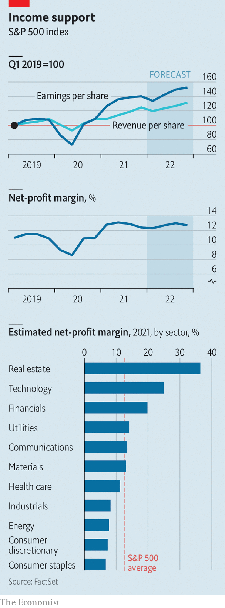

###### Income support

# How long can America Inc’s profits keep rising? 

##### This year they may not be as immune as before to infection, inflation and imploding supply chains 

 

> Feb 12th 2022 

 


THROUGHOUT 2021 corporate profits in America seemed immune to infection, inflation and snarled-up global supply chains. With most of the country’s biggest firms having reported their latest quarterly results, revenues and earnings in the last three months of the year seem poised to set another record. The technology industry’s annual profits rose by a quarter, compared with 2020. Among property firms in the S&amp;P 500 index they swelled by a third. Net-profit margins have edged down from their recent peak in the second quarter of 2021 and analysts forecast lower earnings and sales in the first three months of 2022. It may prove to be a brief sniffle caused by unusually strong seasonal factors. But America Inc no longer looks totally impervious.■


