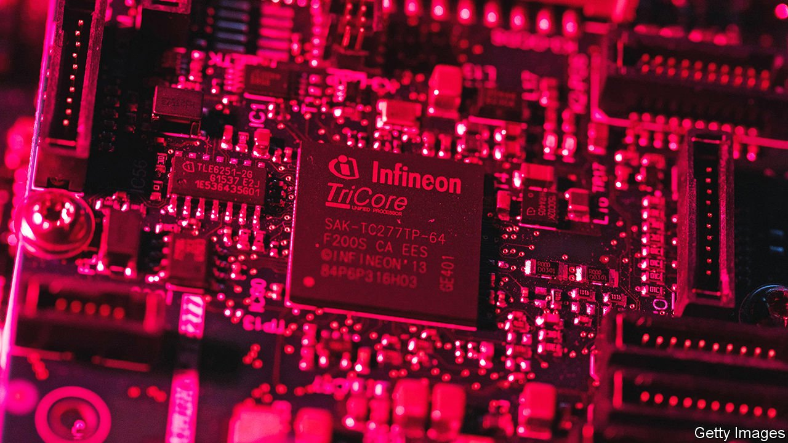
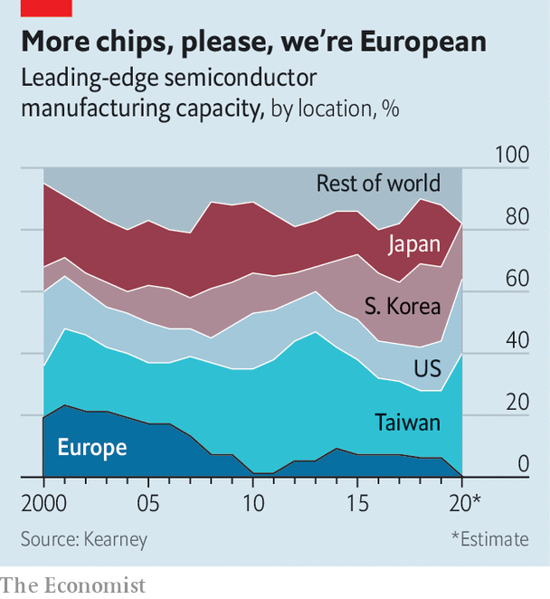

###### Fabs with benefits

# In the global chips arms race, Europe makes its move 

##### Will it work better than it did a decade ago? 

 

> Feb 12th 2022 

IN 2013 THE EU launched an ambitious project. The aim was to double the share of microchips made in Europe to 20% of the global total by 2020. Nearly a decade later it remains stubbornly stuck at 10%. If that were not bad enough, Europe no longer makes any of the most advanced chips of the sort that go into data centres or smartphones (see chart). So, prompted by  and their growing importance for all sorts of industries, the bloc is having another go.

Judged by numbers alone, the EU’s new Chips Act, unveiled on February 8th, could move the needle. It is meant to generate public and private investment of more than €43bn ($49bn), about as much as a similar package working its way through America’s Congress. More than two-thirds of this money is supposed to take the form of state subsidies for new leading-edge chip-fabrication plants, or “mega fabs”—thanks to a more generous interpretation of EU restrictions on state aid. The rest will go to other chipmaking infrastructure.


Reality is likely to prove trickier. To understand why, it helps to see the semiconductor industry not just as a collection of huge fabs, of which the most sophisticated can cost more than $20bn a pop, but as a global ecosystem of thousands of companies. Even more than in other high-tech industries, research and development (R&amp;D) usually takes years and costs billions. New chips are designed by specialised firms using complex software made by other companies still. And after chips leave a fab, contract manufacturers assemble, test and package them (ATP, in the lingo).

 


Seen through this ecosystemic lens, the EU’s position is both stronger and weaker than its small share of global chip output might suggest. Start with the strengths. The continent maintains a leading position in semiconductor R&amp;D. One of the industry’s main brain trusts, the  (better known as IMEC), is based in Belgium.

Europe’s firms also produce many of the machines that make fabs tick. , a Dutch firm with a market value of €230bn, is the sole global supplier of the lithographic equipment without which fabs cannot etch the most advanced processors. Only Nvidia, an American chip-designer, and Taiwan Semiconductor Manufacturing Company (TSMC), the world’s biggest contract manufacturer of chips, are worth more. An array of smaller European outfits enjoy dominant positions in the complex chipmaking supply chain. Carl Zeiss SMT makes lenses for ASML’s lithography machines (and is co-owned by it). Siltronic manufactures silicon wafers onto which chips are etched. Aixtron manufactures specialised gear to deposit layers of chemicals onto those wafers to make circuits.

Once you widen the aperture to the whole ecosystem, Europe’s biggest chipmakers, , NXP and STMicroelectronics, also appear less benighted. Yes, half of the continent’s capacity is for chips with structures (“nodes”) measuring 180 nanometres (billionths of a metre) or more, generations behind the technological cutting edge, dominated by TSMC and Samsung of South Korea, whose transistors come in at a few nanometres. But those nano-electronics are most useful for consumer devices, the bulk of which are assembled in Asia. By contrast, the larger European nodes are sufficient for the continent’s many industrial firms that require specialised silicon for things such as cars, machine tools and sensors. “European chipmakers focus on their customer base,” explains Jan-Peter Kleinhans of SNV, a German think-tank.

If the Chips Act is a guide, European policymakers worry that these genuine strengths are not enough to offset the EU’s weaknesses. Besides lacking cutting-edge fabs, Europe is short of companies with the know-how to design the smallest chips, such as Nvidia. It is similarly behind in ATP, where most capacity is in China and Taiwan. Once approved by member states and the European Parliament, the EU law is meant to help Europe catch up. Besides the €30bn or so for mega-fabs, it has pencilled in €11bn for things like a virtual chip-design platform open to all comers and other infrastructure, including pilot production lines for leading-edge chips. But half of that is to come from member states and the private sector. The EU’s contribution of less than €6bn will, as with the bloc’s other programmes, come with many bureaucratic strings attached.

A bigger problem is the act’s focus on luring giant chipmakers to build mega-fabs. TSMC and Intel, its American rival, have signalled they would consider Europe only if governments shoulder a big part of the costs (40% in Intel’s case). To enable such deals, the first of which is expected in weeks, the European Commission wants to relax state-aid rules to let member states subsidise such fabs “up to 100% of a proven funding gap” if they are “first-of-a-kind” or would “otherwise not exist in Europe”.

If such criteria were meant to avert a subsidy race, they look copious and fuzzy enough for countries to try to game them. Worse, the resulting fabs may end up underused. By the time they are ready in a few years, the chip shortage may have turned into a glut. And if the EU’s efforts to boost Europe’s chip-design firms fail, European fabs would have to rely on foreign chip-designers for custom. Why, asks Mr Kleinhans, would American firms choose to have their chips manufactured in Europe rather than in Asia or at home?

Thierry Breton, the EU commissioner in charge of industrial policy, envisions a Europe of mega-fabs that not only serve the continent’s own demand, but world markets. Europe may be better off propping up its chip ecosystem by investing in things like basic research. Mr Breton doesn’t need to pick Europe’s chipmaking winners. As the EU’s semiconductor stars show, the market can do that just fine. ■

For more expert analysis of the biggest stories in economics, business and markets, , our weekly newsletter.

