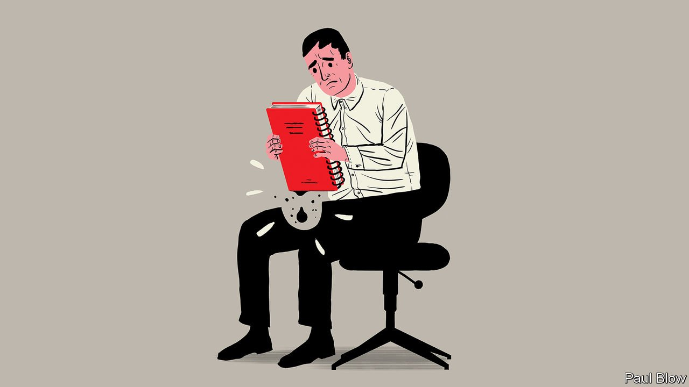

###### Bartleby

# Rio Tinto and the problem of toxic culture 

##### A disturbing report has lessons for other industries 

 

> Feb 12th 2022 

CORPORATE CULTURE is often like mist—indubitably there but hard to pin down. Occasionally it solidifies into something ugly. Take the following figures from an external investigation commissioned by Rio Tinto, a global mining giant, into its workplace culture. Almost half of Rio’s employees report having experienced bullying in the past five years. Almost a third of its female workers have endured sexual harassment; 21 women reported an actual or attempted sexual assault. Two in five Australian Aboriginals and Torres Strait islanders employed by the company have experienced racism.

The report is an admirably open attempt to face up to a toxic culture. As well as survey data, it contains testimony from interviews and focus groups. It was published on Rio’s website earlier this month, along with an apology from Jakob Stausholm, the firm’s boss. Such unusual transparency seems to be building trust: half of the firm’s employees said they were extremely or very confident that Rio would make meaningful progress in stamping out sexual harassment and racism.


The report is a product of specific circumstances. Rio’s reputation was badly tarnished in 2020, when it destroyed Juukan Gorge, a mining site in Western Australia whose ancient rock shelters were sacred to indigenous people. That cost Mr Stausholm’s predecessor his job, kick-starting efforts to change the way the firm was run.

Rio’s culture is traceable, at least in part, to the idiosyncrasies of the mining industry. Its workforce is 80% male, and the worst behaviour occurred on remote sites where employees fly in or drive in for stays of several days, or live full-time in company housing. Machismo and isolation make for poor bedfellows.

But it would be a mistake to regard Rio’s soul-searching as a curio from the world of alpha males and excavators. For both its findings and the fact of its existence hold wider lessons.

First, they show how a corporate culture can rot. The worst abuses may have been more prevalent in the firm’s remote reaches but they were present at its heart, too. The highest rate of sexual harassment was found in the firm’s iron-ore division, but next came Rio’s strategy, sustainability and development group. Widespread suspicion of the company’s internal reporting mechanisms and a fear of speaking out are evident. “The minute you raise an issue about a senior leader, you’re done,” said one employee. “I don’t want to rock the boat so hard that I fall out of it,” echoed another. Interviewees accused Rio of rewarding bullies, and of pushing high performers up the corporate ladder irrespective of how they behaved.

Among other things, the firm says it will set up a specialist unit designed to respond to complaints of harmful behaviour, and to provide support to people who blow the whistle. Whatever the right answer, the report raises questions that executives in all organisations confront: what to do with talented jerks, and how to make sure people voice concerns if something is going badly wrong.

Second, they may be a harbinger of wider demand for data on corporate culture. For all that managers bang on about people being an organisation’s greatest asset, precious little information is available to outsiders on how staff are treated and encouraged to behave. This may be because of the mist problem: it is hard to measure culture. It may be because investors haven’t much cared.

Perhaps that is changing. Labour shortages have focused attention on how well firms retain workers. Research from Donald Sull at the Massachusetts Institute of Technology and his co-authors finds that a toxic culture is ten times more important than pay in predicting industry-adjusted staff turnover.

Movements like #MeToo and Black Lives Matter have pushed sexism and racism up the corporate agenda. Allegations of sexual misconduct have battered the reputations of Axel Springer, a media giant, and Activision Blizzard, a video-game publisher just acquired by Microsoft. Late last year Microsoft’s investors adopted a shareholder proposal requiring the software titan to report on its own sexual-harassment policies. Regulators are making noises about more disclosure on human capital; Gary Gensler, chairman of America’s Securities and Exchange Commission, wants proposals in this area.

Rio Tinto’s problems are extreme. But they are not unique. And in opening up about its corporate culture, it is, in one way at least, ahead of its time.


 (Feb 5th) (Jan 29th) (Jan 22nd)

