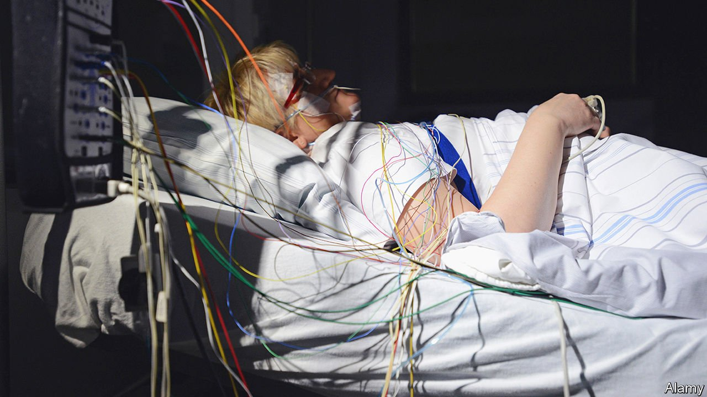

###### Slumber party

# The sleep-tech industry is waking up 

##### The tired are tucking in. Investors dream of riches. Scientists need convincing 

 

> Feb 12th 2022 

THE RICH world has a sleep deficit. The average American adult snoozes almost two hours less than their great grandparents did. More than a third of Americans get less than seven hours of kip a night. The resulting fatigue has been linked to Alzheimer’s disease, hypertension and other ailments. It may cost America’s economy as much as $400bn a year, according to one study. Other wealthy countries are similarly sleepless. Consumption of alcohol and caffeine are partly to blame, as is exposure to phone and computer screens. Ironically, people are turning to some of those same devices for help.

Tiny sensors are now more easily embedded into wearable gadgets to observe users overnight. Consumer-electronics giants such as Google, Samsung and Huawei offer sleep-related technology in their gadgets. Although Apple seems to be winding down Beddit, a Finnish maker of bed sensors it acquired in 2017 for an undisclosed amount, it has incorporated sleep functionalities into its new smart watches.


Specialist “sleep-tech” startups offer fancier wares. Oura Health, also from Finland and valued at nearly $1bn, sells a $300 titanium ring that weighs a few grams and has built-in heart-rate, oxygen and activity monitors; Kim Kardashian is a fan. Kokoon, a British firm, makes a wireless headset whose tiny earbuds play relaxing sounds while sensors infer the sleep stage from blood-oxygen levels. Eight Sleep, an American one, charges $2,000 for its app-synched mattress that heats up and cools as the sleeper’s body temperature changes through the night.

The combination of more sleeplessness and better technology has led to a boom in the sleep-assistance industry. Global Market Insights, a research firm, reckons that worldwide revenues from sales of such gizmos reached $12.5bn in 2020 and could be more than triple that in five years. Matteo Franceschetti, boss of Eight Sleep, thinks the addressable market for his company is “literally everyone in the world”. After all, everybody sleeps.

True. But not everybody sleeps poorly (or can afford to splurge $2,000 on his firm’s self-styled “Lamborghini of mattresses”). And the technology, though it is improving, remains far from perfect. Sleeping with a watch strapped to your wrist is irritating, and the battery may die overnight. Your correspondent struggled to wear the Kokoon headset over the satin scarf protecting her hair, and the “brown noise” designed to drown out snoring sounded more like the jarring static of an old television set.

There are problems with sleep-tech’s business models, too. People can get bored of wearables, and frustrated when the touted improvements fail to materialise. According to a survey last year by Rock Health Advisory, a consultancy, almost 40% of sleep-wearables users abandoned their devices, mostly because they did not have the desired soporific effect. Kokoon, Oura and Eight Sleep have all recently introduced membership models to try and keep people updating their devices. Subscriptions give the companies a more stable revenue stream than one-off device sales, as well as providing data that can then be used to improve their products. But it can also be interpreted as an implicit acknowledgement that the devices are not an instant cure. (Oura says that it now offers various other insights into ring-wearers’ health that are not directly related to sleep.)

Many scientists worry that, as with many emerging consumer-health technologies, sleep-tech often lacks the gold-standard randomised controlled clinical studies where it is tested on many patients and against placebos. Ingo Fietze runs a sleep centre at Charité Berlin, a big university hospital, and studies novel gadgets and mattresses at a private lab he set up on the side. He says that when he asked Samsung, a South Korean device-maker, and Huawei, a Chinese one, to share the methods behind their watches’ metrics, he did not hear back. In any case, says Mr Fietze, no existing wearables, which track sleep using various proxy measures, can match a clinical polysomnogram (PSG), which takes data directly from the brain using electrodes. Samsung did not respond to a request for comment. Huawei says its device measures sleep duration with accuracy comparable to a PSG.

Sleep-tech may, scientists concede, help mild insomniacs and sensitive sleepers decide whether they need clinical interventions. Monitoring blood-oxygen in real time, as some wearables do, can help identify disorders including sleep apnea, a condition whose sufferers stop breathing while they sleep and which afflicts perhaps 1bn people around the world. But ultimately, Mr Fietze believes, “no gadget can make your sleep better.” If consumers in need of more shuteye reach a similar conclusion, sleep-tech investors’ dreams of riches may turn into a profitless nightmare. ■


