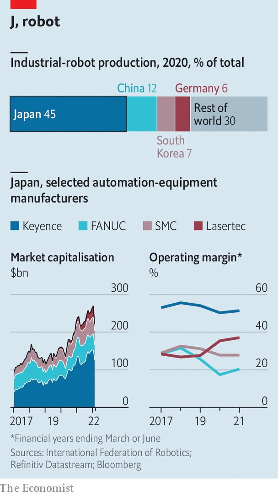

###### Industrial technology

# Why Japan’s Automation Inc is indispensable to global industry 

##### A little-known pinch-point in the world’s supply chains 

 

> Feb 12th 2022 

SHORTAGES AND bottlenecks have been a source of constant frustration for manufacturers around the world for two pandemic-afflicted years. For a handful of companies in the business of keeping factories running and supply chains intact, these frustrations have been a source of cheer—and profits. Japanese makers of industrial equipment, in particular, have seen orders surge as companies turned to automation, first amid the disruption wrought on human workforces by covid-19, then as a result of tight labour markets and rising wage costs.

The world’s stock of industrial robots has tripled in the past decade. According to the International Federation of Robotics, a trade group, Japan furnishes 45% of new ones each year. It also produces lots of other automation equipment, from laser sensors to inspection kit. Even after the recent sell-off in tech stocks, Japan’s four standout gear producers—Keyence, Fanuc, SMC, and Lasertec—are collectively worth two and a half times what they were five years ago (see chart). Last year the founder of Keyence, Takizaki Takemitsu, briefly became Japan’s richest man. His $29bn fortune is half as large again as that of , a flamboyant tech investor who is corporate Japan’s most globally recognisable face. Mr Takizaki’s firm and its fellow equipment-makers are hardly household names. But the hardware they produce is becoming as mission-critical to many industrial supply chains as semiconductors are.


It is no surprise that Japan, a famously robot-loving place, has spawned a strong Automation Inc. Just-in-time manufacturing, pioneered by efficiency-obsessed Japanese companies such as Toyota in carmaking or Panasonic in consumer electronics, has involved replacing humans with machines for decades. This source of competitive advantage became an existential necessity for domestic manufacturers after Japan’s working-age population began to shrink in the 1990s. Today it is becoming one for other rich countries as they enter demographic dotage. Keyence and SMC now derive more than half their revenues from abroad. Fanuc and Lasertec are even more international, with more than 80% of sales coming from overseas.

 


Some of the new foreign demand is the result of the world’s insatiable hunger for computer chips. SMC, which sells pneumatic control devices to chipmakers, has seen its business boom, especially as places including America and Europe strive to bring more  home, says Masahiro Ota, who sits on SMC’s board. Lasertec enjoys a near-monopoly on inspection tools for the most advanced semiconductor photomasks—plates through which circuit patterns are etched onto silicon wafers. Its share price has ballooned four-fold since the start of 2020, making it one of the best-performing blue-chip stocks in Asia. Keyence’s precision sensors are likewise crucial for the detection of flaws in semiconductor surfaces.

The companies’ devices are, of course, also handy in other sectors. Fanuc, which makes large factory-floor robotic arms, has long been a fixture of car assembly lines. Mike Cicco, who runs Fanuc’s American operations, notes that the development of electric cars requires a range of new capabilities on the part of carmakers—and that in turn necessitates new types of robot. Fanuc expects to supply Ford’s factory in Cologne, in Germany, with 500 robots this year as the plant becomes the Ford Cologne Electrification Centre.

Being indispensable has proved to be lucrative. All four stars of Japan’s automation-industrial complex boast operating-profit margins of over 20%. That of Keyence, the most profitable of the lot, exceeds 50%. The firm has reported record net profits in each of the past three quarters. Like chip firms such as Nvidia, Keyence does not manufacture products but rather designs them and assists customers in deploying them in their factories. Lasertec, too, does little of its own manufacturing. This capital-light approach helps sustain profits. Keyence spends just 3% of its net sales on research and development (R&amp;D). Similarly, SMC spends around 4%. Fanuc does make almost all its products independently and invests more in production capacity and R&amp;D. But it uses that capital efficiently, not least, as befits a robot-maker, by deploying plenty of its own robots to build robots for customers. Its biggest “lights out” factory can run for more than a month with no pricey human operators around.

Japan’s automation firms also owe some of their success to corporate culture. SMC maintains a network of 6,000 salespeople who double as systems engineers with in-depth knowledge of customers’ equipment. Keyence uses no middlemen to sell its products, relying entirely on its own sales force. As with SMC, many are engineers, who spend a lot of time on customers’ factory floors identifying niggles and tweaks that might otherwise go unnoticed. They are rewarded handsomely for their efforts. Nikkei, a Japanese publisher, reports that average salaries at Keyence exceeded $150,000 in the last fiscal year.

The automation stars, like Japan Inc as a whole, tend to be less generous with shareholders. Most sit on piles of cash; Keyence held over $10bn in current assets in the last financial year. The reserved character of the companies and their tightfistedness is so well-established that some investors say any sudden shifts in that attitude may be a sign of big and possibly unwelcome changes at the firms.

Investors have to rely on such rune-reading because it is not always clear what is going on inside the companies, at least by contemporary Western standards of open shareholder relations. SMC’s “traditional Japanese approach to corporate governance”, as Baillie Gifford, a tech-focused British asset manager, delicately put it in 2020, offers only limited engagement with shareholders. One asset manager with a stake in Keyence reports never speaking directly with its management.

As the companies become ever more international, they will face pressure to be more candid—and less frugal, both with payouts to shareholders and with investments. Fanuc increased its dividend sharply in 2015 under pressure from Third Point, an American activist hedge fund. As Japan becomes less averse to gadfly investors, Automation Inc should expect more such calls. To maintain their innovative edge, meanwhile, the firms may need to spend considerably more on R&amp;D. Amid tech-inflected geopolitical tensions with the West, China wants to reduce its reliance on foreign suppliers of all manner of advanced technology, including robotics. If successful, the Chinese strategy would at once deprive the Japanese firms of a big market and create new global rivals. Becoming indispensable is one thing. Staying so is quite another. ■


