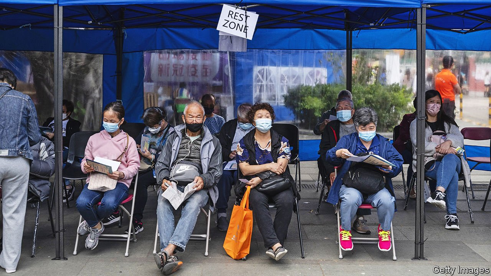

###### Injecting urgency

# Hong Kong’s old folk remain largely unvaccinated 

##### Omicron is putting them at greater risk 

 

> Feb 12th 2022 

YIM SUET MUI, an 83-year-old Hong Konger, waited almost a year before getting a vaccination against covid-19. “If I die, I die,” was her attitude. “I am old.” Such fatalism came easily in the territory until recently because it had done well at keeping the virus out. Controlled borders, ubiquitous mask-wearing and strict quarantining meant months have sometimes passed without a locally transmitted infection. But one side-effect was the elderly not wanting (or not bothering) to be jabbed. Only 30% of over-80s and 60% of over-70s have chosen to have a first dose, compared with 86% of residents aged 12-69. (The same is true in some provinces of mainland China, where less than 30% of over-80s and less than 50% of over-70s are jabbed.)

Now the bug has breached the territory’s defences. Since two infected Cathay Pacific crew members broke quarantine rules over Christmas, an Omicron wave has grown. On February 9th Hong Kong logged more than 1,000 new covid-19 cases, easily its highest tally since the pandemic began. The fear is that the old and unvaccinated will now pay a heavy price for their reticence.


This week Hong Kong’s government unveiled its toughest social-distancing restrictions to date. Gatherings are limited to two people and there are plans to allow only the vaccinated into shopping malls. Carrie Lam, the chief executive, said the measures were needed to buy time for the elderly to get their jabs.

Since the Sinovac and Pfizer vaccines have been freely available for a year, such talk frustrates parents and businesses alike—all the more so because officials have often seemed over-cautious on vaccination, feeding old people’s hesitation. Residents of care homes had to request a jab, unlike for flu shots, which are given to all unless they opt out.

Omicron’s high transmissibility means the new outbreak will not be easily quelled, particularly because fully locking down the densely populated city, mainland-style, is probably unfeasible. Even so, Mrs Lam says that Hong Kong must continue to implement a “dynamic zero” policy of trying to eliminate transmission of the virus.

Pensioners are at last mobilising. Some 35,000 Hong Kongers are now receiving vaccinations each day; around 40% of them are over-60s getting a first dose. Among those queuing up outside vaccination centres, most say they were finally persuaded by the announcement in January that the unjabbed would be barred from yum cha restaurants, where many elderly Hong Kongers spend their mornings. Nothing is going to get between them and their breakfast buns.

Dig deeper

All our stories relating to the pandemic can be found on our . You can also find trackers showing ,  and the virus’s spread across .

