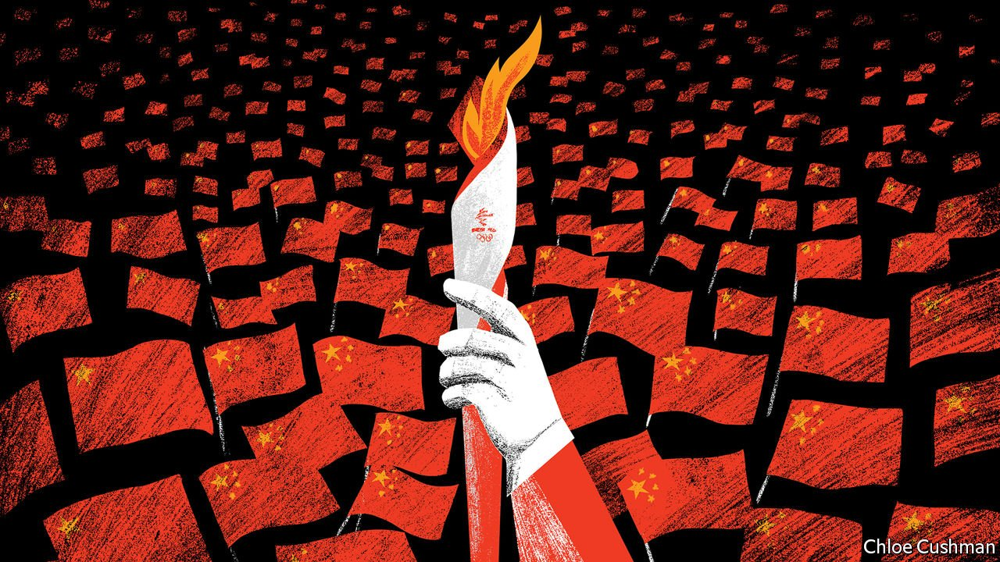

###### Chaguan

# The good and the bad of China on Olympic show 

##### As Beijing hosts the winter games, a mood of pride mixed with defiance 

 

> Feb 12th 2022 

THE TERM “raucous” could not be applied to the crowd at the opening ceremony of the Beijing Winter Olympics—perhaps because many of them were officials, attending as a reward for good conduct. So on the few occasions that spectators at the Bird’s Nest stadium did show emotion on the cold, clear evening of February 4th, their reactions were worth studying. Chaguan was among dozens of Beijing-based foreign reporters invited to the ceremony. He sat in a section of the stadium separated by fences and guards from the “closed-loop”, a secure quarantine zone created for Olympic athletes, coaches and dignitaries newly arrived from an outside world that, in contrast with China, has resigned itself to living with covid-19. Most of the stadium’s seats were kept empty, as a pandemic precaution. Olympic tickets are not on sale to the public, and China’s borders are closed to foreign fans.

Some moments would have made any Chinese crowd cheer. These included the arrival of President Xi Jinping and the raising of the national flag to the strains of “Me and My Motherland”, a patriotic hymn. Other reactions were more revealing: notably, the applause that welcomed a few athletic delegations marching into the stadium, when most were greeted with silence. China’s arrival, naturally, prompted roars of pride. There were cheers, too, for Hong Kong and for athletes from Taiwan, the democratic island that China claims as its own. The Taiwanese looked a bit glum, perhaps because—bowing to demands from China—the International Olympic Committee makes them compete under the made-up name of “Chinese Taipei”. Two other countries earned loud cheers: Pakistan and Russia. That is telling. After all, many things that the Chinese public dislikes are endemic in Pakistan, from rampant corruption to Islamic extremism to terrorist groups that target Chinese interests. As for Russia, its team is competing in Beijing as “the Russian Olympic Committee” rather than under its own flag, as punishment for systematic state-sponsored doping.


The pattern held at a women’s ice hockey game the following night, between America and Russia. As Team USA cruised to a 5-0 win, the crowd of fewer than 600 locals, rattling around the 18,000-seat Wukesong arena, did not hide a pro-Russian tilt, yelling “Good, good!” and waving small flags depicting Bing Dwen Dwen, a wide-eyed panda mascot, whenever Russia controlled the puck. Chaguan’s neighbours, officials from the Beijing State-Owned Assets Management Company, who had been offered free tickets a week earlier, said they backed Russia as an “old friend”.

In many ways, the games find China in confident and upbeat mood. Take the many student volunteers in Olympic snowsuits and furry hats. A hand-picked bunch, some revealed that they belong to the Communist Youth League, a recruiting ground for future party members. Others said that organisers chose good students with “a volunteer spirit”. Either way, their good cheer is unfeigned, even after hours outdoors in the cold. As for this year’s opening ceremony, it was less bombastic than the show that kicked off the Beijing summer games in 2008, though both were directed by Zhang Yimou, a film-maker. In place of massed drummers and other shows of might 14 years ago, this time dancers paid tribute to pensioners who twirl each night in parks and public squares. Later, children scampered about with illuminated doves.

This China wants to be seen as modern but lovable. That explains dancing robots at Wukesong’s security checkpoint, singing the Beijing 2022 theme song, “Together for a Shared Future”. Even some Olympic venues reflect growing cultural confidence, such as a freestyle-ski ramp built among the disused cooling towers and blast furnaces of Shougang, a former steelworks in western Beijing. Unfairly mocked by foreign commentators, Shougang is actually magnificent: a slice of carefully preserved industrial heritage resembling a steam-punk film set.

A conditional welcome

But China’s confidence has a darker side. Guided in part by grievance-stoking propaganda outlets, the public mood increasingly resents foreign criticism. In this polarising age, many in China divide the world into friends—countries and organisations that praise China as a model—and the rest. Russia’s president, Vladimir Putin, issued a joint statement with Mr Xi just before the opening ceremony that unveiled a united front against America and its Western allies. The pair condemned powers that use “advocacy of democracy and human rights” to lean on other countries, and endorsed what sound a lot like Russian and Chinese spheres of influence in Europe and East Asia. Both hailed a moment of “redistribution of power in the world”. Pakistan is liked in China because it is a noisily loyal ally. Its prime minister, Imran Khan, in Beijing for the games, praised China’s Communist Party for its discipline and focus on ending poverty, hailing its achievements as “unique in the history of mankind”.

Rising confidence and impatience with critics are two sides of the same national mood. The Olympic slogan “Together for a Shared Future” is in fact an ideological challenge, even when sung by cute robots. It refers to a Xi-era foreign-policy mantra, “A Community of Shared Future for Mankind”. That is code for replacing universal values with moral relativism, and putting economic development above individual rights. The aim is to help China, in its diplomats’ words, move nearer the “centre of the world stage”.

Amid warm welcomes for athletes, flashes of cold defiance lurk, as when China chose a little-known Uyghur skier to light the Olympic cauldron with a Han Chinese colleague: a statement that China feels no shame at repression of Uyghurs and other Muslims in Xinjiang. Any hint of bad news about the games is blamed by Chinese officials on “paranoid Western media”. A meme flying around Chinese social media shows Bing Dwen Dwen in a bobsleigh, warning those who block his way: “I’ll run you over.” Though not an official slogan, it captures China’s mood well. ■

Read more from Chaguan, our columnist on China: (Feb 5th)

 (Jan 29th)

 (Jan 22nd)

