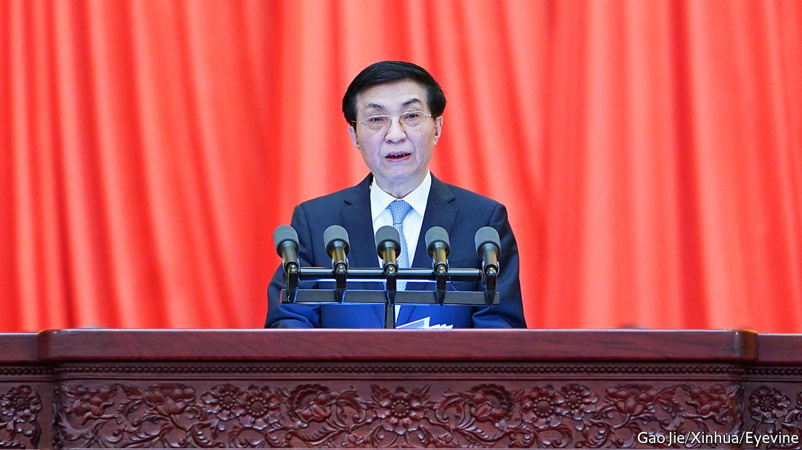

###### Thinker-in-chief

# Wang Huning’s career reveals much about political change in China 

##### He has shaped the leaders’ defining policies for more than two decades 

 

> Feb 12th 2022 

IN THE YEAR before the Tiananmen Square protests of 1989, campuses in China buzzed with debate about how to make the country more liberal. To some intellectuals the West offered a model. In the Soviet Union Mikhail Gorbachev had shown how a start could be made. Amid this ferment, in August 1988, a bespectacled political scientist arrived in America for half a year of study, initially at the University of Iowa. He found much to criticise but also plenty to admire in America: its universities, its innovation and the smooth transfer of power from one president to another. Capitalism, wrote the 32-year-old party member, “cannot be underestimated”.

That academic, Wang Huning, is now one of seven members of the Politburo Standing Committee, the Communist Party’s supreme ruling body. As its chief of ideology and propaganda, he is in charge of crafting a very different message: that China practises true democracy, that America’s is a sham and that American power is fading. For a party locked in an escalating ideological war with America, this line is unsurprising. Mr Wang’s role in the struggle is more so. His early writing did not suggest narrow-minded nationalism. He saw weaknesses in America’s system, but did not exaggerate them. He saw problems, too, in China’s. Even more remarkably, he has been crafting the party’s message under three successive leaders. China’s current ruler, Xi Jinping, has trusted him in this vital role even though he is not an old associate. A state-linked newspaper called him the party’s “number one adviser”.


It is a shadowy post. His occasional speeches give little hint of what he does behind the scenes. Before Mr Xi stopped travelling abroad two years ago, at the outset of the pandemic, Mr Wang often accompanied him on foreign trips, suggesting he is also involved in diplomacy. Party-linked media in Hong Kong have given more away. They have credited Mr Wang with shaping the defining policies of each leader for more than two decades, from the “three represents” of Jiang Zemin (which removed taboos surrounding the admission of private entrepreneurs into the party) to Hu Jintao’s “scientific outlook on development” (aiming for a more eco-friendly and equitable approach) and Mr Xi’s “Chinese dream” of a rich, militarily strong and globally powerful China.

This may have required some tricky political footwork. As a member of Mr Xi’s inner circle, Mr Wang would have needed to distance himself from both Mr Hu and Mr Jiang, whose allies have been among the targets of Mr Xi’s purges. It was Mr Jiang who had brought Mr Wang from Fudan University in Shanghai, where he taught, to the party’s headquarters in Beijing in 1995. Being an academic, not a politician, may have helped Mr Wang to rise above the party’s internal battles. All factions have valued his skills as a theoretician, and his willingness to use them flexibly.

It is impossible to know what Mr Wang truly thinks of the policies he espouses. How did he react when, in 2018, the year after Mr Wang’s elevation to the Politburo Standing Committee, Mr Xi changed the rules to make it easier for China’s leader to remain in power indefinitely? In his book about his American sojourn, “America Against America”, which was published in 1991, Mr Wang noted that if a political system failed to devise a way of transferring power, it would be hard for that country “to enjoy enduring and stable political order”. The book is often described as a gloomy survey of America’s prospects (with “collectivist” Japan challenging its supremacy). Yet its stability clearly impressed him.

But assuming that Mr Wang believes the propaganda he is now promoting, his intellectual journey is not so different from that taken by many others of his generation. In the 1980s he typified those who believed in “neo-authoritarianism”, ie, that strong leadership was necessary in order to manage gradual and orderly change, over a lengthy period, towards a more liberal form of politics (few openly suggested an eventual end to one-party rule).

Much changed at the end of that decade and beyond. First, the pro-democracy unrest of 1989 all but ended the party’s talk of political reform. Then came the collapse of communist regimes elsewhere. Little of what emerged appealed to China’s liberals. The country’s economic boom in the 1990s bolstered the attraction of a strong party that could keep the country stable. “Continue writing articles about political reform,” Mr Wang wrote in his diary in 1994 while still an academic (it was published the following year). “Suggest some feasible methods for dealing with the present situation…but if you want change quickly, you won’t accomplish it.”

The diary, titled “A Political Life”, covers just one year, but offers fascinating details of Mr Wang’s non-academic interests at the time. He liked watching foreign films, often late at night (many entries begin “In the small hours…”). “Alien”, a science-fiction horror movie, was one. Such films were popular in the West, he noted. “I don’t know whether that’s something to do with their mentality or some social reason.”

Like many people in the 1990s, Mr Wang also appeared intrigued by the claims of mystics to have supernatural powers. He described meeting one who showed his skills, appearing to twist together a fork and spoon with just a touch, and extract pills from a bottle without opening it. “It really was a miracle,” Mr Wang wrote. “One couldn’t but believe.” In 1999 the government launched a fierce campaign against Falun Gong, a mystical group led by a self-styled miracle-worker. These days no official would even hint at belief in magic.

Mr Wang would probably have little time for such diversions now, anyway. Late this year the party will hold a five-yearly congress, at which it is likely to clarify that Mr Xi will indeed remain the party’s leader, despite having served for the once-expected maximum of ten years. Mr Wang should be busy already preparing the report that Mr Xi will deliver.

He has long experience of such work. When an academic, he was invited in 1987 to submit suggestions for the report delivered at that year’s congress, according to Ming Xia, a former colleague who now teaches at the City University of New York. With regard to politics, that document in 1987 was the most pro-reform of the Communist era, calling for the separation of party and government. But Mr Wang avoided entanglement with the party’s reformist faction in Beijing, and kept mum during the upheaval in 1989, says Mr Xia (who was less guarded). He did, however, facilitate Mr Xia’s departure for America after the bloody suppression of the protests.

It is far from clear what will happen to Mr Wang after the congress. He is young enough, at 66, to remain in the Politburo Standing Committee for another five years. But new ideologues are emerging, says Cheng Li of the Brookings Institution. One is Jiang Jinquan, who took over from Mr Wang in 2020 as head of the party’s policy research centre, a powerful think-tank. Mr Jiang may get a seat in the Politburo after the congress, Mr Li believes.

Perhaps Mr Wang is ready for a move. “When a person has been at his work for a long time...his thinking will gradually become fixed and he will lack open-mindedness,” he wrote in his diary of 1994. The relentless, obsessive calls for devotion to Mr Xi by Mr Wang’s propaganda machinery suggest that fixed thinking is a problem that pervades the system. ■

