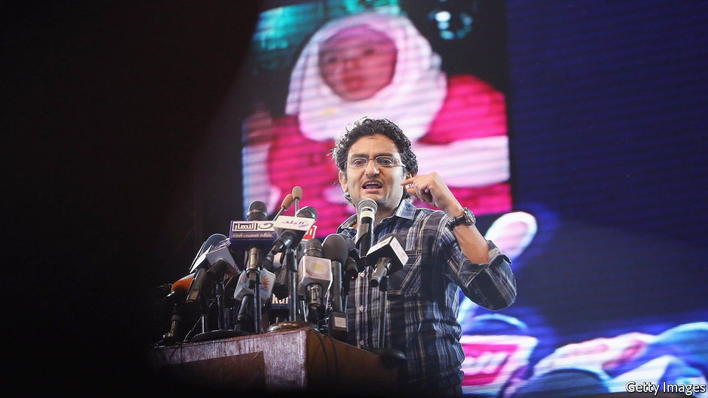

###### Insurgent history

# How do radicals find each other—and get heard? 

##### Gal Beckerman offers some answers in “The Quiet Before” 

 

> Feb 12th 2022 

The Quiet Before. By Gal Beckerman. Crown; 352 pages; $28.99. Bantam Press; £20

ONCE THEY spread, the quiet words of tiny groups can trigger big changes. Stepping off from that commonplace, Gal Beckerman asks two intriguing questions. “Radical change”, he notes, “doesn’t start with yelling.” How, then, do those who challenge conventional wisdom get themselves heard? And how do they find and communicate with each other? Radicals, by nature, are a minority. To start an avalanche, a rock needs neighbours to budge.


Rather than answering directly, Mr Beckerman offers short portraits of dissidents and naysayers in history. He focuses on the technical and political drawbacks they faced in attempting to stay connected and spread the word. Some succeeded. Others failed. His gallery ranges over politics, culture and science. He has talked to many of his present-day outsiders himself.

Political portraits include Feargus O’Connor, an early-19th-century Irish radical, newspaperman and leader of the Chartist push for universal male suffrage in Britain; NNamdi Azikiwe, editor in the 1930s of a west African anti-colonialist newspaper harried by the British, who became independent Nigeria’s first president; and Natalia Gorbanevskaya, a pioneer in the 1960s of samizdat, the underground press that helped undermine the Soviet Union. His web-era examples include Wael Ghonim, a Google employee in Egypt, whose net campaign against police brutality in 2011 led to the Tahrir Square movement for democracy.

What the radical pamphlet was for politics, aesthetic manifestos were for modern art. In the early 1900s Filippo Marinetti, an Italian Futurist, poured them out. Mr Beckerman concentrates on his fellow Futurist, Mina Loy. Fed up with the posing and bullying of male colleagues, she left them to write a manifesto for feminism. A nice echo, eight decades on, is the feminist punk scene of the 1990s that was sparked by a home-made “zine”, Riot Grrrl. 

Although Bay Area counterculture and Silicon Valley are often treated as cultural poles, Mr Beckerman unites them in an affectionate portrait of John Coate, godfather of social media, who started a chat network on a primitive computer from a boathouse in Sausalito in 1985. Among the failures he cites is Nicolas Peiresc, a 17th-century scientist-polymath who strove to measure longitude accurately. With exemplary patience, he co-ordinated timed observations of a solar eclipse by amateur stargazers recruited from Cairo to Spain. His brave efforts foundered on slow mail. Longitude was not properly fixed for another century, with seaworthy clocks.

The problem was different for Duane Caneva, a federal health official, when covid-19 struck America at the start of 2020. Communication was instant. The snag was getting politicians and the public to listen. Mr Caneva started Red Dawn, an unofficial network of worried experts and medical officers. From no more than a dozen, Red Dawn soon linked hundreds across the country. It was another seven weeks before the declaration of a national emergency.

Mr Beckerman ends his engaging study by noting how social media both mobilise and demobilise. His sympathies are on the left, but the observation is general. Social media give radicals of every stripe a wonder tool, but an imperfect one: they are too fast. They mobilise without time to work out aims and ideals or create a durable movement. Missing is what Mr Beckerman—borrowing from Silicon Valley—calls the vital stage of “incubation”. Pre-digital communication, by contrast, required patience. It was slow, laborious and patchy. But what it lost in speed, and cost in effort, it gained in incubation.

Wisely, the author does not put more weight on his portraits than they will bear. “The Quiet Before” is not a treatise or big-picture history. Open-minded and curious, it suggests rather than argues, and never shouts. Those are virtues easy to overlook—like Mr Beckerman’s chosen radicals as they “incubated” in obscurity. ■

