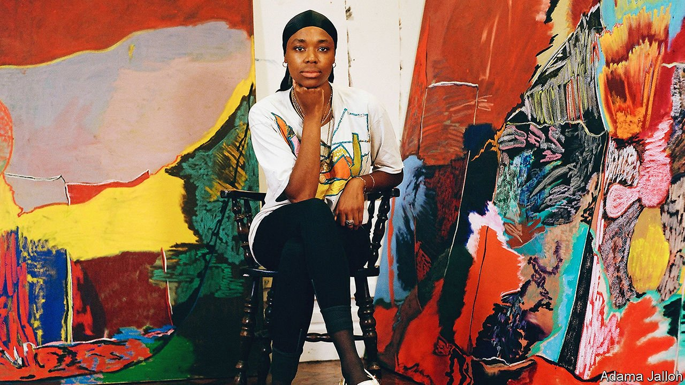

###### Heart in mouth

# Rachel Jones is an artist of the moment 

##### Her painting captures the concerns of the 30-year-old’s generation 

 

> Feb 12th 2022 

WITH ITS sunlit cupola and fluted marble staircase, Ely House has long been a place of silent contemplation. In the 18th century the grand Mayfair town house was the episcopal residence of Edmund Keene, an English bishop. Since 2017 it has fostered a different kind of reverence, as one of the contemporary-art showcases run by Thaddaeus Ropac, an Austrian gallery owner. In this normally hushed environment, the sound of giggling that rang through the building on a recent afternoon was pleasantly jarring.

Two students from east London were lying on the floor to gaze at a long, unframed canvas tacked just above the skirting board. They pointed and laughed as they tried to decipher the imagery, with its scribbles and slabs of pinks and yellows, greys and reds. A third young visitor was poised on one leg, wondering whether to hop over or onto another painting that had been stuck to the floor like a doormat.


Like that of the Italian Arte Povera movement in the late 1960s, this is art that toys with traditional notions of painting—all that rectangular formality, respectful framing and careful placing of pictures at eye level on a gallery wall. Both paintings are by Rachel Jones, a 30-year-old black British artist who was brought up in Essex by a Jamaican mother and a Bajan father. The laughing young visitors might not have ventured into a Mayfair gallery were it not showing work that captures their concerns and shares their cultural references, including music, Instagram and the Black Lives Matter protests. “She paints our world,” one of them said.

Ms Jones studied at the Glasgow School of Art and then at the Royal Academy of Arts in London. There her graduate show caught the eyes of Zoe Whitley of the Chisenhale Gallery in the capital’s East End, who is known for discovering and nurturing new talent, and Ralph Rugoff, head of the Hayward Gallery and curator of the Venice Biennale in 2019. In “Mixing It Up”, an exhibition of British painting at the Hayward last autumn, Mr Rugoff chose to place two of Ms Jones’s biggest pictures opposite some by Oscar Murillo, a dynamic Colombian painter. In their colour and intensity, her pieces were more than a match for Mr Murillo’s muscular blues, blacks and reds.

At the Hayward, Ms Jones’s paintings were not formally hung but simply tacked to the wall—as they were in the recent show at the Ropac gallery, and will be in another that is scheduled to open at the Chisenhale on March 12th. Unstretched and raw-edged, one was over seven metres wide and both were majestic. The bigger of the two, “lick your teeth, they so clutch”, pulsates with colour and depth. Its jostling shapes cohere into a recognisable form: around the outer edge is a patchwork of blood and flesh, and teeth are strung across the middle like gravestones. It is a painting of a mouth, but viewed from an intriguing perspective. You cannot tell if you are inside it peering out or on the outside looking in.

Even to fill her biggest canvases, Ms Jones uses only oil sticks and pastels. She says she can work both faster and more precisely with these than with paints and brushes, a technique that yields a raw, electric energy. In contrast to some big-name contemporary artists, whose output is manufactured in studio-factories, she is herself part of the picture: every mark, every line, every frenzied dash shows what the artist’s hand is doing. The composition, the velocity and the riot of colours—some hot and some cool—all suggest an artist in pursuit of an emotional response. As she once put it, the experience of seeing her paintings is meant to resemble “feeling with your eyes”.

At school, Ms Jones says, she was only ever one of a small handful of black children; later, as an art student, she responded to being stared at by painting eyes. The mouth, with its contradictory allusions to nourishment and vomiting, smiling and grimacing, offered her a broader visual metaphor. For Ms Jones, it evokes an era when the health of African slaves who had been shipped across the Atlantic was calibrated by the state of their teeth. One of the teeth in the Hayward painting is ornamented with small circles outlined in red—a reference, she says, to the success of contemporary black fashion designers and musicians, who sometimes adorn their teeth with coloured gemstones.

Painting is a form of political engagement for Ms Jones, but her art is more thoughtful than didactic. As much as political slogans, the mouths she paints speak of joyful human pastimes such as singing or kissing. Her technical prowess, and her deep engagement with urgent ideas about race and justice, have attracted museums and collectors. Her most recent commercial show sold out; institutions are eager to exhibit her work. But it is the emotional impact it has on young viewers, like those lying on the floor in Mayfair, which best attests to its power. ■

