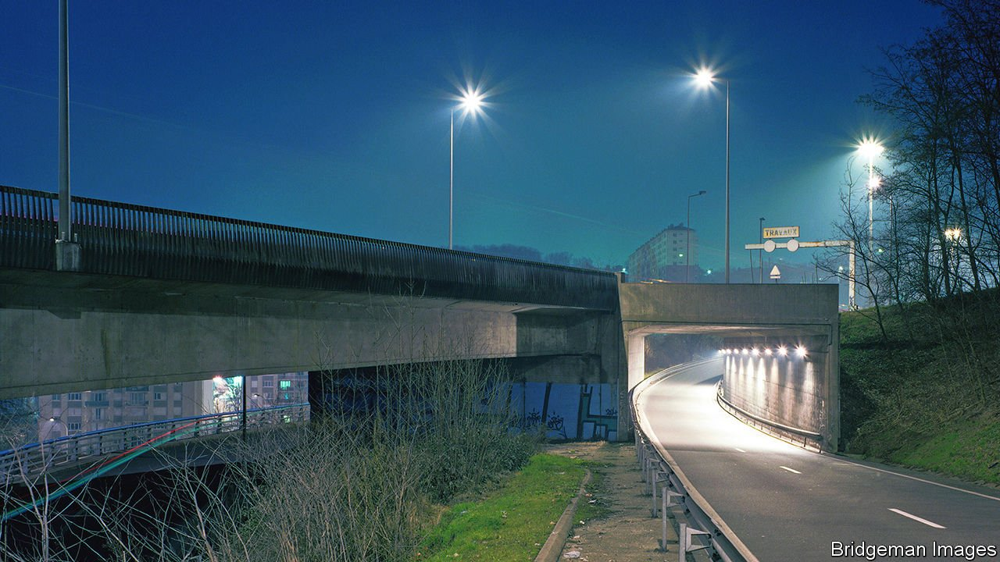

###### Au revoir tristesse

# The strange tenderness of Michel Houellebecq’s new novel 

##### In “Anéantir”, a bard of modern France takes a surprisingly upbeat turn 

 

> Feb 12th 2022 

Anéantir. By Michel Houellebecq. Flammarion; 736 pages; €26

NEAR THE start of Michel Houellebecq’s latest novel, “Anéantir”, the protagonist, Paul Raison, finds himself in a hotel bar in Addis Ababa with the preternaturally successful French finance minister, for whom he works. A well-trained politician who is always busy drafting a long-term policy solution, Paul’s boss serves as an aching reminder of his own bleak failings. The minister “had never been, and perhaps would never be, in the morose state of mind that was increasingly his own, which consisted in admitting that there is no long-term solution; that life itself contains no long-term solution.”


The former enfant terrible of the French literary scene has these days turned into more of a national treasure. But Mr Hou ellebecq does not stray far from familiar déprimiste territory in his new book, at least initially. Paul, whose surname means “reason”, is a high-level technocrat with a low-level emotional range, a dysfunctional marriage and a life marked by monochrome self-doubt. Yet Mr Houellebecq’s eighth novel—due to be published in English next year—is more than a meditation on existential melancholy. It also holds up a mirror to contemporary France, this time in a presidential-election year and in unexpected ways.

“Anéantir” means to annihilate, or reduce to nothing, and the novel touches on grim themes that are recognisably Houellebecquian—solitude, ageing, physical degeneration, suicide, death, unsatisfactory sex, emotional disconnection, the transience of human existence. Little inconveniences prompt devastating metaphysical doubt. When Paul’s dentist retires, he is undone. “What he couldn’t tolerate, he realised with concern, was impermanence itself; the idea that something, whatever it was, comes to an end; what he couldn’t tolerate was nothing less than one of the essential conditions of life.”

As ever, French literary critics have lamented Mr Houellebecq’s flat prose. But it is well-suited to conveying the crushing mediocrity of both his characters’ relationships and the physical landscape they inhabit. Far from the country loved by tourists, the novel takes place amid the unprepossessing geography of in-between France: an ibis Styles hotel, a Courtepaille or Buffalo Grill chain restaurant beside the motorway or on a roundabout. Distances are collapsed by high-speed trains, intervening pastoral scenes blurred and obscured. “Passing through an ocean of thick fog at 300km/hour”, Paul has “the impression of numbness, of a motionless fall in an abstract space”.

Even gastronomy, in the land that celebrates it, disappoints. Paul finds a pre-packaged “maxi soft” chicken-and- Emmental sandwich lying on a ministerial tray. His brother-in-law, Hervé, pays a visit to Paul’s father, who has had a paralysing stroke; afterwards, eating dinner at a roadside chain restaurant, Hervé “mechanically turned a piece of plastery Camembert” round on his plate. The ordinary is desolate, the inauthentic absurd. Paul lives amid urban concrete in a development called “Bercy Village”.

Some of Mr Houellebecq’s previous novels have been unnervingly prescient, tapping into French anxieties as they unfold. “Serotonin”, published in 2019, anticipated a rural uprising on a motorway intersection just as the gilets jaunes (yellow jackets) streamed onto roundabouts across France, protesting against a rise in the carbon tax on motor fuel. Four years earlier Mr Houellebecq was accused of stirring up far-right Islamophobia with “Submission”, which imagines France under Islamist rule; it was published on the day of the Charlie Hebdo terrorist attack.

“Anéantir” is set in 2027, at the end of the second term of a president who closely resembles Emmanuel Macron. Mr Hou ellebecq does not dwell on this, although in itself it constitutes a prediction, since Mr Macron is up for re-election in April this year. More intriguing, by the end of his second term France has been transformed into a competitive, industrially powerful economy. This is largely thanks to presidential instructions carried out by Bruno Juge—a thinly disguised fictional version of Bruno Le Maire, Mr Macron’s current finance minister—who is Paul’s drinking companion in Addis Ababa. Paul considers him “probably the greatest finance minister since Colbert”. Though the president was originally elected on the “fantasies of the startup nation”, it is the revival of France’s dirigiste spirit, embodied by Louis XIV’s finance chief, which has enabled this remarkable turnaround.

Au revoir tristesse

From a novelist best-known for his nihilistic outlook, this upbeat arc is striking. Past works, including “Atomised” and “Whatever”, deplored degenerate post-1968 consumerist society, capitalism, narcissistic individualism and the commodification of human interaction, usually including sex, sometimes at pornographic length. Mr Houellebecq tends to put his finger on a painful spot in society’s phobias and fears, and gently press. He connects instinctively to the ennui and discontent that are France’s default state of mind.

Indeed, in 2017 the author seemed perplexed by the victory of the centrist Mr Macron. Nearly half of voters then backed a candidate from the extreme left or right (which polls suggest they may do again this April). Mr Macron’s run-off opponent was the nationalist-populist Marine Le Pen, who warned of the country’s imminent collapse. The final contest was, to simplify, between his can-do confidence and her doom-mongering. Mr Houellebecq commented at the time that the election of Mr Macron, who later awarded the novelist the légion d’honneur, was a form of “group therapy” for a morose nation, and was designed “to convert the French to optimism”. In “Anéantir” he seems to be hinting that the patient can be cured.

The last part of the novel takes an unusually tender turn. An initial plot, revolving around a series of cyber-attacks, one targeting the minister, is never fully resolved. Instead, the story develops into a personal drama prompted by Paul’s own cancer diagnosis. Poignancy intrudes, as he attempts awkwardly to reconnect with his paralysed father, grows back in love with his wife, and contemplates death and departure amid the scarlet and gold leaves of autumnal Burgundy. France upbeat? Mr Houellebecq tender? Each notion is as unsettling as the other, which may be precisely the effect he set out to achieve. ■

