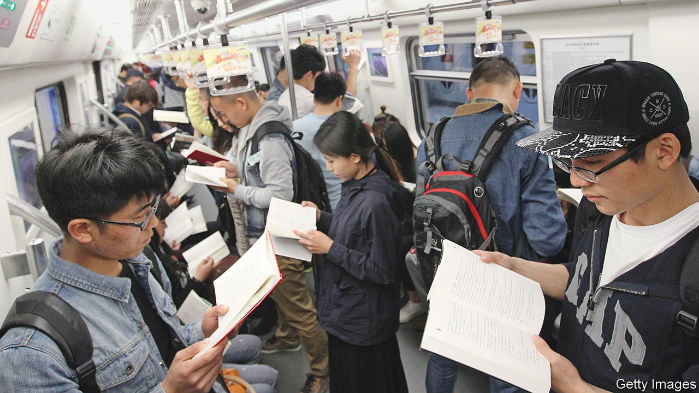

###### China’s other dreams

# To understand China, says Megan Walsh, turn to its literature 

##### “The Subplot” is a pacy tour of contemporary Chinese literature 

 

> Feb 12th 2022 

The Subplot. By Megan Walsh. Columbia Global Reports; 133 pages; $16 and £11.99

S OME SENSITIVE subjects, such as the Tiananmen crackdown of 1989, have always been off-limits for Chinese authors. But between the 1980s and early 2010s, Chinese novelists such as Mo Yan and Yan Lianke were able to portray the enormities of Maoism as experienced by ordinary people. That freedom has shrivelled since Xi Jinping took power in 2012: amid intensifying authoritarianism, Megan Walsh notes in “The Subplot”, the number of cultural figures imprisoned for “subverting state power” or “picking quarrels” is “the highest in the world”.


Nevertheless, argues Ms Walsh in her wonderful, pacy tour of contemporary Chinese literature, the Communist Party’s control over creative writing has to some extent been challenged by growing commercialisation and the advent of internet publishing. The result is a literary landscape teeming with corruption exposés, homoerotic fantasy, poignant migrant-worker poetry, time-travelling entrepreneurs and desolately radical science fiction. Together these form “a confusing and intricate tapestry that offers a beguiling impression of Chinese society itself”.

The book opens with a survey of traditional print publishing in recent decades. A generation of authors born in the 1950s and 1960s reflected deeply on the bewildering transformations of post-war China. The stories of Mr Mo and Mr Yan stand out for evoking a sense of tragic dislocation between Maoist political puritanism and the cut-throat commercialism of the past 40 years. Ms Walsh moves on to the pack of urban writers who came of age in the literary market economy of the early 21st century—authors such as Han Han and Guo Jingming, who became publishing sensations with their tales of rebellious teens and vapid fashionistas.

The rise of internet literature, she shows, has now dismantled the monopoly on forging reputations and tastes that traditional publishing once held. These days there are over 461m Chinese readers of online writing, with more than 24m fiction titles to choose from. Outlandish trash is the main genre. Addiction to tales of toxic masculinity and chick-lit romances is fuelled by extravagant serialisations: one work has reached 8.33m characters and 998 chapters, and is still growing.

Chinese internet fiction hooks audiences by incentivising them to vote, comment and create their own content, such as fan fiction and illustrations; Ms Walsh describes enthusiasts as “prosumers” (both producers and consumers) rather than readers. Internet fiction is written too hastily to count as serious literature, top writers churning out as many as 30,000 words a day. All the same, it provides the fantasy worlds to which hundreds of millions of Chinese people regularly escape—mythological and imperial pasts, the underworld, the zombie apocalypse.

A gripping chapter of “The Subplot” maps out the imaginary elements of Chinese science fiction—the genre in which Chinese writers, above all Liu Cixin, have enjoyed most success overseas. Boosted by the pandemic, intrusive technology has come to seem all-pervasive in China; internet censorship and granular high-tech surveillance are now routine. Stories by writers such as Nian Yu and Han Song explore the dystopian implications of the “monsters that rampant new technologies have thoughtlessly created”, as Ms Walsh puts it. Mr Han, for instance, depicts the transformation of human minds and bodies into “another outdated piece of hardware in need of an upgrade”.

The book makes a powerful case for Anglophone readers who want to understand China to look past the headlines and turn to literature. The country’s creative writers navigate both encroaching censorship and relentless commercial pressures. Yet in fantastical, satirical and provocative ways, their work vibrantly reimagines China’s past, present and future. ■

