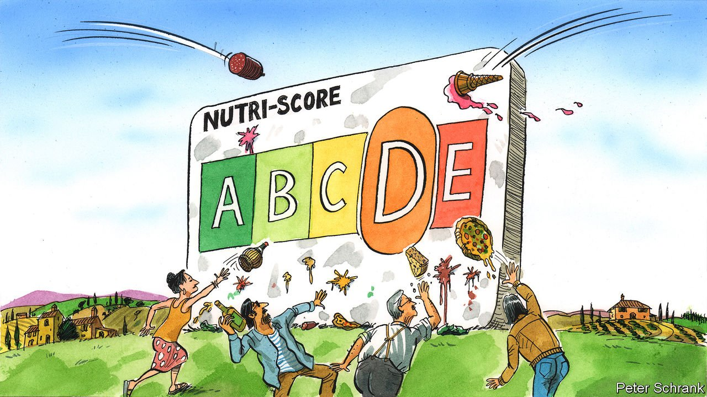

###### Charlemagne

# A European bunfight breaks out over food labels 

##### Italy is mounting a defence of the Mediterranean diet 

 

> Feb 12th 2022 

THE TREATY of Versailles, signed in 1919, is usually remembered for the humiliating punishments it heaped on Germany. But flip through the pages of the accord that ended the first world war and a lesser-known aim of the Allied powers appears: the protection of champagne. Article 275 ensured that never again would French palates have to suffer the infamy of tasting German-grown grapes passed off as Gallic fizz. Among diplomats and historians the treaty is not considered one of Europe’s finest hours, given its role in sparking the next world war. Pampered farmers are perhaps the only ones who remember it more fondly.

A century later, food remains the stuff of high politics in Europe. This year marks the 60th anniversary of the EU’s Common Agricultural Policy, which still manages to hijack a third of the bloc’s budget. Trade deals wanted by some member states are routinely scuppered to protect farmers in another (usually France). Now a new bunfight is gripping the continent. The European Commission in Brussels will this year propose rules that would require the nutritional qualities of all foods to be displayed on the front of their packaging. The idea is to tip off shoppers about what makes them fat. But the measure, backed by nutritionists, is being attacked by its opponents as nothing less than an assault on the European way of life.


Nearly all grub sold in Europe has had to divulge its nutritional qualities (or lack thereof) since 2016. But the nagging only goes so far. The information is found on the back of the pack, written in a font size usually reserved for the finer points of insurance contracts. In 2017 French food scientists developed a system that distilled that hard-to-read data into a simple “Nutri-Score”. A standard label placed where consumers can see it would provide colour-coded grades from an acceptable A to an execrable E. Public-health officials and consumer groups laud Nutri-Score’s simplicity and have pushed for its wider use. Backed by authorities in France, Germany and Spain among others, the system has been voluntarily adopted by many retailers. The commission thinks something like it should be mandatory across the EU.

The sensible push to steer consumers away from unhealthy food has run into a problem inherent in any regulation designed for 27 countries: what is backed by most ends up raising the hackles of a few. In this case the problem is Italy. Nutri-Score is unkind to many staples of Italian cuisine. A meal of prosciutto, gorgonzola and tiramisu turns out to be entirely at the wrong end of the spectrum. Even olive oil, the elixir at the heart of the country’s famed Mediterranean diet, gets only an amber light from the grading system. For Italians, ever alert to the possibility that condescending northerners are holding them to an unreasonable standard, this is provocation enough. How can their food be bad when Italy has among the lowest adult obesity rates in the rich world?

Politics have helped turn the issue into a matter of national pride in Rome. Populists rail against what they call a senseless system cooked up by bloodless, tasteless technocrats. Matteo Salvini of the far-right Lega party dismisses Nutri-Score as fit only for joyless acolytes of alcohol-free wine, fake meat and edible insects. Others discern a menace to Italian agriculture, designed to benefit multinationals. Mario Draghi, Italy’s prime minister and formerly chief of Europe’s central bank, is a technocrat himself. Yet to hold his fractious coalition together, he has had to make disparaging comments about Nutri-Score, too.

A crude lobbying operation complete with dodgy websites mimicking public-health agencies has popped up in opposition to Nutri-Score. It contrasts the terrible grade given to parmesan (E) with the passing mark of Coke Zero (B). How can two-thirds of the products served by KFC—a chicken outfit that owes its very existence to crispy-fried crust—be classified as no worse than mozzarella? The food-grading endeavour is painted as a ploy to undermine ancestral farming products: it is far easier to change the recipe for Coco Pops (whose formula was recently tweaked to achieve a B) than salami (a flat E).

Nutri-Scorers point out that makers of processed foods, too, have lobbied against stricter labelling (though a few now endorse it, including Kellogg’s, which makes Coco Pops). Serge Hercberg, an academic who helped devise the scheme, describes it as an obvious health measure. Finding skewed comparisons is easy, but foods should be compared to alternatives in the same category: one cannot replace a can of Coke with a cup of olive oil (which, he notes, scores better than butter). Italy has a child obesity problem, and the Mediterranean diet it defends originally included rather more fruit and vegetables than makers of cured ham would like to admit. “Even if foods are ancestral, it does not mean they are good for you,” Mr Hercberg says. As for KFC, the parts of its menu that score well are wholesome: a side of cherry tomatoes, for example.

Food for thought

The Italian griping has caught on. Farmers in France and beyond worry bad scores for their products will crimp sales. Agriculture ministries are being coaxed to pare back Nutri-Score even where it has already been adopted. A proposal to create a special category for alcohol (a black F, sadly) is being used to galvanise more opponents. Italy has developed an alternative labelling scheme so confusing that it seems aimed at making a food’s healthiness utterly unknowable. And national governments will have plenty of opportunity to hollow out the commission’s proposals, as they did when the issue of food labelling last came up a decade ago.

They should not, however. For all the raucous disagreement, Nutri-Score’s fans and detractors are not so far apart. Italians are slim despite all that pecorino and gelato because they know these treats should be enjoyed in moderation. Professor Hercberg and others say much the same thing: everything is fine, if you adjust the quantities. Even a glass of Italian wine, perhaps. Salute!  ■

Read more from Charlemagne, our columnist on European politics: (Feb 5th)

 (Jan 29th)

 (Jan 22nd)


