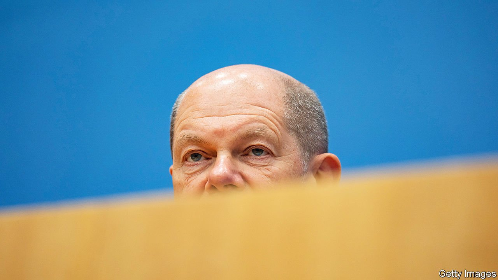

###### The chancellor wakes

# A beleaguered Olaf Scholz launches a diplomatic offensive 

##### Caution over Ukraine has hurt the German leader’s image 

 

> Feb 12th 2022 

THEY WERE not the sort of headlines any leader would hope to read. “Germany, NATO’s weakest link,” said the Wall Street Journal. “The ‘invisible’ chancellor heads to Washington amid fierce criticism,” offered the New York Times. As Russian troops massed on Ukraine’s border and the West fumbled for a response, Olaf Scholz, Germany’s new chancellor, stood accused by allies of being missing in action. At home Germans concerned by his reluctance to enter domestic debates detected a pattern. “Our image has been seriously damaged abroad,” says Johann Wadephul, an MP from the opposition Christian Democrats.

With criticism mounting, Mr Scholz has belatedly sprung into action. On February 7th he visited Joe Biden in Washington, DC. He hosted half a dozen EU leaders in Berlin this week, and on February 14th and 15th will travel to Kyiv and then Moscow for his first meeting with Vladimir Putin. Officials do not expect this sudden burst of diplomacy to bring immediate results. But it shows a sensitivity to allies’ demands for German action.


The damage control was most urgent in America. Here concerns have centred on Germany’s reluctance to threaten to scrap Nord Stream 2, a new undersea Russia-Germany gas pipeline that America fears would allow the Kremlin to blackmail Europe. Mr Biden says he will kill the pipeline if Russia invades. German officials concur.

But like an actor nervous of uttering “Macbeth” in a theatre, Mr Scholz refuses to let the words “Nord Stream 2” pass his lips in public. This increasingly farcical stance, designed to forestall Russian allegations that Germany is wielding energy as a weapon, wins the chancellor few friends. Nor does Germany’s stubborn denial of Ukraine’s requests for weapons.

 


Yet on substance Germany and America are broadly aligned. The two countries have been discussing potential sanctions since last September and financial officials from the two countries now speak at least weekly. Should Russia invade, Germany would be willing to sign up to a common package. What transatlantic (and intra- EU) differences there are revolve around details, especially on the Russian gas that accounts for over half of Germany’s imports. Mr Biden, for his part, is keen to calm the storm. “Germany is completely, totally, thoroughly reliable,” he said during Mr Scholz’s visit. A group of senators who dined with the chancellor declared themselves charmed. During a TV interview Mr Scholz defended Western values with an ardour that surprised even his supporters.

Germany is stepping up in Europe, too. The government will not change its mind on arms exports, but it has sent more troops to Lithuania, where Germany has led a  force since 2017. Emmanuel Macron has taken the diplomatic lead for Europe, but is co-ordinating with Mr Scholz. The chancellor’s team hope his visit to Moscow will pick up where the French president this week left off. The two leaders are united in trying to breathe life into the Normandy format, a diplomatic grouping that brings France and Germany together with Russia and Ukraine, thereby offering Europeans a seat at the negotiating table.

These ambitions are married with frustration over the criticism laid at Germany’s door. “Maybe our allies have to come to terms with the ‘Scholz way’,” says Nils Schmid, the foreign-policy spokesman for the parliamentary group of Mr Scholz’s Social Democrats (SPD). He defines this as “short, clear statements and a refusal to be pressured into saying particular things”. During last year’s election campaign Mr Scholz presented himself as accomplished and unflappable, and so a natural heir to Angela Merkel. But Mrs Merkel had been in office for nine years when she marshalled the EU’s response to Russia’s annexation of Crimea in 2014. Mr Scholz has a long CV but little foreign-policy experience.

Indeed, barely two months after replacing Mrs Merkel, Mr Scholz is in a tricky spot. He took office at the head of an unprecedented three-party coalition fizzing with ideas, notably on greening Germany’s industrial economy. Those plans have started to unfold, but have been overshadowed by a diplomatic crisis almost precision-engineered to test the young government’s resolve. The parties have different instincts on Russia; the SPD even has competing wings. During coalition negotiations in November no foreign-policy issue proved trickier than Russia and Nord Stream 2. “This debate has wrong-footed the government,” says a German official.

Voters have noticed. Two-thirds say they are unhappy with their government’s response to the Ukraine crisis. After a narrow election win last September, the SPD has slid behind its conservative rival in polls. (The Greens and the pro-business Free Democrats, the junior coalition partners, are holding steady.) Before Mr Scholz took office half of Germans said they expected him to govern well. Now barely a fifth say he has made a good fist of things.

This is despite a foreign-policy stance broadly in line with public preferences. Three-quarters of Germans do not wish to send arms to Ukraine. They support Nord Stream 2, or at least would prefer to sequester it from diplomatic rows. Few think Germany should be confrontational towards Russia. The coalition has so far defied expectations that it would prove endlessly quarrelsome. Instead, voters have grown frustrated with a leader whose reticence has been acute even by the modest standards of German chancellors. “If you order leadership from me, you will get it,” Mr Scholz once said. Germans are no doubt relieved to see him finally try. ■

