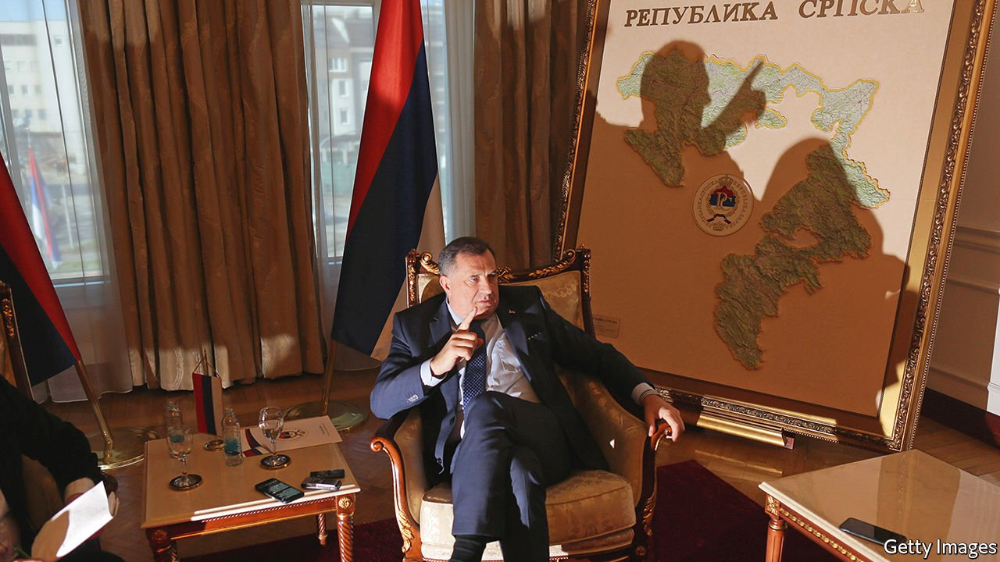

###### Shaky state

# Bosnia is on the brink of falling apart again 

##### The Serbs want out 

 

> Feb 12th 2022 

A PLAQUE ON Sarajevo’s magnificent old town hall, built under the Austro-Hungarian empire, commemorates its destruction by “Serbian criminals” in 1992. The hall has been reconstructed, but Bosnia-Herzegovina is crumbling. The country is facing its worst crisis since the end of the war in 1995.

The Dayton Accords that ended the fighting in Bosnia created a country composed of two main entities: the Serbian-dominated Republika Srpska (RS) and the so-called Federation, where Bosniaks (Bosnian Muslims) share power with Bosnian Croats. Above them was a largely toothless national government, which has gradually acquired a few more powers and a small army. A foreign “High Representative” was appointed to oversee the deal. The system helps keep the peace among Bosnia’s once-warring ethnic groups, but also provides vast opportunities for corruption.


Now this structure is under threat. Milorad Dodik (pictured), the Serbian member of the country’s three-man presidency, wants to rescind powers granted by the RS to the Bosnian state. That is secession in all but name. The most explosive proposal is to recreate the RS’s army, which murdered 8,000 Bosniaks at Srebrenica in 1995. Mr Dodik’s power play started in July, after the High Representative imposed a law making it illegal to deny that the massacre at Srebrenica was genocide. Damir Arnaut, an MP, says Mr Dodik’s real aim is to “deflect debate about corruption”.

Meanwhile HDZ, the main Bosnian Croat party, is threatening to scupper this year’s planned elections. For years it has objected to the fact that Bosniaks and Croats vote jointly for the Federation’s Bosnian and Croatian representatives in the presidency. Hence Zeljko Komsic, the Croat representative, is elected mainly with Bosniak votes. Mr Komsic objects to changing the electoral rules to divide the Federation’s voters by ethnicity, saying the HDZ and Mr Dodik are trying to achieve what separatist leaders failed to during the war. Those threatening Bosnia’s constitution should be arrested, he insists—seated under a portrait of Marshal Tito, the former leader of united Yugoslavia.

Arguments over ethnic divisions leave Bosnia’s politicians unable to govern. The country has Europe’s second-highest death toll from covid-19 relative to population. The prime minister of the Federation is on trial for corruption relating to the procurement of sub-standard ventilators. In the RS cheap industrial oxygen was used for covid patients instead of the medical sort.

On January 9th the RS’s paramilitary police marched in a parade for the republic’s 30th anniversary, though the constitutional court had ruled the holiday illegal. Looking on with Mr Dodik was the Russian ambassador. On January 5th America imposed sanctions on Mr Dodik for “attempting to dismantle” Dayton and for corruption. Individual European countries will follow suit, but not the EU as a whole, as Hungary, which supports Mr Dodik, will not allow it.

The atmosphere is febrile. Some are talking of war again, although Ljubisa Cosic, the mayor of East Sarajevo, which is in the RS, says there is “no chance” of that. The border divides neighbourhoods, he says, and every day people from the RS go to work in Sarajevo while people from the capital come to ski in his constituency. Deals can be made to halt the RS’s withdrawal from national institutions, he says.

Zlatko Miletic, an MP and former police chief, says the number of men under arms in Bosnia is small and that “a real war” could happen only if Serbia and Croatia get involved. Diplomats are watching Ukraine. If war breaks out there Mr Dodik, encouraged by Moscow, might ramp up his separatist drive. Bosnia has repeatedly survived crises since 1995, and will probably survive this one. But the population has shrunk from 4m in 1991 to about 3m today. Bosnians are voting with their feet. ■

