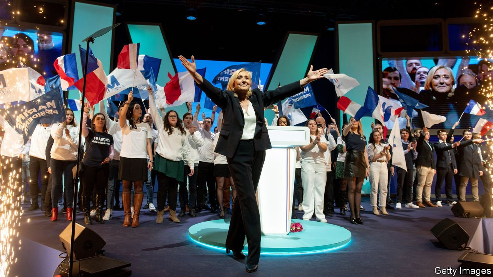

###### All the boys and girls

# In France’s election young people are all over the map 

##### From the far right to the far left and everything in between 

 

> Feb 12th 2022 

“SHE’S THE best!” declares Adrien, a 20-year-old student, cradling a French tricolore flag. He is waiting in the winter sunshine outside a trade hall on the outskirts of the cathedral town of Reims, where a rally for Marine Le Pen is about to start. “Before making decisions,” explains Adrien, “she asks people what they think, how they live, to find the best solution to their problem.” Alexandre, a fellow student, agrees. The nationalist-populist candidate at April’s French presidential election, he adds, is focused not only on “braking mass immigration” but also on the cost of living. As for Emmanuel Macron, the president, “We detest him.”

Young French voters, like those in many countries, seem set to vote differently from their elders. Yet in France the split is not simply that youth are more liberal and retirees more conservative. One surprise is the enduring popularity of Ms Le Pen among the young. Only 8% of over-70s say they will back her, according to Ipsos, a polling group. Her share of the vote among under-25s is double that.


Some pensioners share the fears of immigration that Ms Le Pen stirs up. Indeed over-70s are keen on Eric Zemmour, a hard-right candidate, former television commentator and polemicist, who vows to “save France” from an immigrant invasion. But they recall too that in 2017 Ms Le Pen vowed to take France out of the euro—a pledge the candidate has since given up, but which made retirees edgy about their pensions. Younger voters seem as drawn to Ms Le Pen’s promise to help with the cost of living as to her flag-waving. She promises to abolish income tax for the under-30s, as well as to cut VAT on petrol and energy bills and lower motorway tolls.

The Greens’ Yannick Jadot gets some youth support. So, more improbably, does the hard left’s Jean-Luc Mélenchon. An early convert to social media, he held rallies in 2017 which featured himself in one town and his holographic image in another. This year the 70-year-old plans to repeat the same trick. Last month in the western city of Nantes Mr Mélenchon held an “immersive and olfactory” meeting, complete with the sounds and smells of the sea. Like Bernie Sanders in America, he has a grandfatherly appeal and a cult following.

Among the leading candidates to make the run-off stage of the two-round election, the one the young favour least is Valérie Pécresse. Fully 28% of over-70s plan to vote for the centre-right Republicans’ nominee, a fiscally prudent cultural conservative. Her plans to raise the retirement age to 65 no longer concern this age group; her family values are reassuring. Only 8% of under-25s, however, say she will get their vote. The more socially liberal among them recall that Mrs Pécresse voted against gay marriage in parliament in 2013.

As for Mr Macron, he does less well among the young than in other age groups. But past policies are beginning to bring rewards. Thanks to a big expansion of apprenticeships, youth unemployment has fallen to its lowest level for almost 15 years. The president, who has a distant relationship with youth culture, has tried to engage with it a bit more. Last year, to the consternation of traditionalists, he invited Mcfly and Carlito, two popular YouTubers, to the Elysée palace, where he took part in a game of “true or false”. The young may not be his biggest fans, but neither does anyone else eclipse him in their eyes. Among those who have decided on their vote, Mr Macron does better than any other candidate. ■

For more coverage of the French election, visit our dedicated 

