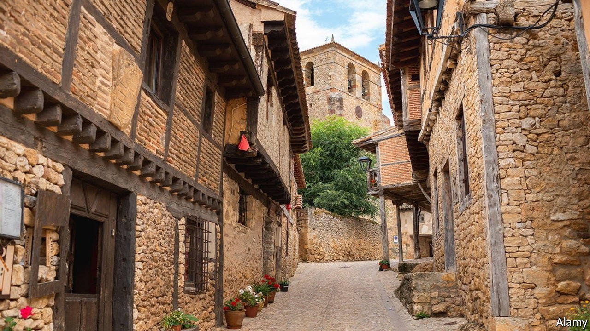
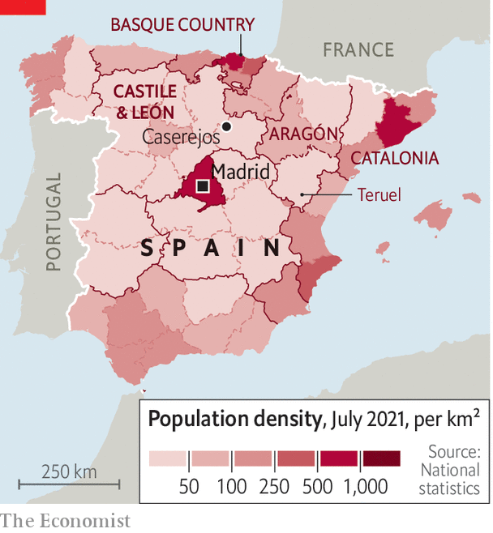

###### The few, the proud

# Spain’s empty middle flexes its political muscles 

##### In Castile and León’s election, local parties fight depopulation 

 

> Feb 12th 2022 

“I HAVE FOUR children,” says Blanca over a midday glass of wine with olives. “None of them lives here.” There are 156 residents registered in Casarejos, down almost half from 25 years ago. Locals differ on how many children live in the village, but all use just one hand to count them.

Blanca is complaining to Laura Gil, a candidate for Soria Ya (“Soria Now”) in the regional elections in Castile and León, scheduled for February 13th. Soria Ya is a new party that will compete only in Soria, one of the region’s nine provinces. Allied groups will run in other provinces, too, unified loosely under the banner of España Vaciada, or “Emptied Spain”.


This slogan is a twist on “Empty Spain”, a book published by Sergio del Molino, a journalist, in 2016. The parties say the countryside is not simply empty, but is being emptied by neglect that gives young people no choice but to leave in search of work and public services. The grouping was inspired by Teruel Existe (“Teruel Exists”), a party opposing depopulation in Teruel province in Aragón, next door to Castile and León. It surprised observers by coming first in Teruel in national elections in 2019, giving it an MP. That proved important: Spain’s minority government needed small parties to help install Pedro Sánchez as prime minister. Teruel Existe parlayed that into more attention for depopulation. The environment ministry is now the Ministry for Ecological Transition and the Demographic Challenge.

 


Soria Ya wants to imitate that success in Castile and León, where the regional president, Alfonso Fernández Mañueco of the conservative People’s Party (PP), has called early elections. Many think he did so to pre-empt the growth of España Vaciada, and to repeat the PP’s trouncing of the left last year in Madrid. If so, he may have miscalculated. Mr Mañueco is not particularly popular, and polls show Mr Sánchez’s Socialists running a close second, even though Castile and León is normally a PP fief. The new parties are also doing rather well, with Soria Ya expected to win in its province. Even if, as is likely, the PP wins the most seats in the region overall, it has little chance of securing an outright majority. That means it will have to team up with one or several other parties to form a regional government, perhaps including España Vaciada.

Soria Ya says it will work with any party that promises to carry out its agenda. Its programme is almost heartbreakingly specific: add a new radiography clinic to the local hospital, upgrade a local road to a motorway and so forth. Mr Mañueco, apparently daunted by the strength of the new provincial parties, has compared them disparagingly to separatists in the Basque Country and Catalonia, who trade their occasional support of Mr Sánchez in Madrid for favours.

Mr Mañueco has also tried to sound like a friend to farmers, attacking a minister in the national government for criticising “megafarms” as bad for the environment and animal welfare. But farmers are less than a quarter of the rural population, according to Vicente Pinilla of the University of Zaragoza. Country-dwellers want jobs, not hymns to tillers of the fields.

In fact, Mr Pinilla argues, despite España Vaciada’s sudden prominence, depopulation is nothing new. Spain’s countryside emptied later and faster than in other countries in Europe. But young people leave farms in every fast-growing and urbanising country. In Spain the most rapid exodus was in the 1950s and 1960s, not recently. In fact, Spain’s rural population has nearly stabilised. But that masks geographical disparities: in provinces with a thriving capital city, people stay in the surrounding countryside. In those with a capital that can offer them little, they flee. Teruel Existe did best in atrophying Teruel city, Mr Pinilla points out, rather than the surrounding countryside.

Ángel Ceña, Soria Ya’s leader, argues that the party is already a success, however it performs. When the Socialists and PP announced their platforms in Castile and León, they promised to grapple with depopulation, a subject he says they paid less attention to during the last election in 2019. In Casarejos, Blanca is not sure whether she will bother to vote. But she gives Ms Gil and Soria Ya credit for one thing: “You’re the only ones who come here.” ■

