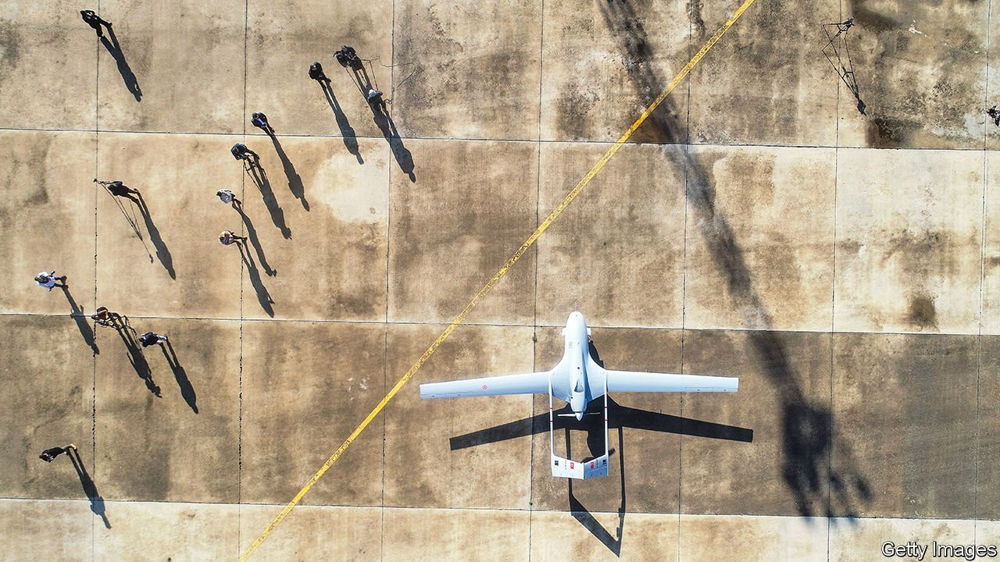

###### Drones of their own

# Turkey is the arms industry’s new upstart 

##### It has won clients in Azerbaijan, Ethiopia, Ukraine and elsewhere 

 

> Feb 12th 2022 

IT HAS LEFT a trail of smouldering Russian-made tanks, trucks and artillery in wars in Nagorno-Karabakh, Syria and Libya. Soon Turkey’s TB2 drone may have a chance to do so again in Ukraine, which has bought dozens of them over the past couple of years and is now bracing for a . On February 3rd Ukraine’s president, Volodymyr Zelensky, and Turkey’s, Recep Tayyip Erdogan, inked a deal to build more of them together. Some of the drones have already seen action. A TB2 destroyed a howitzer used by pro-Russian separatists in Ukraine’s Donbas region in October. American officials say Russia may have been planning to fake a TB2 strike against civilians as a pretext for war.

Mr Erdogan sees Turkey’s drones as the harbinger of a military revolution. He wants to eliminate Turkey’s reliance on foreign suppliers and turn the country into a big arms exporter. Some of his plans are fanciful, but he has already made considerable headway. Next year Turkey expects to deliver two corvettes to Ukraine, of a model used by its own navy.


Turkey’s arms industry is bigger and more self-sufficient than ever. Turnover rose from $1bn in 2002 to $11bn in 2020. Its army, the second-biggest in NATO, once relied on foreign suppliers for 70% of its needs. That is now down to 30%. Last year Turkish arms and aerospace exports reached $3.2bn, a new record.

Plans to develop a homegrown defence industry first picked up steam after 1974, when America responded to Turkey’s invasion of Cyprus with an arms embargo. But they have kicked into overdrive under Mr Erdogan. Foreign pressure is again a big motivator. After Mr Erdogan purchased a missile-defence system from Russia in 2017, America banished Turkey from its F-35 stealth-fighter programme and imposed sanctions on the country’s procurement agency. Other NATO allies banned some weapons sales after Turkey attacked American-backed Kurdish rebels in Syria and supported Azerbaijan in its recent war with Armenia. Mr Erdogan now seems determined to go it alone. “We will continue,” he said last year, “until we completely free our country from foreign dependence.”

Turkey’s drone programme has been the industry’s calling card. (It has also become a family affair. The head of the programme, Selcuk Bayraktar, married one of Mr Erdogan’s daughters in 2016.) At only a few million dollars a pop, the TB2s have been flying off the assembly line. Last year Poland became the first NATO member to buy them. Turkey has sold them to at least 12 other countries, including Qatar, Morocco and Ethiopia, which has used them against rebels from Tigray, its northernmost region. Evidence suggests the TB2 was responsible for an air strike that killed at least 58 civilians in Tigray in January. In Turkey’s own forever war against the guerrillas of the Kurdistan Workers’ Party (PKK) in northern Iraq and Syria, the TB2 has become a routine tool. Mr Erdogan believes total victory is within reach, and rules out new peace talks.

But Turkey’s ambitions go well beyond drones. The country plans to roll out its first light aircraft carrier, the 25,000-tonne  TCG Anadolu, later this year. The warship was designed with the F-35 in mind but is being refitted to carry the Akinci drone, the TB2’s more advanced cousin. The new drone, equipped with a Ukrainian engine, can strike targets in the air and on the ground. Deliveries of Turkey’s first indigenous battle tank, the Altay, are scheduled to begin in 2023, though the project has been plagued by delays. Qatar, which owns 49.9% of the company that produces the tanks, has promised to purchase 100 of them. Turkey also plans to build its own submarines, unmanned attack helicopters and fighter jets.

The industry has a bright future, but Mr Erdogan’s dream of self-sufficiency is unrealistic. Designing and building components like aircraft and naval engines, advanced sensors and microchips is prohibitively expensive, says Arda Mevlutoglu, a defence analyst. Foreign sanctions, which have inspired the industry’s growth, are also holding it back, disrupting procurement and exports. The most notable example is Turkey’s planned sale of 30 attack helicopters to Pakistan. The deal, worth $1.5bn, is nearing collapse because America has refused to grant Turkey an export licence for the chopper’s American-made engine.

The biggest hole is the one left behind by the 100 F-35s Turkey ordered, but will not receive. Aboard the  TCG Anadolu or elsewhere, Turkey’s drones are no substitute for the advanced American fighter jets. Unfortunately for Ukraine, they are also no match for Russia’s army. The TB2s could land a few blows in the war’s early stages, says Michael Kofman of CNA, an American think-tank, but would easily be knocked out of the sky or destroyed on the ground by Russian air defences and warplanes. Conflicts with Russian proxies allowed Turkey to show off its new weapons. A Russian war with Ukraine would be a vastly tougher test. ■

