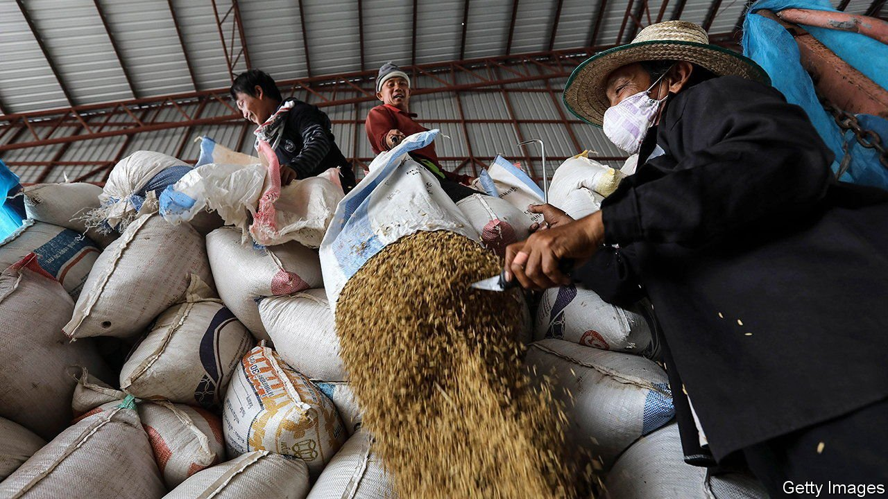

###### Rice restraint

# Asia is not feeling the same price pressures as the West 

##### A stronger dollar could change that 

 

> Feb 12th 2022 

INFLATION HAS shot to multi-decade highs in much of the rich world during the past year, with the effect of supply constraints, covid restrictions and a burgeoning economic recovery all helping to drive consumer prices higher. In Asia, however, pressure on prices is much weaker. Why?

In much of the region—in China, Hong Kong, India, Indonesia, the Philippines and Vietnam—inflation is in fact below average levels over the decade before the pandemic, notes Abdul Abiad, director of macroeconomic research at the Asian Development Bank. Where it is higher than the average for 2010-2019—in Malaysia, Singapore, South Korea, Taiwan and Thailand—it is by around two percentage points or less.


The divergence between East and West is the result of several factors. Some of the disparity with the booming prices seen in North America and Europe, as well as many non-Asian emerging markets, comes down to food. Whereas prices of food globally have surged, Mr Abiad notes that the effect has been uneven. Maize and wheat prices rose by 18% and 20% respectively in the 12 months to the end of January. In contrast, the price of rice fell by around a fifth in the same period. In a country like the Philippines, rice makes up a quarter of the food share of the consumer-price index, and one-tenth of the entire index. In China in particular, average wholesale pork prices dropped by more than half in the 12 months to January, as the African swine fever epidemic that has raged through the country since 2018 began to abate.

The impact of food prices is most obvious in developing economies, but there are reasons why Asia’s richer countries have recorded lower inflationary pressure too. For one, supply-chain bottlenecks are not as severe as they are in the West. The cost of shipping a 40-foot container from Shanghai to Rotterdam has risen by around 60% in the past year, to $13,686, according to Drewry, a supply-chain consultancy. In contrast, the price for the return journey is little more than a tenth of that, at $1,445, a figure which has dropped by 1% in the past year. Surveys of purchasing managers suggest that supplier delays are still worsening in most of Europe and America, but falling in China, India, Indonesia, Thailand and Vietnam.

The different ways in which countries have emerged from the pandemic matter too. Researchers at Capital Economics, another consultancy, note that Asia’s “reopening” inflation in consumer services remains low. The rise in prices for recreation and cultural services in Indonesia, Malaysia, the Philippines, Singapore, South Korea and Taiwan is half or less of the American year-on-year rate of around 4%. The difference may be caused by more gradual loosening of restrictions, as well as a dearth of international tourists.

Not all forms of inflationary pressure can be avoided. Energy prices are more influenced by global trends than those for most other goods and services. Rising energy costs have been the biggest contributor to the inflation surge in Asia, making up as much as a third of the total increase recently, according to analysts at Goldman Sachs, a bank.

Many economies in the region may face higher interest rates despite their milder inflation. Potential interest-rate increases from the Federal Reserve this year raise the threat of a stronger dollar, which would bring imported inflation to Asia. Monetary policymakers in Indonesia, Singapore and South Korea have already announced small steps to tighten monetary policy. They are unlikely to be the last. ■

