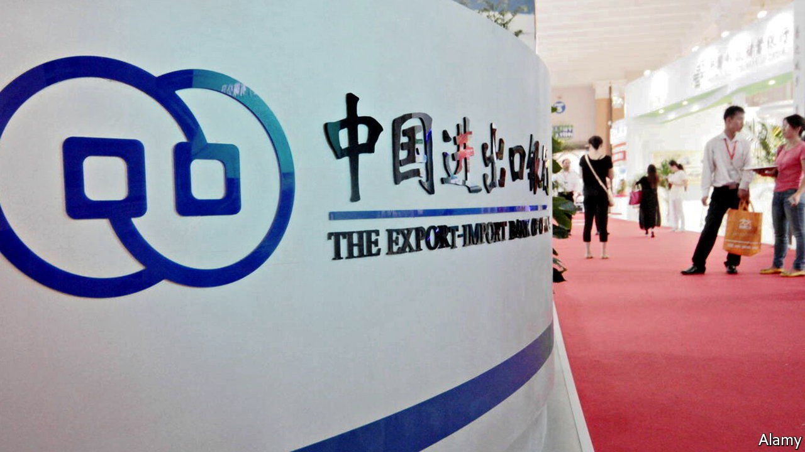
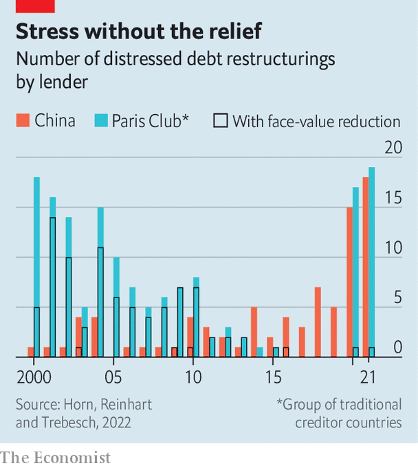

###### How to default on China

# China does not always collect its debts on time 

##### Thirty-nine developing countries have delayed repayment to China since 2000 

 

> Feb 12th 2022 

CHINA’S LENDING boom to poor countries is turning sour, as governments struggle to repay their debts to its state-owned lenders like the Export-Import Bank of China and China Development Bank. So how will China handle countries on the brink of default? Will it show the solidarity one developing country might expect from another? Or will it insist on its pound of flesh?

Some think defaults would be good for China. It is often accused of “debt-trap diplomacy”: lending heavily to poor countries with an eye to seizing their strategic assets, such as ports, when they cannot repay. The truth is more prosaic. A fresh effort to count China’s debt restructurings finds that when faced with a debtor that cannot repay, China mostly just kicks the can down the road.


The new paper by Sebastian Horn and Carmen Reinhart of the World Bank and Christoph Trebesch of the Kiel Institute for the World Economy counts 261 instances of debt relief or renegotiation since 2000. Since China is far from open about its lending, the number is probably an underestimate. It includes 149 cancellations or reschedulings of small, interest-free loans by China’s commerce ministry, mostly in the 2000s when debt relief became a cause célèbre, embraced by G7 governments and Irish rock stars. Another 28 were payment holidays granted to countries in no great debt distress as part of the G20’s response to the pandemic. That leaves 84 restructurings proper (of which 30 were also part of the G20 initiative, but to countries under financial strain).

 


China’s 84 credit mishaps compare with 158 in total by all 22 members of the Paris Club, an informal group of rich-country governments including America, Japan and Britain (see chart). China was perhaps unlucky in lending a lot at a bad time, just before the prices of oil and other commodities exported by African countries began to drop in 2014. In almost all these cases, China simply gave borrowers more time to repay. In only four did it reduce the face value of the debt (Cuba, Iraq and Serbia, twice). Its approach thus resembles that of Western lenders in the 1980s, when they seldom provided deep debt relief.

The pandemic may force China to move from forbearance to forgiveness. Otherwise the authors fear that a debt “overhang” may inhibit growth in poor countries. China has joined the G20’s “common framework” for debt relief, which is meant to bring it into line with the Paris Club. In becoming a big lender to poor countries, China has followed in the footsteps of the club’s leading economic powers. It has also repeated a number of their blunders. Now it must follow them in writing off some of its past mistakes. Who is China’s Bono?


