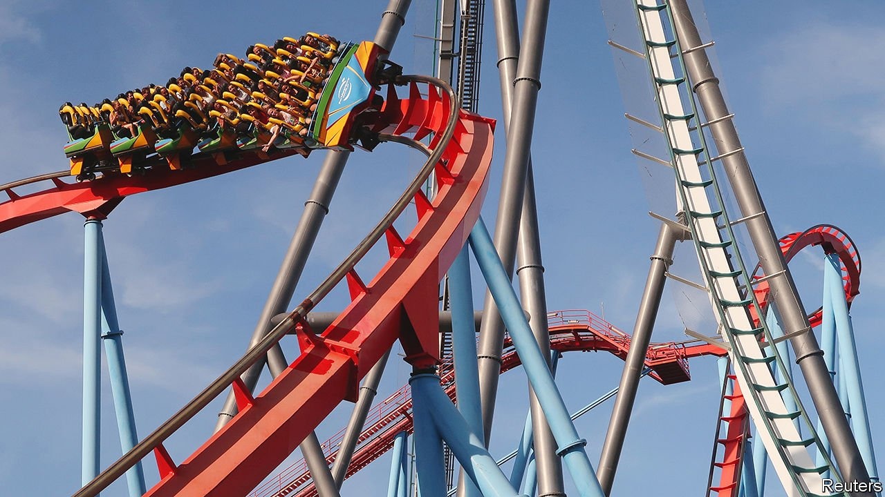
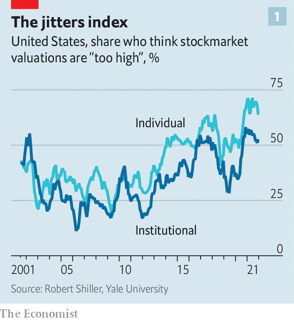
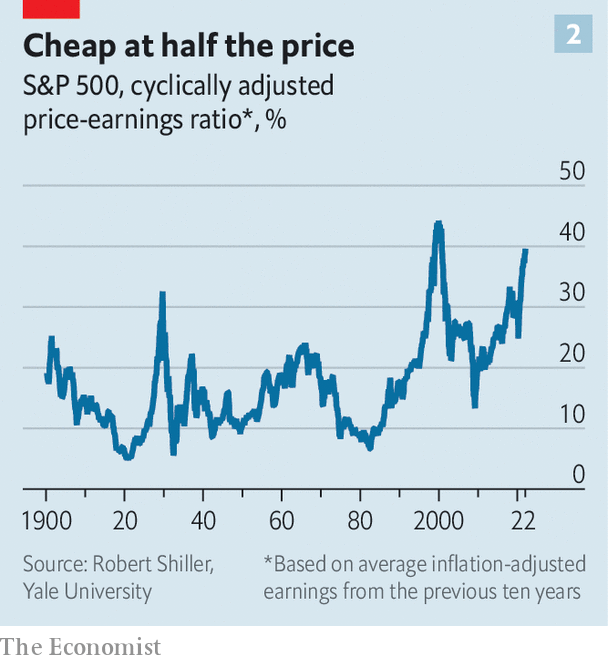
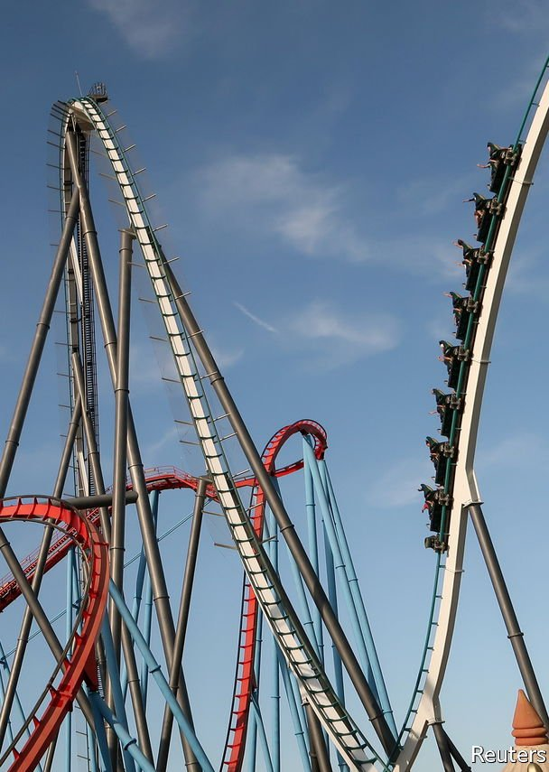
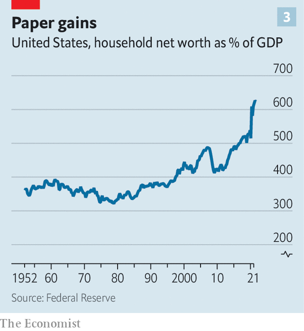

###### What goes up?

# Is the modern, bank-light financial system better than the old one? 

##### Brace for a stress test 

 

> Feb 12th 2022 

THE PARALLELS between rollercoasters and financial markets are plentiful. Both go up, both go down. A mountain-high climb is often followed by a stomach-churning plunge. And, on reaching the peak, some riders start to wonder whether they will make it off alive.

The recent tumult in stockmarkets has brought the fairground metaphors flooding back. Should equity investors brace for a sickening lurch downwards? And as they plummet, will the groaning girders beneath them—the infrastructure underpinning markets—hold firm? The structure of finance has changed dramatically since the financial crisis of 2007-09. Every new big-dipper has to go through rigorous testing to ensure it is safe to ride. Post-crisis global markets may be about to experience a wrenching stress test of their own—though with cars packed not with dummies but actual people.


For almost two years after markets recovered from a brief but vertiginous slide when covid-19 spread globally, investing was a scream. Much fun was had bidding up shares in Hertz, a bankrupt car-rental firm; engineering a short-squeeze in shares of GameStop, a video-game retailer; and piling into cryptocurrencies, including dogecoin, a joke one. With markets so buoyant, picking winners was like shooting fish in a barrel. Stocks, particularly those of tech giants, were supercharged by the Federal Reserve’s announcement in March 2020 that it was cutting interest rates to zero and would begin buying Treasury bonds and other assets. The S&amp;P 500 reached all-time highs on 70 of the 261 trading days in 2021. Only in one other year, 1995, has it reached a greater number.

The laughter is not so loud now. On January 27th the S&amp;P 500 closed in correction territory, 10% below its high at the beginning of the year (it has since regained some lost ground). The NASDAQ composite, a tech-focused index, is down by 9.8% from its all-time high in November. Volatility is back with a vengeance: on January 24th, for instance, on the back of no obvious catalyst, the S&amp;P 500 sold off by almost 4% before a sharp rally saw the index close up 0.3% (and then tumble again the next day).

 


Robert Shiller of Yale University, who won a Nobel prize for his work on financial bubbles, sees parallels with the go-go years before the crash of 1929. Back then, “there was an explosion of fun things to do with stocks. I think we’re in a similar situation now.” According to Mr Shiller’s surveys, over the past year the share of individual investors who think the market is overpriced has been higher than at any point since the turn of the millennium, before the dotcom bubble burst (see chart 1). Yet at the same time their belief that stocks will rally if there is ever a fall has never been so high. This contradictory combination of fear of overvaluation and fear of missing out mirrors the dynamic in 1929.

The proximate cause for the boom in valuations is more than a decade of all-but-free money. Central banks slashed interest rates after the financial crisis, then took monetary and fiscal support to new levels in response to the pandemic. This lit a rocket under asset prices. The average stock in the S&amp;P 500 cost 40 times its earnings in early January, as measured by the cyclically adjusted price-to-earnings, or CAPE, ratio, a level so high it is only topped by the period which preceded the stockmarket crash of 2000 (see chart 2).

 


Frothy valuations attracted a torrent of capital-raising. A record-breaking $600bn was raised in initial public offerings in 2021. Private-equity firms saw the pots of capital they oversee overflow. Nor were stocks the only financial assets soaring. Cryptocurrencies leapt by even more. House prices in America have climbed by 29% since the start of 2020.

“All asset prices are where they are today because of liquidity and interest rates,” says Greg Jensen of Bridgewater Associates, a hedge fund. As demand for goods and services has jumped in the face of supply-chain constraints, the consequences have cropped up as inflation and shortages. This has forced policymakers to change course and start removing liquidity. As recently as October investors expected just a single 0.25 percentage-point rate rise from the Fed in 2022. They now expect five, and there is talk of the Fed beginning “quantitative tightening”, selling off its bond holdings, later this year. This reality is now “catching up” with valuations, says Mr Jensen.

A correction—quite possibly a big one—appears to be unfolding, then. The most important question is whether the financial system is equipped to handle the ride. “Markets need to be able to correct, and some people will lose money. That is a necessary part of the process,” says Sir Jon Cunliffe, a deputy governor of the Bank of England. “What matters is does that knock on to something else or is that correction absorbed? You want a financial system that can absorb corrections.”

The last big correction, in March 2020, was a weird one. Caused by an exogenous shock—the pandemic—it was easy for policymakers to justify intervention. The last crash caused by endogenous financial risks was that of the global financial crisis. Since then the financial system has undergone a period of unusually rapid technological and regulatory change which has fundamentally altered its structure. It is hard to know how a correction would rattle through this new system.

The financial landscape has been altered in three main areas: who owns financial assets; which firms intermediate markets; and how transactions are settled.

Start with the owners of assets. A smaller share of these is now held on bank balance-sheets. In 2010, just after the crisis, banks held $115trn-worth of global financial assets. Other kinds of financial institutions, such as pension funds, insurers and alternative asset managers, held roughly the same amount. But non-banks’ slice has swollen far more quickly since. By the end of 2020 they held $227trn, 26% more than the banks did. The share of American mortgages that originated in banks (many of which they held on to) was around 80% before the financial crisis. Today around half originate outside the banking system and most of these are sold on to investors.

A post-banking world

The composition of non-banks has also changed. In the past most individual investors held their financial assets indirectly, through pension funds. In the early 1990s around a quarter of the wealth of American households came from claims on defined-benefit pensions and just 10% was in equities directly. Today, households hold 27% of their wealth directly in stocks, the highest-ever share. Just 15% comes from pension claims.

It was a lot harder for those individuals to move in and out of investments before the financial crisis than it is today. Thanks to the rise of low-cost retail brokerages, it is now trivially easy for people to buy or sell stocks or bond funds on a smartphone. The ease with which the little guy can trade has made it far easier for there to be a run on the investment industry. And the investment industry does not have the same backstop that banks enjoy through deposit insurance and central-bank support.

Next consider the intermediaries. Bank trading desks have long been outcompeted by specialist high-frequency trading firms like Citadel Securities, with whizzy algorithms which automatically match buy and sell orders. But increasingly, over the past decade, there has also been a retreat from bank intermediation of Treasury and corporate bonds, owing to both technological and regulatory changes, including new rules that deter banks from holding trading assets.

Broker-dealers’ gross inventory positions of Treasury securities fell from 10% of outstanding bonds in 2008 to just 3% in 2019. The share of corporate bonds held by dealers has fallen even further, to less than 1%, down from 8% in 2007. This hampers their ability to act as middlemen in markets in times of trouble. It can also amplify the impact of the failure of a fund. “Twenty-five years ago, if a bank had a client that could not make a margin call the bank could bid [buy] that position itself and absorb it on its balance-sheet. But now banks don’t have that balance-sheet. So they just hang out a For Sale sign and everybody sees it and it just drives the market down further,” says Robert Koenigsberger of Gramercy Funds Management.

At the same time as capacity to intermediate has dropped the supply of bonds has grown, in part driven by a deluge of government supply and in part because corporate borrowers rely more on debt issuance than bank loans. And the demand to trade bonds has been fuelled by the growth in exchange-traded funds (ETFs) built by the likes of BlackRock, the world’s largest asset manager.

It used to be hard to buy bonds in small increments. Now, thanks to ETFs, it is much easier. Some of the fixed-income ETFs offered to individuals by BlackRock might have 8,000 or more different bonds in them. If demand for units of the fund rises or falls it begins to trade above or below the fair value of its component bonds. That incentivises market-makers to intervene, either creating units by buying up a portfolio of similar bonds or destroying them by selling a portfolio. Much of this activity is automated.

Problems can arise in times of stress. ETFs trade far more frequently than their component bonds. In March 2020, as volatility shook markets, BlackRock’s biggest investment-grade corporate-bond ETF traded 90,000 times a day, while the top five holdings of the fund traded just 37 times. Some argue that this makes bond prices more accurate. But it can also reveal just how volatile prices are in times of stress and could encourage a run.

The problems can be most acute with investments like emerging-market bond funds. In times of stress, liquidity dries up. If funds need cash to meet redemptions they have to sell their most liquid assets, like Treasuries, instead of their emerging-market bonds. These dynamics contributed to the pressure on liquidity in the Treasury markets in March 2020.

 


Finally, think about the settlement layers. In the past, banks often settled complex trades like derivative contracts or interest-rate swaps bilaterally. But during the financial crisis this meant that they could only see the trades they had with each bank, not the full picture. Each had no idea whether there were mitigating (or exacerbating) trades with others. Fearful their counterparts were insolvent, banks stopped lending to each other.

International regulators decided to try to fix these issues by forcing more derivatives trading through central clearing houses, which settle trades between a wide range of members. Positions are transparent and netted off. To join a clearing house a member must post an “initial margin” in case it defaults on its trades, and that margin can climb if markets move against it. There are now a handful of major clearing houses worldwide including LCH in London, which clears most interest-rate swaps; ICE in Atlanta, which settles credit default swaps; and the DTCC in New York, which clears and settles American shares.

In sum these changes have reduced the role of banks: they own and intermediate less than ever before, while settlement is now carried out by centralised institutions. In many ways this seems like an improvement over the old system, in which banks whose failure could rock entire economies were highly leveraged and exposed to swings in asset values. But it comes with its own potential perils.

One risk is that although leverage has fallen in banks, it has grown in some non-banks, from insurers to hedge funds. A stark illustration of this was the blow-up of Archegos Capital Management, a previously low-profile family office, in March 2021. The case also showed that banks can remain dangerously exposed even when it is non-banks taking the craziest risks. Archegos’s collapse caused banks—mostly those that had served it as prime brokers—more than $10bn of losses.

 


How might this high-tech, bank-light financial system fare under severe stress? Some insight can be drawn from recent mishaps. In 2019, as the Fed cut its holdings of Treasury bonds, interest rates in the overnight repurchase market, where banks and investors swap Treasuries for cash, spiked as high as 10%. In March 2020 the Treasury market went into spasms when a flood of sellers, spooked by illiquidity elsewhere and desperate for cash, all tried to offload bonds at once. Market-watchers like Mohamed El-Erian, chief economic adviser at Allianz, an insurer, think the short-squeeze in GameStop wiped as much as 5% off the S&amp;P 500 as hedge funds with open short positions were forced to deleverage their portfolios.

In the first two cases the Fed ultimately saved the day by buying assets and creating liquidity. During the GameStop saga the clearing system imposed such high capital calls on Robinhood and other brokerages that they were forced to suspend trading, halting the squeeze. Had it been allowed to continue it could conceivably have bankrupted enough funds, and caused them to fail to deliver enough GameStop shares, that the retail brokerages would have been forced to buy the required shares at any price. That could have caused them to go bust, too.

It is possible to imagine such an event causing havoc. Instead of retail traders and other investors buying the dip, as has been their habit, markets continue to slide. Moves are big and wild because market-making capacity is reduced. Margin calls go out to a slew of hedge funds, some of which fail to meet them because they are more leveraged than anyone anticipated. Bond and equity funds suffer overwhelming outflows. To meet redemptions, managers sell their most liquid assets, like Treasuries or blue-chip stocks, causing yields to jump and equities to fall further. Retail investors use their brokerage apps to bale out of their investments, too.

Even if this does not trouble the banks much, such an event could upset the wider economy. “Ownership has widened significantly,” says Mr El-Erian. “That is a good thing long-term, but in the short term it might amplify household financial insecurity. People with less income and less of a wealth buffer now have a greater proportion of wealth subject to volatility.”

In some ways this would mark a return to form. In the 1990s people would go out shopping on the back of wiggles in the Nasdaq, because they felt suddenly richer. That connection seems to have returned, especially for moves in cryptocurrencies and popular stocks.

In extremis, volatile markets could prompt bankruptcies of enough leveraged investors or funds to wipe out a member of a clearing house—perhaps a smaller, weaker bank or insurance fund—which might in turn wipe out the clearing house’s default fund. This would send margin calls around all of the banks. If they, weakened by the same defaults that felled the other member, failed to meet these, the clearing house itself could be jeopardised. Paul Tucker, a former deputy governor of the Bank of England, has written that a clearing house that could not withstand a member’s default could be a “devastating mechanism for transmitting distress across the financial system”.

Both pedals at once

This scenario is speculative fiction. At some point central bankers would step in. The advantage of market-based finance is that intervening by buying assets is often enough to quell dysfunction. But it is harder for central bankers to intervene if their financial-stability objectives and inflation mandates are pulling them in different directions, as they would be at present with inflation well above target in many advanced economies. “You’d be sort of stepping on the brake while trying to keep one foot on the accelerator,” says Sir Jon. “It’s not impossible but it could be difficult.”

The big vulnerability of the new financial system is that chaos can be self-fulfilling: more participants are exposed to market swings, and those swings have become potentially more violent. The banks themselves are certainly much more resilient than they were before the global financial crisis. Yet it is difficult to know whether the high-tech, market-based financial system that has been created is sturdier than the more bank-based system of 15 years ago. Those still in for the ride may not have to wait long to find out. ■

