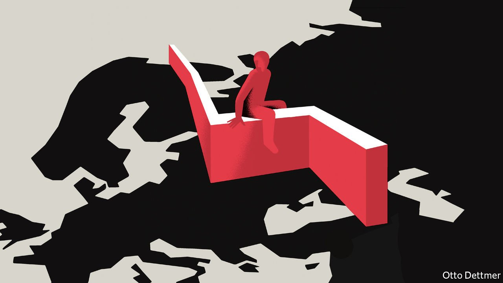

###### Free exchange

# The promise of former eastern-bloc economies is mostly unfulfilled 

##### But those that joined the EU have done much better than the rest 

 

> Feb 12th 2022 

WHETHER OR NOT Vladimir Putin sends Russian troops into Ukraine, increasingly icy relations between East and West may signal a coda to the era of increasing global economic integration which began with the collapse of communism. In the mid-1980s scarcely a quarter of the world’s population lived in economies which could be considered open to foreign trade and capital flows, according to an estimate published in 1995 by Jeffrey Sachs, Andrew Warner, Anders Aslund and Stanley Fischer. Less than a decade later, the figure had jumped above 50%, and a three-decade burst of rapid globalisation was under way.

The era of openness has been good for much of the world. Yet the performance of the countries of the former eastern bloc has been decidedly mixed. While some, like Poland and Latvia, grew faster than the emerging world as a whole between 1992 and 2019, Russia did little better than the far richer American economy, and Ukraine did worse. Thirty years on, the question of why some succeeded while others failed remains difficult to answer.


In the critical early years, transitional governments faced huge challenges. Their economies lacked functioning labour and capital markets, and were burdened by uncompetitive manufacturing sectors and a forbidding macroeconomic picture. In the early 1990s inflation exceeded 1,000% in Estonia, Latvia and Lithuania, and 2,000% in Kazakhstan, Russia and Ukraine. Economists broadly agreed on what should be done: economies needed to be opened to trade and market forces, state enterprises sold off, and new institutions built. They differed, though, on how fast to do it. Some, including Mr Sachs, argued for a speedy transition—an approach dubbed “shock therapy”—reckoning that rapid reform would reallocate capital faster and put food on shelves sooner. Critics reckoned that a slower pace would accommodate more institutional reform, and win more political support.

In practice, most governments wasted no time opening to trade and confronting macroeconomic challenges. Strategies diverged with respect to privatisation. Some, like Estonia, moved relatively slowly, matching buyers to enterprises one at a time. Others, like Russia, favoured rapid privatisation through schemes which transferred shares to existing managers and employees (though the Russian state retained stakes in critical industries like oil and gas). Building new institutions took longest of all. Early results were mostly disappointing. A few countries notched up healthy growth: in Poland, GDP per person, on a purchasing-power-parity basis, rose at an annual average pace of nearly 8% in 1992-98. Most did not. The core of the former Soviet Union experienced a collapse in incomes—punctuated, in Russia, by a financial crisis.

By the 2000s some economists were calling for a reconsideration of the fast-versus-slow debate. In 2006 Sergio Godoy and Joseph Stiglitz argued that faster privatisations had in fact been associated with slower economic growth, and that persistence in developing high-quality legal institutions paid dividends. Similarly, work published by Jan Svejnar in 2002 credited thorough reforms in places like Poland and Hungary for lifting growth, by securing property rights and encouraging good corporate governance.

While economists reassessed, the facts on the ground changed. From 1998 to 2013 all of the post-communist world enjoyed a boom. Per-person annual GDP growth accelerated to 7% in the Baltic states and Ukraine, 8% in Russia and 13% in Turkmenistan. Russia’s resurgence enabled it to recapture some geopolitical stature. And the robust growth of emerging markets as a whole, led by China, forced economists to reassess the importance of democracy and the rule of law.

Yet in recent years a different picture has come into focus. From 2014, the long boom in commodity prices ended and the fortunes of economies which had hitched their wagons to resource exports turned. From 2013 to 2019, GDP per person in Turkmenistan shrank, while growth in Russia and Kazakhstan decelerated sharply. As economies stalled, living standards stagnated and corruption and inequality became harder to ignore. Frustrations exploded onto city streets in Kazakhstan in January.

You don’t know how lucky you are

Among the economies which joined the EU, in contrast, growth remained strong. In 2016, GDP per person in Romania overtook that in Russia. While much of the former Soviet Union remained dependent on exports of grain, gas and gold, central Europe and the Baltics became deeply integrated with European labour and financial markets, and tied into European supply chains. Sailing has not been entirely smooth; over the past decade, populist governments in Poland and Hungary have weakened democratic institutions. But such systems remain miles away from the authoritarian regimes common across most of the post-Soviet world.

These divergent experiences raise difficult questions: did the quality of institutional reform determine the economic and political avenues available, for example, or did other factors—like natural-resource endowments or the prospect of closer ties with the EU—affect how robust reforms were? Certainly, the literature on transitional economies suggests that countries faced different internal constraints as they reformed. An analysis of Russia’s experience in 1993 by Maxim Boycko, Andrei Schleifer and Robert Vishny reckoned that the country’s privatisation scheme favoured insiders because management and employees enjoyed outsized influence within the Russian parliament, without whose support privatisation could not proceed, to take one example.

And yet external forces do influence internal politics. Western Europe’s attractions surely shaped decisions taken in Warsaw and Budapest, and continue to in places such as Belgrade, Tirana—and Kyiv. The lure of close ties with the rich West can be a powerful inducement to reform, and a spur to growth and democratisation: a fact Mr Putin seems to recognise all too well. ■

Read more from Free Exchange, or column on economics: (Feb 5th) (Jan 22nd) (Jan 15th)


