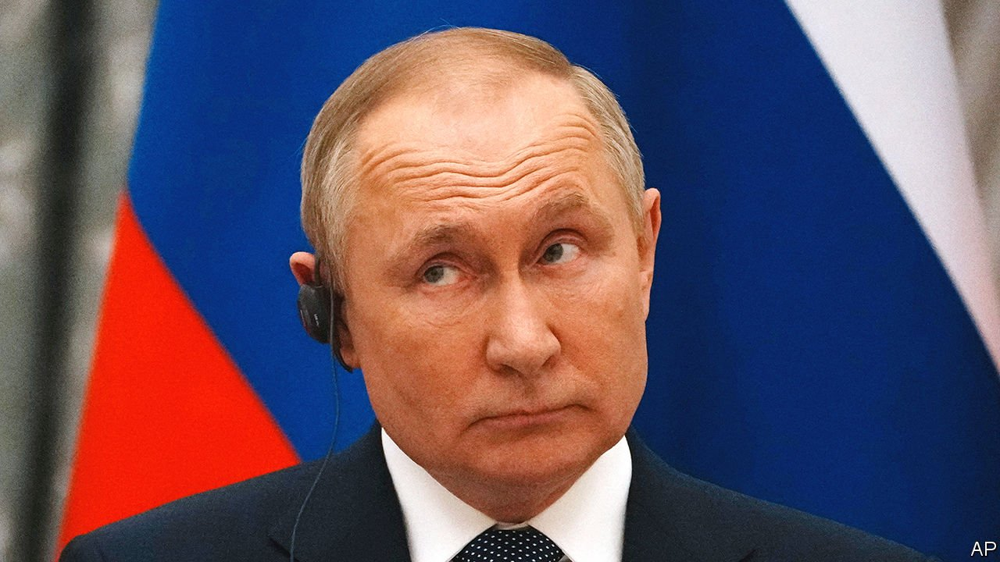

###### Minsky moment

# Diplomacy has created an opening for detente in Ukraine, but beware a trap 

##### Russia is invoking the Minsk agreement to sow chaos, not to bring peace 

 

> Feb 12th 2022 

NOTHING CONCENTRATES minds like 130,000 troops poised to invade. For years relations between Russia and the West have languished, but the Russian forces converging on Ukraine have caused a spasm of diplomacy. On February 7th and 8th Emmanuel Macron, France’s president, went to Moscow and Kyiv with plans to prevent war. He was to be followed east by the British ministers of foreign affairs and defence. Next week will be the turn of Olaf Scholz, Germany’s chancellor.

All face two sets of Russian demands. One is to recast Europe’s security architecture by constraining NATO in the east. The other is to lock Ukraine in Russia’s orbit. Of the two, Ukraine is more urgent and perilous. The danger is that in seeking to avoid an invasion, the West lumbers Ukraine with a deal that leads to internal chaos, or even civil strife.


The fulcrum is Donbas, where Russian-backed separatists have been at war with the rest of Ukraine since 2014. The Minsk II agreement, signed in 2015, including by a Ukrainian negotiator, was supposed to stop the fighting, but much of it has never been implemented. Russia’s president, Vladimir Putin, wants the West to force the Ukrainian government to comply. Mr Macron and Mr Scholz, backed by the Biden administration, see Minsk as an opportunity.

, and they are right to be worried. Minsk is not a treaty so much as a sketch scrawled on the back of an envelope. In fewer than 900 words in its English version, it deals mostly with the ceasefire, dodging hard questions about what comes later. It declares that the renegade regions have a “special” status, without defining what that is. It says there will be elections, but not who can stand or vote. Unspecified “representatives” will help write a new constitution. Which side must do what and when?

Vagueness suited Mr Putin, who all along saw Minsk as a tool to manipulate Ukraine. The special status is sometimes taken to mean that the Donbas region should have a veto over foreign policy, including membership of NATO. Mr Putin has backed elections there that excluded most of those sympathetic to the government in Kyiv. He has issued hundreds of thousands of Russian passports and controls perhaps 40,000 local troops, whose leaders he wants to help write the new constitution. His version of Minsk is a Trojan horse that would either put Ukraine under Russian control or foment chaos.

For all those reasons many Ukrainians see Minsk as utterly unacceptable. Yet its very vagueness creates a diplomatic opening, which Volodymyr Zelensky, Ukraine’s beleaguered president, could exploit in order to take back the initiative. Mr Putin’s is just one of many possible interpretations of Minsk. Talks involving France, Germany, Ukraine and Russia could put flesh on the agreement so as to limit the special status of Donbas, ensure fairer voting and make sure that delegates from Donbas to a constitutional convention are properly elected, not simply appointed by the Kremlin. After the agreement, Western powers could support Ukraine politically, economically and diplomatically.

Would Mr Putin agree to that? Perhaps not. In any case the West should not force a deal on Ukraine. That would abrogate Ukrainian sovereignty and destabilise the whole country, with unpredictable consequences that could spill back into the European Union.

Mr Putin must weigh the odds, too. Talks over Ukraine, followed by more talks with NATO on, say, arms control, could ease tensions and give him some of what he wants. He could tell Russians he is a statesman who has avoided being goaded into war by the West. By contrast, refusing to talk would leave him no tool except an unpredictable, long and (for Russia) possibly ruinous war. Mr Putin has kept people guessing as to what he really wants. Talks over Minsk are the best and safest way to find out. ■

All of our recent coverage of the Ukraine crisis can be found 

