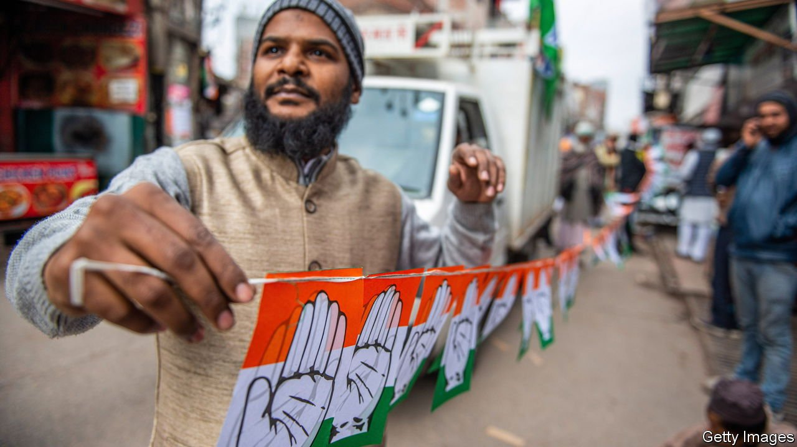

###### Festive but fraying

# India’s democracy is not as healthy as this month’s elections make it seem 

##### It is not just sectarianism that is ailing the body politic 

 

> Feb 12th 2022 

THE PHRASE “state election” does not do it justice. Over 150m people have registered to take part. They will throng to 174,351 polling stations in the course of seven rounds of voting spread over a month. There will be thousands of candidates and hundreds of parties. There are even 39,598 voters aged 100 or more, for whom special provision will be made. And all this is just in the biggest state—Uttar Pradesh—of the five that are holding elections in India in the coming weeks (see Briefing).

There will be lots of talk of a “festival of democracy”—and so it will be. Every caste, every sect, every view will be catered for. The candidates include film stars, holy men, feminists and entre preneurs. Three different sorts of communists are competing: Marxist, Marxist-Leninist and the garden variety. And although the Bharatiya Janata Party (BJP), which runs both the national government and those of many states, is favoured to win in Uttar Pradesh and elsewhere, its victory is by no means guaranteed. Uttar Pradesh may be as poor as Mali, and deeply divided by caste and religion, but it is also a genuine democracy. Its voters have a meaningful choice, and often confound the pundits.


Just because Indian democracy is full of life, however, does not mean that it is healthy. Its most commonly lamented ailment is growing sectarianism, stoked by the Hindu nationalists of the BJP. In Uttar Pradesh the party chose as chief minister Yogi Adityanath, a Hindu cleric who casts politics as a struggle to overturn the legacy of 1,000 years of Muslim invasions and return power and pride to the Hindu majority. Such talk leads to frequent discrimination and violence against Muslims and could one day fuel a conflagration.

But Hindu chauvinism is far from India’s only political malaise, and the BJP is not the only party tainted by it. In fact, the BJP’s anti-Muslim rhetoric has been such a hit with voters that other parties, too, have become ever less willing to speak up for minorities. Few are fielding many Muslim candidates in Uttar Pradesh, for example, although 19% of the voters are Muslim.

Other vices are shared by all the big parties. Take another worrying aspect of the : many of them are criminals. A shocking 43% of those who won seats in the national parliament at the most recent general election, in 2019, had been charged with crimes of some sort. For 29% the charges involved grave offences such as rape or murder.

Perhaps unsurprisingly, when these lawmakers arrive in office, they do not devote themselves diligently to the minutiae of drafting laws. Uttar Pradesh’s legislature used to meet for about three months a year back in the 1950s. Last year it managed only 17 days. The assembly in another state holding elections this month, Punjab, clocked up only 11 days in 2021. It is run by the Congress party, the main nationwide opposition to the BJP. Despite the infrequency of sessions in all these assemblies, attendance is low. And the process of legislating is becoming ever more perfunctory. Fewer and fewer bills are debated in committee; many are approved by voice votes.

Campaign finance is another worry. The BJP has introduced what it calls electoral bonds, which allow individuals and businesses to donate unlimited sums to political parties in secret, in effect. The BJP hoovers up three-quarters of the money donated in this way, but other parties are also happy to accept the scraps. It is impossible to allay suspicions that India’s industrialists are buying favours from the government, since no one knows who is making donations, much less whether there might be any quid pro quo involved.

These mechanical failings are not as glaring as the rise of Hindu nationalism, but they could be highly damaging, since all parties suffer from them. Even if voters in Uttar Pradesh spurn the divisive rhetoric and discriminatory policies of the BJP, as they should, the steady corrosion of the internal workings of democracy means that they are unlikely to secure a thoughtful, effective and responsive government.

Naturally, that matters very much for ordinary Indians. It also matters for the world. India is the planet’s most populous democracy. By upholding political freedoms for 75 years, bar a two-year hiatus under Congress in the 1970s, it has set a heartening precedent for the developing world. But these days it is looking less and less like a model. In a world where authoritarian China seems to grow stronger by the day, it has never been more important for India not just to hold elections, but to repair the underpinnings of its democracy, too. ■

