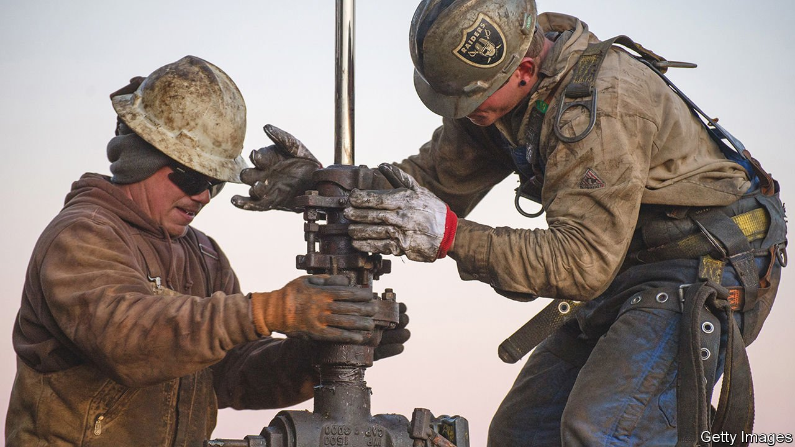

###### Green investors’ filthy secret

# The truth about dirty assets 

##### Polluting businesses are moving into the financial shadows 

 

> Feb 12th 2022 

SINCE 2016 the value of investments in financial products that claim to abide by environmental, social and governance (ESG) rules has grown from $23trn to $35trn. Bloomberg Intelligence, a research firm, reckons it could exceed $50trn by 2025. ESG funds typically tell their customers that, among other things, they do their bit to tackle climate change when they invest in publicly listed companies. Most individual investors take these claims seriously and buy these funds in good faith.

Such faith is not always well-placed. A lack of rigorous measurement means that greenwashing is rife and bogus claims go uncontested. Many funds claim that there is no trade-off between maximising profits and green investing, which seems unlikely for as long as the externalities created by polluting firms are legal and untaxed. And ESG funds often seek to meet their goals simply by excluding the shares of firms in polluting industries from their portfolios, and piling instead into pricey tech stocks, from Alphabet to Zoom.


As we report this week, the  and the stigma faced by publicly listed energy firms is having an unintended side-effect. The Western world’s dirty assets are heading into the shadows. Public firms, including European oil majors such as Shell, and large listed mining outfits, are selling their most polluting assets in order to please ESG investors and meet their carbon-reduction targets. But those oil wells and coal mines are not being shut down.

Instead they are being bought by private companies and funds that have alternative sources of capital and stay out of the limelight. Little wonder: owning dirty assets may require a thick skin, but it is likely to be profitable. Private-equity firms have snapped up $60bn-worth of fossil-fuel-linked assets in the past two years alone, from shale fields to pipelines. Their appetite may grow as turmoil around Ukraine sends oil prices back up over $90 a barrel.

This retreat to private ownership is part of a broader global trend. More opaque institutions are taking over dirty assets. State-owned oil giants such as Saudi Aramco do not have to worry overmuch what ethical investors think. Nor do the government-run firms and banks that own or finance a vast archipelago of coal-power projects across Asia.

The shift to the shadows is problematic for two main reasons. First, the claims being made by listed firms (and ESG funds) that they are helping to decarbonise the planet are questionable. Selling a polluting asset does not, in itself, reduce emissions at all, if it keeps pumping oil or digging up coal. Second, as dirty assets pass into private hands, it becomes harder to tell if their owners plan to reduce their output over time, or expand it. All that has been created is a system of arbitrage, in which dirty assets change hands to misplaced applause.

What to do? First, impose more carbon taxes or carbon prices. Such tools are the best ways to align the profit motive with the imperative to cut emissions, and so unleash the power of markets to reallocate capital quickly and efficiently. And they can apply across the whole economy, not just to particular industries or forms of legal ownership. Long dismissed as politically impractical, they are gradually being introduced, at least in places. Almost half of all energy-related carbon emissions in G20 economies are covered by a carbon price, up from 37% in 2018, according to the OECD, a club of mostly rich countries. Still, coverage needs to expand further, and the price of carbon needs to be higher, to curb emissions more effectively.

The other answer lies with institutional investors, such as pension funds, endowments and insurers. Some are the proud beneficiaries of virtuous ESG funds whose portfolio companies are dumping dirty assets, and simultaneously the partners of private-equity funds that are eagerly buying them. If institutional investors are serious about being green, they should consider the entire carbon footprint of their portfolios. The task of measuring these footprints, and avoiding double-counting, is onerous but crucial.

Finally, investors should question the idea that the best way to make polluters pollute less is to dump their shares. Such dumping is supposed to raise the cost of capital for polluters, and thereby impede new investment by them. But this does not work if there is an abundance of alternative private cash willing to buy up those shares—which there is. Larry Fink, the boss of BlackRock, the world’s largest asset manager, has suggested a different approach. Sincere green investors—and there are plenty of them—should hold on to dirty shares and work with managers to reduce emissions. He is right. To be truly green, investment strategies must be less black and white. ■

For more coverage of climate change, register for , our fortnightly newsletter, or visit our 

