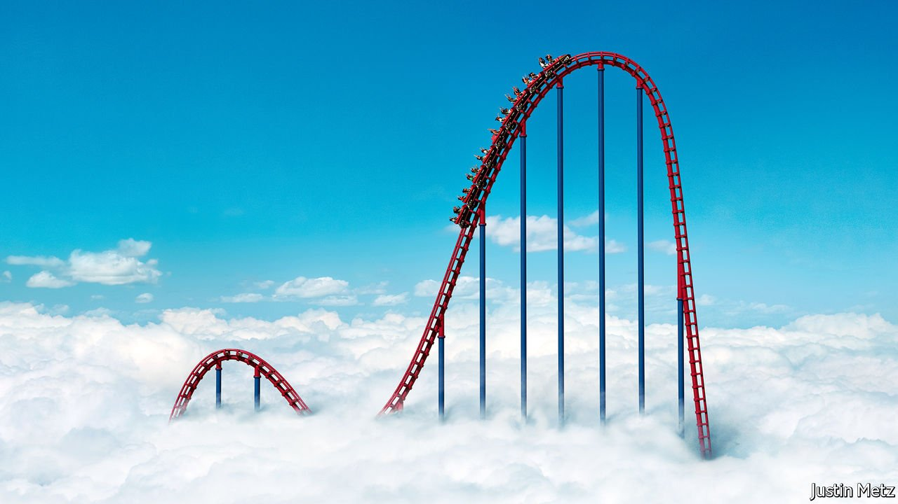

###### The next crisis

# What would happen if financial markets crashed? 

##### Look to history for a guide, but know that next time will be different 

 

> Feb 12th 2022 

“FOR HISTORIANS each event is unique,” wrote Charles Kindleberger in his study of financial crises. But whereas “history is particular; economics is general”—it involves searching for patterns which indicate if a cycle is turning. Today America’s financial system looks nothing like it did before the crashes of 2001 and 2008, yet lately there have been some familiar signs of froth and fear on Wall Street: wild trading days on no real news, sudden price swings and a queasy feeling among many investors that they have overdosed on techno-optimism. Having soared in 2021, shares on Wall Street had their worst January since 2009, falling by 5.3%. The prices of assets favoured by retail investors, like tech stocks, cryptocurrencies and shares in electric-car makers, have plunged. The once-giddy mood on r/wallstreetbets, a forum for digital day-traders, is now mournful.

It is tempting to think that the January sell-off was exactly what was needed, purging the stockmarket of its speculative excesses. But  is still loaded with risks. Asset prices are high: the last time shares were so pricey relative to long-run profits was before the slumps of 1929 and 2001, and the extra return for owning risky bonds is near its lowest level for a quarter of a century. Many portfolios have loaded up on “long-duration” assets that yield profits only in the distant future. And central banks are raising interest rates to tame inflation. America’s Federal Reserve is expected to make five quarter-point increases this year. German two-year Bund yields leapt 0.33 points last week, their biggest jump since 2008.


The mix of sky-high valuations and rising interest rates could easily result in large losses, as the rate used to discount future income rises. If big losses do materialise, the important question, for investors, for central bankers and for the world economy, is whether the financial system will safely absorb them or amplify them. The answer is not obvious, for that system has been transformed over the past 15 years by the twin forces of regulation and technological innovation.

New capital rules have pushed a lot of risk-taking out of banks. Digitisation has given computers more decision-making power, created new platforms for owning assets and cut the cost of trading almost to zero. The result is a high-frequency, market-based system with a new cast of players. Share-trading is no longer dominated by pension funds but by automated exchange-traded funds (ETFs) and swarms of retail investors using slick new apps. Borrowers can tap debt funds as well as banks. Credit flows across borders thanks to asset managers such as BlackRock, which buy foreign bonds, not just global lenders such as Citigroup. Markets operate at breakneck speed: the volume of shares traded in America is 3.8 times what it was a decade ago.

Many of these changes have been for the better. They have made it cheaper and easier for all types of investors to deal in a broader range of assets. The crash of 2008-09 showed how dangerous it was to have banks that took deposits from the public exposed to catastrophic losses, which forced governments to bail them out. Today banks are less central to the financial system, better capitalised and hold fewer highly risky assets. More risk-taking is done by funds backed by shareholders or long-term savers who, on paper, are better equipped to absorb losses.

Yet the reinvention of finance has not eliminated hubris. Two dangers stand out. First, some leverage is hidden in shadow banks and investment funds. For example the total borrowings and deposit-like liabilities of hedge funds, property trusts and money market funds have risen to 43% of GDP, from 32% a decade ago. Firms can rack up huge debts without anyone noticing. Archegos, an obscure family investment office, defaulted last year, imposing $10bn of losses on its lenders. If asset prices fall, other blow-ups could follow, accelerating the correction.

The second danger is that, although the new system is more decentralised, it still relies on transactions being channelled through a few nodes that could be overwhelmed by volatility. ETFs, with $10trn of assets, rely on a few small market-making firms to ensure that the price of funds accurately tracks the under lying assets they own. Trillions of dollars of derivatives contracts are routed through five American clearing houses. Many transactions are executed by a new breed of middle men, such as Citadel Securities. The Treasury market now depends on automated high-frequency trading firms to function.

All these firms or institutions hold safety buffers and most can demand further collateral or “margin” to protect themselves from their users’ losses. Yet recent experience suggests reasons for concern. In January 2021 frenzied trading in a single stock, GameStop, led to chaos, prompting large margin calls from the settlement system, which a new generation of app-based brokerage firms, including Robinhood, struggled to pay. The Treasury and money markets, meanwhile, seized up in 2014, 2019 and 2020. The market-based financial system is hyper active most of the time; in times of stress whole areas of trading activity can dry up. That can fuel panic.

Ordinary citizens may not think it matters much if a bunch of day-traders and fund managers get burned. But such a fire could damage the rest of the economy. Fully 53% of American households own shares (up from 37% in 1992), and there are over 100m online brokerage accounts. If credit markets gum up, households and firms will struggle to borrow. That is why, at the start of the pandemic, the Fed acted as a “market-maker of last resort”, promising up to $3trn to support a range of debt markets and to backstop dealers and some mutual funds.

Fine margins

Was that bail-out a one-off caused by an exceptional event, or a sign of things to come? Ever since 2008-09 central banks and regulators have had two unspoken goals: to normalise interest rates and to stop using public money to underwrite private risk-taking. It seems that those goals are in tension: the Fed must raise rates, yet that could trigger instability. The financial system is in better shape than in 2008 when the reckless gamblers at Bear Stearns and Lehman Brothers brought the world to a standstill. Make no mistake, though: it faces a stern test. ■

For subscribers only: to see how we design each week’s cover, sign up to our weekly 

