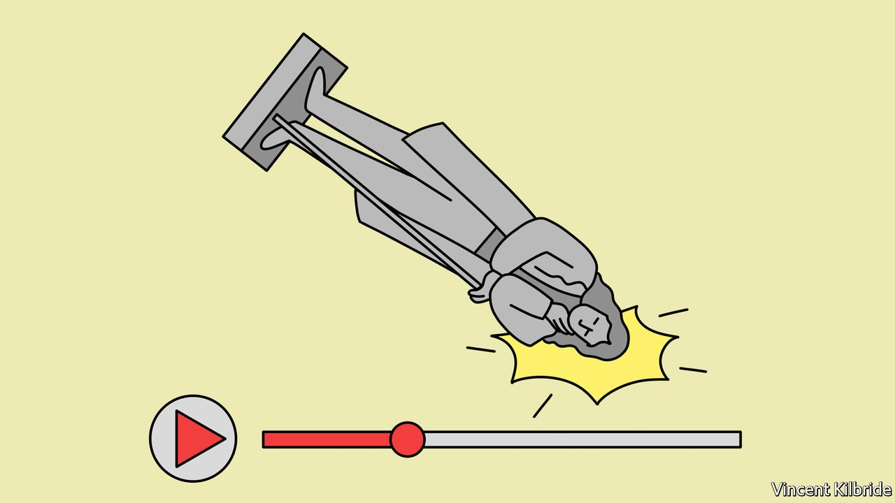
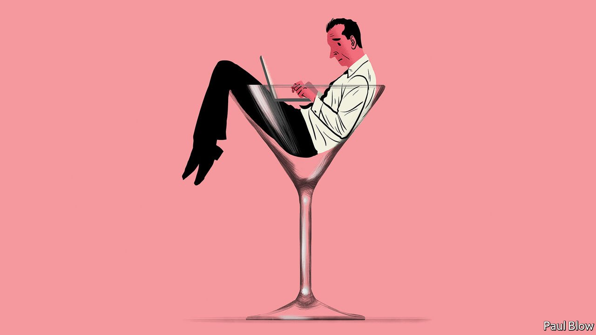

###### On Ukraine’s gas pipelines, the Cuban missile crisis, George McGovern, Bangladesh, police alternatives, culture, Boris Johnson

# Letters to the editor 

##### A selection of correspondence 

 

> Feb 12th 2022 


Ukraine’s gas pipelines

“” (January 29th) contained a map showing Europe’s gas-pipeline network. The figure you gave of 40bn cubic metres per annum (bcmpa) for the volume of gas transited from Russia via Ukraine is most certainly not a “theoretical capacity” of our extensive pipeline network. The Ukrainian system is designed to accommodate as much as 146 bcmpa of international transit. The image paints a picture in which Nord Stream 2 seems necessary; that is not so.


In 2021 Gazprom, Russia’s state gas company, exported 175 bcmpa to Europe through five major gas corridors. It is obvious, when the Ukrainian transit system is properly reflected, that the existing east-west pipeline network is fully capable of handling the gas flow. If Germany were to double its imports of Russian gas in 2022, the existing east-west transit system could easily handle it and have spare capacity left. In fact, Germany can triple its imports of Russian gas and the need for Nord Stream 2 still will not arise.

It is also readily apparent that the current gas crunch is not a question of transit capacities. The International Energy Agency has correctly concluded that Russia is orchestrating Europe’s gas crisis. We have no doubts that if Nord Stream 2 becomes operational, gas flows via Ukraine will be terminated and Gazprom will control all incoming gas pipelines into Europe. It is still not too late for Germany and for Europe to reject Nord Stream 2 and decisively defend our shared energy security.

SERGIY MAKOGON

Chief executive

Gas Transmission System Operator of Ukraine

Kyiv

 


Behind-the-scenes diplomacy

Bello stated that Soviet missiles were removed from Cuba in 1962 in return for an American promise not to invade the island (). Many academics consider America’s placement of missiles in Turkey as the trigger for the Soviet deployment in Cuba. Soon after the crisis America quietly removed its Turkish weapons. America didn’t have to advertise its concession and the Soviets got something they seriously wanted. With Ukraine in mind, diplomacy works on many levels.

BRUCE BABCOCK

Guildford, Surrey

 


If I knew then…

Your special report on the state’s new interventionism revealed governments’ widespread enthusiasm for taxes and regulation (). You warned that politicians lack experience of the private sector and should not mess with the classic liberal principles rediscovered in the 1980s. That reminded me of a stunning admission by George McGovern, the Democrats’ presidential candidate in 1972, who steered the party well to the left. After earning a small fortune in post-retirement speeches, McGovern bought an inn in Connecticut. In 1990 it went bankrupt and closed the following year. In a column written for the Wall Street Journal in 1992, the Democratic lion blamed the failure on suffocating red tape. He described these myriad regulations as being worthy in their intention, but admitted:


Blanket rules on business ignore the reality of the marketplace. After the pandemic, let’s hope government officials rediscover their pro-market memory, and that the guiding principles of liberal capitalism re-emerge.

FRANCOIS MELESE

Professor of economics

Naval Postgraduate School

Monterey, California

 


Bangladesh

The Economist's speculative stories on Bangladesh deprive its readers of the successes of Sheikh Hasina and the prime minister’s efforts to pursue a progressive development doctrine championing women and a secular Bangladesh founded on 1971 Liberation War values. (, January 29th). Bangladesh has leapfrogged to Asia's highest growth economy in the IMF's World Economic Outlook, is consistently ranked on top in World Economic Forum's South Asian Gender Parity Index, and is the Global Terrorism Index's most successful country in South Asia in countering terrorism. Our law enforcement agencies have also helped maintain stability across our borders and the region, such as providing shelter for the Rohingyas.

The article overlooked the proud history of women's rights in our Muslim-majority country and the strides made by our girls and women breaking stereotypes and glass ceilings in every sphere. Bangladesh is a country where women have historically been on the frontlines of national movements and where more girls than boys attend educational institutions. The Economist appears to misunderstand the resilience of Bangladesh and that it has overcome the odds to stand tall as a thriving nation after just 50 years.

ASHEQUN NABI CHOWDHURY

Minister (Press)

Bangladesh High Commission

London

 


Mental-health responders

It is not “all but impossible” to determine which 911 calls can replace police with trained mental-health responders (“”, January 15th). We have helped jurisdictions across America analyse hundreds of thousands of emergency calls, review call codes with law enforcement, identify situations that are less likely to result in arrest, rewrite call scripts to ask callers which emergency resources they need, and co-ordinate with clinicians who are embedded in 911 call centres to help triage mental-health calls. Initial data from communities that practise diversion tactics show that very few, if any, calls to alternative emergency- response programmes require law enforcement.

In Denver’s programme, not a single call has required police backup. Los Angeles has diverted hundreds of suicide-related calls to a local hospital with specialised suicide-response units. These approaches are logical and practical and free up police to focus on public-safety incidents that are better aligned with their training.

GLORIA GONG

Executive director

Government Performance Lab

Harvard Kennedy School

Cambridge, Massachusetts

 


Our new Culture section

Stories don’t only offer vicarious adventure and solidarity (“”, January 22nd), they have cognitive functions, too. Stories, whether associated with a computational model, novel or a film, convey models of the world that shape public reasoning. Just as Jane Austen’s novels model some of the rules of society in Regency England, so Kim Stanley Robinson, who spoke at COP26 in Glasgow, writes models of possible future societies as they adapt to climate change.

Story-listening is as important as story-telling, and The Economist’s new Culture section won’t only be acknowledging the erosion of past and present, its reflections on the present will inform the future.

CLAIRE CRAIG

Provost

The Queen’s College Oxford

SARAH DILLON

Professor of literature and the public humanities

University of Cambridge

 


Drunk on power

I enjoyed Bartleby’s column about drinking in the office (). Perhaps the inhabitants of Number 10 are simply taking their lead from Herodotus, who told us how the Persians made important decisions:


ALAN BUXTON

Rickmansworth, Hertfordshire

Boris Johnson’s accusation that Sir Keir Starmer failed to prosecute Jimmy Savile, Britain’s most notorious paedophile, is a perfect example of the adage that when the debate is lost, slander becomes the tool of the losers (, February 5th).

JOE KENNEDY

London

The world is watching Mr Johnson’s excruciating performances in Parliament. When in time this is written as an updated fable of Aesop, it might be titled, “The Tortuous and the Hair”.

BRUCE STENING

Canberra, Australia

