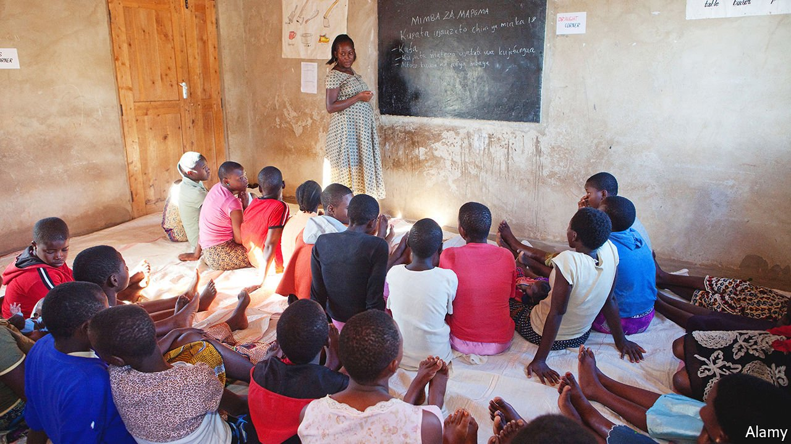
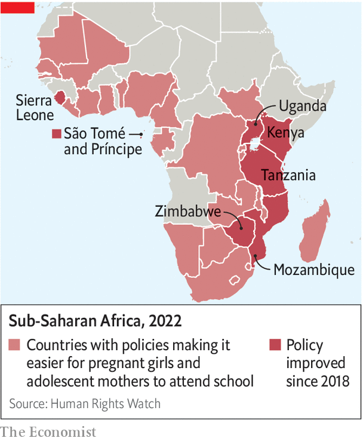

###### Back with a bump

# More African countries are letting pregnant girls stay at school 

##### Parents, principals and religious types still need convincing 

 

> Feb 12th 2022 

SARAH DID not know she was pregnant until teachers told her. In 2020 her state-run boarding school in Tanzania ordered tests for all the girls, who were returning after a three-month closure caused by covid-19. When her result arrived she was expelled and sent home. She was less than two years from graduating.

Sarah is one of thousands of girls harmed each year by a law that compelled schools to kick out pupils who were accused of “an offence against morality”. These expulsions were celebrated by John Magufuli, the previous president, who declared: “After getting pregnant, you are done.” Magufuli died last year, perhaps of covid. The government of his successor, Samia Suluhu Hassan, relented in November, saying it would let teenage mums come back into class.


Sub-Saharan Africa has roughly double the world’s rate of teenage births. Only 40% of girls in the region aged 15-17 attend school, compared with 45% of boys. This is partly because of policies like the one Tanzania has abandoned. Such rules are self-defeating, since there is a strong link between the number of years of schooling that girls complete and the number of babies they will subsequently have.

 


At least 30 African countries now protect the educational rights of pregnant girls and young mothers, according to Human Rights Watch (HRW), a pressure group. Half a dozen have made progress in the past few years (see map). New rules in Uganda, where about a third of girls marry before they turn 18, allow parents to report school principals who refuse to enroll young mothers. Mozambique and Zimbabwe have made schooling easier for teenagers with children, too. The last two holdouts still expelling the expectant are Equatorial Guinea and Togo.

The most celebrated recent reforms are in Sierra Leone. In early 2020 the government ended a ten-year ban on adolescent mothers attending normal schools. A year later it introduced a new policy—dubbed “radical inclusion”—that gives pregnant girls the right to remain in class until they give birth and allows them to return to lessons as soon as they wish. Local law considers girls who have sex before the age of 18 to be victims of a crime, says David Sengeh, the education minister. Forcing them to give up their schooling made no sense.

Many of these changes were in train before the pandemic. But some 30 weeks of school closures in Africa have made them all the more essential. The Mo Ibrahim Foundation, an NGO, reckons the hiatus deprived pupils in 23 African countries of roughly an eighth of the learning they would typically receive in their entire time in school. That is all the more worrying because they do not receive as much as pupils elsewhere to begin with.

In the early months of the pandemic World Vision, another NGO, estimated that around 1m sub-Saharan African children would drop out of school as a result of becoming pregnant during lockdowns. Reliable data on the impact remain scant. But the available evidence suggests that teenage pregnancies have indeed ticked up. Youngsters spent more time unsupervised, contraceptives were harder to come by and violence against women increased. One study of 500 rural adolescent girls in Kenya has found that after a six-month closure they were twice as likely to become pregnant as girls who had completed their schooling before the pandemic.

Governments have more to do. Few of them maintain policies as liberal as Sierra Leone’s. Uganda’s new guidelines require pregnant girls to leave school before their second trimester, for example, even if their right to return is much clearer than it was. Countries with enlightened rules often struggle to enforce them, says Elin Martinez of HRW. Principals, parents and village chiefs have to be on board. Mr Sengeh says he still runs into activists, both male and female, who tell him the new policy on pregnancy is a big mistake.

Mshabaha Mshabaha, of the Change Tanzania Movement, a campaign group, says he won’t be satisfied until his country’s new rules are written into law. Without that, he says, future governments may return to old habits. And they are too late for many, including Sarah, whose child is now almost a year old. “We gave you a chance to finish school,” her parents tell her. “And now you’ve lost it.” ■

