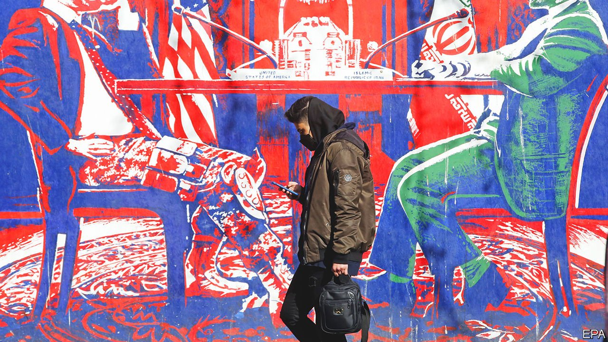

###### America and Iran

# Nuclear talks with Iran enter the endgame 

##### Time is running out to avert a new crisis in the Middle East 

 

> Feb 12th 2022 

IN A WORLD of increasing geopolitical rivalry—over Ukraine, Taiwan and more—the big powers have at least managed to co-operate in the diplomatic effort to contain Iran’s nuclear programme. Might negotiators in Vienna succeed in reviving the nuclear deal agreed on by Barack Obama in 2015 and abandoned by Donald Trump three years later?

The latest round, which began on February 8th, looks decisive. Negotiators have never been closer to a breakthrough, yet have also never been closer to a breakdown, says a source. Upbeat American officials say a deal is “in sight”. In an apparent gesture of goodwill, America last week said Chinese, Russian and European firms could again receive waivers from sanctions for some civilian nuclear activities in Iran. American hawks have also grown louder in their opposition. More than 30 Republican senators have warned President Joe Biden that he must submit any deal to the Senate or face “the full range of options and leverage” they can muster.


The dangers of a breakdown are readily apparent. Iran’s allies in Yemen, the Houthis, have intensified missile and drone attacks against the United Arab Emirates (UAE). That has prompted, in turn, the deployment of an American warship and advanced fighter jets, not just to help protect the UAE but to send an implicit warning to Iran. Israel, which worries about a “damaging” deal, has been rehearsing military strikes on Iran’s nuclear facilities. Its security co-operation with Gulf states is increasing, too.

The  (JCPOA), as the nuclear deal is known, strictly limited Iran’s nuclear programme and strengthened inspections in return for a lifting of many international sanctions. But it was denounced by Israel and even some Democrats. It allowed Iran to resume large-scale uranium enrichment after 15 years. It did not oblige Iran to end its ballistic-missile programme or its involvement in regional conflicts. Mr Trump, calling the JCPOA “the worst deal ever”, imposed a multitude of sanctions on Iran under a policy of “maximum pressure”.

In response, Iran progressively accelerated its enrichment of uranium, the fissile material required both for nuclear reactors and for bombs. It has spun some uranium to 60% enrichment, a hair’s breadth away from weapons-grade. It has also converted enriched uranium hexafluoride gas into uranium metal—for which the most likely use is in bombs—and hampered inspections by the UN’s International Atomic Energy Agency (IAEA). Rafael Grossi, the agency’s director-general, notes that Iran is the only country without nuclear weapons to enrich uranium to such a high degree. “What you have here is an Iran that has grown in width, in depth, in height, in all, in all dimensions, in its nuclear programme,” he says.

Iran’s “breakout time”—the period it would need to make a bomb’s-worth of fissile material—has shrunk to less than a month, much shorter than the year or more when the JCPOA was still in force. (Putting a nuclear warhead on a missile would take perhaps another year or two.)

Hence America’s insistence that the talks are entering the “endgame”. It believes that a deal will have little value unless concluded soon. The longer the negotiations drag on, the sooner the restrictions on Iran’s programme will expire under the JCPOA’s “sunset clauses”. Given Iran’s increased capabilities, even a quick return to the deal would no longer restore the full year’s breakout time, admits Rob Malley, America’s chief negotiator.

For the Iranians, too, the JCPOA is losing value. Any lifting of American sanctions is liable to be temporary, given that  may well be out of office in 2025. Mr Trump might be back in the White House. Any Republican president would face immense pressure to abandon the deal. American negotiators have rejected Iranian demands for a “guarantee” that sanctions will not be reimposed. Mr Biden cannot bind his successor, they say; the best he can offer is a promise to abide by the JCPOA if Iran remains in compliance.

Will such limited reassurance be enough? Optimists see a better-than-even chance of a deal, noting the shift in America’s positions. It would give the Iranian economy a boost at the start of Ebrahim Raisi’s presidency. Pessimists see a high likelihood of failure, reckoning that Iran wants to press its advantage, convinced that America will not go to war. The risk of misunderstanding is high, given that Iran refuses to talk directly to America (instead, it negotiates indirectly through European, Chinese and Russian diplomats).

Mr Biden says he will not allow Iran to get a nuclear weapon, but Israel is not reassured. It says Iran should not have the “capability” to acquire a nuke (but does not define this). Having promised a deal that would be “longer and stronger” than the JCPOA, the Biden administration will at best get one that is shorter and weaker. The blame for that lies in Mr Trump’s “catastrophic” withdrawal from the JCPOA, says the administration. It hopes that, once the JCPOA restores some stability, follow-on negotiations may improve its terms.

Western officials are also preparing for a breakdown, however. They are quietly discussing the next steps to increase economic and political pressure on Iran. One option would be for a European country—probably Britain—to invoke the “snapback” provisions of the JCPOA to reimpose UN sanctions. These would have limited impact and risk a breach between the West and Russia and China, whose acquiescence would increase the impact of any effort to impose more economic pain on Iran.

Thus far Russia and China have helped nudge Iran towards a deal. In December, for instance, they pushed it to return to its limited co-operation with the IAEA to avoid bringing the matter before the UN Security Council. Their ties with Iran are complex. Russia provides it with weapons and civil nuclear technology. China is the biggest buyer of its oil. Both seem keen on using Iran as a counterweight against American influence. But neither wants Iran to go nuclear. Nor do they seem to want a new crisis in the Middle East that will add to geopolitical instability.

The gathering storm in Ukraine may affect such calculations. Some diplomats hope the crisis there will hasten an agreement, as the big powers seek to contain their rivalry. Others fear that positions are already hardening. Russia and China last week issued a joint declaration denouncing America and its allies for fuelling “antagonism and confrontation” around the world. Iran could become another element of antagonism. If so, a new crisis in the Middle East will be added to that in Europe and the one looming in Asia. ■

