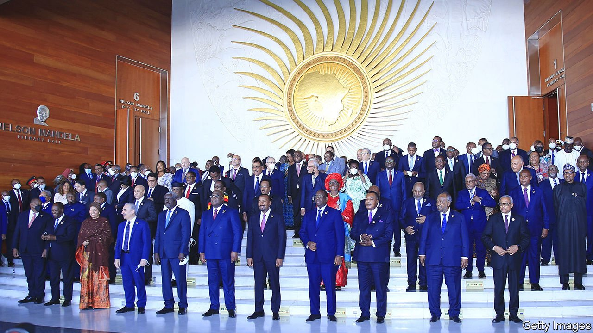

###### Older and less wise

# The African Union is less effective at 20 than it was at two 

##### Its enforcement of democratic norms is slipping 

 

> Feb 12th 2022 

IT WAS A birthday commemorated in style. In the heart of Ethiopia’s capital, Addis Ababa, the seat of the African Union (AU), water fountains erupted and champagne glasses clinked as heads of state and assorted dignitaries tucked into a four-course meal to the sound of sultry jazz.

The party marked 20 years since the AU’s founding. It coincided with the AU’s annual summit, which took place on February 5th and 6th. Abiy Ahmed, the prime minister of Ethiopia, seized the opportunity to thank his fellow African leaders. They had stood by his government through a challenging year, he said, confirming the principle of African solidarity upon which the AU was built. It was a veiled reference to his country’s civil war, which continues to rage a few hundred kilometres from the city. Neither he nor the other leaders made any mention of his tactics, which include starving into submission the 5m people of Tigray, a rebellious province. That would have ruined the festive mood.


Yet it is such horrors that keep thoughtful African officials up at night. The AU, which replaced its discredited predecessor, the Organisation of African Unity (OAU), in 2002, is supposed to resolve the continent’s wars, ease the flow of trade across its borders and help Africa to speak with one voice in world affairs. Thabo Mbeki, a former president of South Africa and one of the AU’s architects, promised a “continent of democracy” in which “the people participate and the rule of law is upheld”. Two decades on, its record is mixed.

The African Continental Free Trade Area, which took effect last year, is a genuine (if incomplete) achievement. So too are some of the AU’s early efforts at peace-keeping and upholding democracy. Unlike the OAU, which refused to interfere in the affairs of its members, the AU has the power to intervene, without consent, to stop a bloodbath. In 2004 it sent African troops into Darfur to halt a genocide. Three years later it established a mission to combat a jihadist insurgency in Somalia. And for almost two decades putsches had become much rarer, thanks in part to the AU’s strict no-coups policy.

In other respects, though, the AU has come to resemble the talking shop it supplanted. At each summit it approves admirable-sounding schemes. Too few go anywhere. In 2017 Paul Kagame, Rwanda’s president and soon to be chairman of the AU, spoke of a “crisis of implementation”. According to Bruce Byiers of the European Centre for Development Policy Management, a think-tank, “the gap between the number of continental initiatives and their entry into force” has widened over time. Mr Kagame warned of a “dysfunctional organisation in which member states see limited value…and our citizens have no trust”. According to Afrobaromoter, a polling firm, more than a third of Africans either think the AU is useless or have no opinion of it at all.

The AU’s ambition to end conflict on the continent (originally by 2020, now pushed back to 2030) has rarely seemed more daunting. In addition to the war in Ethiopia, jihadists sill run amok across large parts of Somalia and much of the Sahel. Mozambique is struggling to quell a bloody insurgency in its impoverished north. Eastern Congo seethes with rebel militias. Coups are also making a comeback: in the past year the AU has suspended four countries (Burkina Faso, Guinea, Mali and Sudan) because of putsches. Solomon Dersso of Amani, a think-tank in Addis Ababa, frets that there has been a “puncturing” of the democratic norms that the AU had been trying to enforce.

Others lament inaction. The AU’s peace and security council, a 15-member panel modelled on the UN Security Council, has “lost some of its energy and zeal”, says a former AU official. It chose not to expel Chad when the son of Idriss Déby, Chad’s late dictator, seized power after his father’s death last year. (The AU said the takeover was not a coup.) Pragmatism as well as diplomatic sensitivities partly explain this: Chad’s army plays an important role fighting jihadists in the Sahel, and Moussa Faki, a former Chadian foreign minister, is currently chairman of the AU‘s commission, its executive arm. Nonetheless, “this will constitute a precedent,” warns Mohamed Diatta of the Institute of Security Studies, another think-tank in Addis Ababa.

The commission’s dream of becoming something like the executive branch of the European Union has faded. Unlike the European Commission, it has no meaningful powers to enforce treaties or craft regulations. “It might be called a commission, but it is becoming more like a secretariat,” says a Western diplomat.

Game of phones

Paul Williams, an academic at George Washington University who has studied the AU, argues that African governments have also learnt how to game it. “At first the commission ran the show, and a lot of the member states didn’t know how to push back,” he says. “But as they have gained expertise and knowledge they have begun to exert themselves much more forcefully.”

Ethiopia is a prime example. For more than a year it has kiboshed a strong AU response to its civil war. AU mediators dispatched at the outset of the conflict were soon rebuffed. It took almost another year for the peace and security council to meet expressly to discuss the crisis (the fact that rebels were then threatening to storm Addis Ababa no doubt focused minds). Another mediation effort was established in August. It is led by Olusegun Obasanjo, a former Nigerian president who, happily for Abiy, chaired the AU electoral observation mission that endorsed Ethiopia’s questionable polls last year. Almost six months into the job, Mr Obasanjo is only now hiring staff.

Even if it were more willing to be firm, the AU has little by way of sticks or carrots to enforce its decisions. Countries, big or small, can thumb their nose at it. When the peace and security council voted to send troops to quell violence in Burundi in 2015 the Burundians “basically told them to bugger off”, says Mr Williams. Few are better at this than Ethiopia. Its government can lean on AU diplomats who displease it, or expel them altogether. But Mr Faki, in a candid address on February 5th, warned that cries of sovereignty were being used by African states as an “iron wall” against any intervention, and that expressions of solidarity were no substitute for action when “neighbouring houses [are set] ablaze”. It was a tacit admission that the task of building a union greater than the sum of its parts remains unfinished. ■

