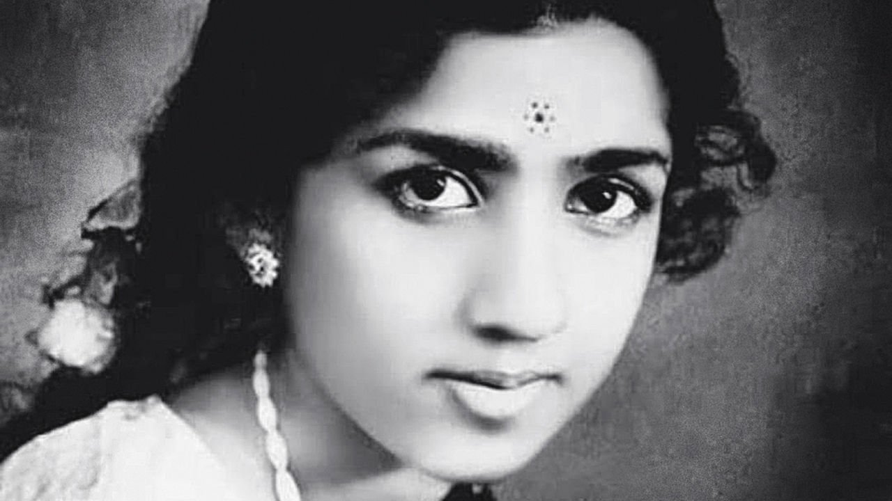

###### India’s nightingale

# Lata Mangeshkar was the soundtrack of newly independent India 

##### The most celebrated of all playback singers died on February 6th, aged 92 

 

> Feb 12th 2022 

THE SCENE is the garden of a palace in Allahabad where a young woman, ghostly in the twilight, is singing on a swing. Inside, in the grand ballroom, the owner of the palace sees a chandelier swaying in time to the song. The haunting beauty of this voice draws him out into the garden, but as he approaches the young woman disappears. All that is left is the empty swing and the song, “Aayega Aanewala”, “He will come, he who is to come”:


The young woman in “Mahal” (The Palace), made in 1949, was the great actress Madhubala, then still a teenager. But she was not the one singing. In trademark Bollywood fashion she lip-synched the words to a song recorded by a short, slightly dumpy, barefoot girl in a sweltering studio with the fans turned off, because they made too much noise. For “Aayega Aanewala” she crept towards the microphone from 20 feet away, mimicking the echoes of the song. The combination of her passionate voice with the elegant beauty of Madhubala was a peak of Bollywood’s art.

Her name, mentioned only as the song drew wide acclaim, was Lata Mangeshkar. She came from Indore in central India, the daughter of a touring theatre producer. From “Mahal” on, over seven decades of playback singing, her fame grew exponentially. She performed for every Indian prime minister, sang for actresses from Madhubala to Kajol, did duets with all the famous actors and built a catalogue of more than 5,000 songs, half of them solos. Directors fought to have her in their films, and she sang in more than a thousand. Inevitably, her voice also became the soundtrack of newly independent India. Through PA systems in malls and factories, from radios in chai stalls and barbers’ stands, out of the windows of idling, hooting cars, at funerals and weddings, her songs wove India together. She seemed to be always there, describing love’s joy and pain, famously as the defiant courtesan Anarkali in “Pyar Kiya to Darna Kya” (“Why Fear to be in Love?”) from the film “Mughal e Azam”, “The Emperor of the Moghuls”:


She could never have imagined fame on such a scale. It meant that she could support her mother and her siblings and, later, get a second-hand Mercedes, indulge her love of Test cricket, buy diamonds and take holidays in Las Vegas, where she played the slots all night. But when, at five, she had begun to sing in her father’s productions, she feigned headaches to avoid his stern teaching. And when he died and she, at 13, took up acting to support the family, she could not bear to be in front of the camera. It did not love her, with her plumpness and her eyebrows, which one director told her were “too broad”. Nor could she bear to be directed what to say. By contrast to be an unseen playback singer, freely adding high emotions to the drama, felt exactly right.

Not that it was always easy. Her voice at first struck many as too high and thin, when the vogue was for a gutsier sound. With practice she made it fuller, improved the vital coloratura and developed her own honeyed way of singing, which others quickly copied. Languages other than Hindi or her native Marathi (she sang in dozens), were tricky, but she worked hard to perfect them. Practise, practise, was her mantra; and then get tough. She fought doggedly for playback singers to share in the royalties given to composers, as well as for higher fees for herself. There were frosty spells in that dispute when she refused to work with Mohammed Rafi, the playback partner with whom she sang 450 duets, and the director Raj Kapoor, whom she usually counted as a friend.

Nor did she stay behind the scenes for long. By the 1970s she was touring the world, bringing Bollywood’s music to the West and to proper concert halls. In 1974 she sang at the Royal Albert Hall, the first Indian to do so. Her early training had been classical, including playing sitar and composing, but she was confident that Bollywood’s music could stand beside the older kind. Her father would never have agreed, but now both she and her sister Asha Bhosle were playback superstars.

She also featured in most concerts the song she had sung in 1963 in front of Jawaharlal Nehru, then prime minister. India had just lost a border war with China, and her song, “Aye Mere Watan ke Logon” (“Ye People of my Land”) was for the martyrs.


As she sang Nehru cried, and afterwards he thanked her.

Her ardent, simple patriotism made some think that she belonged in politics, and in 1999 she was appointed to the Rajya Sabha, the upper house of parliament. She did not go much and did not take any MP’s perks, which included a free phone and cooking-gas connection. What did she know about politics? Her world was music, and it was wide enough to contain Mozart, Beethoven, Chopin, the Beatles and Nat King Cole. Music was her god and her husband too, for she never married.

In a way (though Pakistan embraced her, too) she was also married to her country. She was everyone’s “Didi”, sister, and divya, divine. When she died, of covid, people wept in the streets. Flags flew at half-mast, and there were two days of national mourning. At her funeral Narendra Modi himself laid flowers on her coffin. Her last song had been a tribute to him and to the Indian army.

All that was left was the empty swing. The swing, and the songs; the pain and the joy. ■

