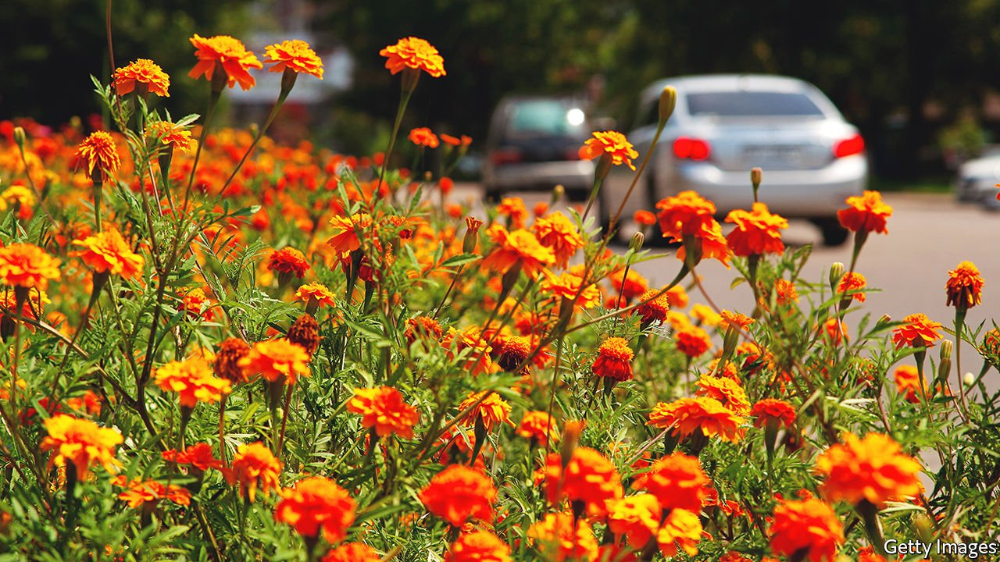

###### Deafened

# Plants are adversely affected by the racket of urban traffic 

##### They get stressed and grow less well 

 

> Feb 12th 2022 

MANY ANIMALS depend upon sound to find food, detect predators and communicate with one another. These species understandably suffer when loud motorways cut through their habitats. Some cope by singing more loudly, some change the timing of their calls to occur when fewer people are driving, others just move to quieter locales.

All of these actions come with significant costs attached and scientists have long documented the ecological damage caused by noise pollution. It has always been assumed, however, that noise is a problem unique to animals. But a new study by Ali Akbar Ghotbi-Ravandi, a botanist at Shahid Beheshti University in Tehran, has revealed that plants suffer too.


That plants can be hampered indirectly by noise pollution has never been in doubt. Since most flowering species depend upon pollinators and most fruit-bearing species need animals to disperse their seeds, it is obvious that if these animal partners are harmed by noise then their botanical counterparts will do badly, too. What has remained unknown is whether or not plants themselves suffer directly from noise pollution.

Sounds are concussive pressure waves transmitted through gases, liquids and solids. Scientists have previously hypothesised that plants may be able to sense these waves as they are struck by them. A number of experiments have confirmed this in recent years—plants bombarded with ultrasound in the lab have shown a range of adverse responses including the expression of stress-related genes, stunted growth and reduced germination of seeds.

Yet blasting plants with ultrasound is not the same as growing them in the presence of actual traffic noise. To this end, Dr Ghotbi-Ravandi decided to set up an experiment to study precisely this question.

Working with a team of colleagues, Dr Ghotbi-Ravandi grew two species in his lab that are commonly found in urban environments—French marigolds and scarlet sage. The plants were grown from seed and allowed to mature for two months in the same space before they were divided into two groups. One group was exposed to 73 decibels of traffic noise recorded from a busy motorway in Tehran for 16 hours a day. The other group was left to grow in silence. After 15 days had passed, samples were taken from the youngest fully expanded leaves on every plant in the experiment and studied.

None of the plants exposed to the traffic noise did well. Analysis of their leaves revealed that all of them were suffering. The chemical compounds hydrogen peroxide and malondialdehyde are indicators of stress in plants and both were found at much higher levels in the specimens exposed to the traffic noise. Most notably, malondialdehyde levels in the sage plants exposed to noise were double what they were in those grown in silence and hydrogen-peroxide levels were three times higher in French marigolds grown with the noise than those grown in silence.

These compounds were not alone. The team found that a range of hormones normally associated with healthy growth and development in plants were present at significantly reduced levels in the plants exposed to the noise. Two stress hormones, jasmonic acid and abscisic acid, which are normally produced to fend off insect attacks and deal with salty soil or very cold temperatures, were elevated. Even the weight of the freshly clipped leaves differed—clippings from plants exposed to noise consistently weighed less than clippings from plants grown in silence.

Dr Ghotbi-Ravandi’s results were published in the journal Basic and Applied Ecology. His findings make it clear that, though plants lack ears, the vibrations generated by the noise of traffic still bothers them enough to trigger potent stress responses that are not much different to those that would be found in plants exposed to drought, high salinity or heavy metals in their soil.

The next question is whether all noise pollution affects all species in the same way. The natural world is by no means silent. Alpine meadows are exposed to no shortage of cacophonous gales. Ferns grow along the edges of turbulent pools fed by thunderous waterfalls. Whether some plant species have evolved coping mechanisms, which might one day be collected and transferred into urban-dwelling species, is a mystery worth exploring. ■

To enjoy more of our mind-expanding science coverage, , our weekly newsletter.

