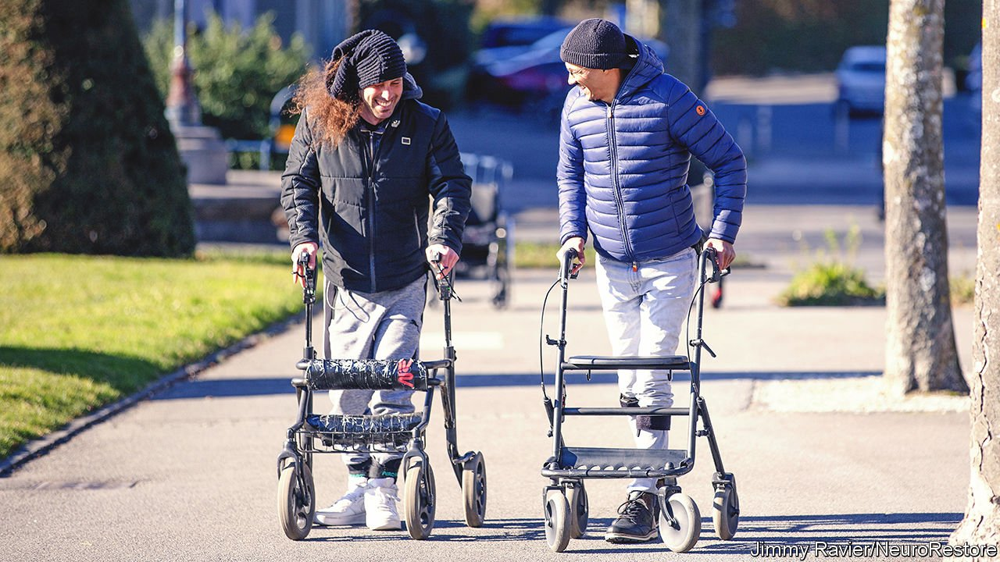

###### Standing ovation

# Spinal implants allow the paralysed to walk, swim and cycle again 

##### The new device works in less than a day after it is fitted 

 

> Feb 12th 2022 

FOUR YEARS ago Michel Roccati was involved in a motorcycle accident. He suffered what neurologists call a “complete” spinal-cord injury—he lost all sensation below the site of the damage to his spine and he could no longer move his legs. In December last year, however, the young Italian stood up on the streets of Lausanne, Switzerland, and took a short walk.

Mr Roccati’s remarkable steps, supported by a wheeled walking frame, were the conclusion of more than a decade of work by Grégoire Courtine, a neuroscientist at the Federal Institute of Technology in Lausanne, and Jocelyne Bloch, a neurosurgeon at Lausanne University Hospital.


The scientists had fitted Mr Roccati with a device that stimulated nerves in his back that once controlled muscles in his lower body and legs, but which had lain dormant since his accident.

Even after a severe spinal injury, the nerves that control activities such as walking often remain intact below any damaged tissue. In people with paralysis, however, the damaged tissue interrupts or weakens any electrical signals coming from the brain.

Dr Courtine and Dr Bloch developed a wafer-thin device with electrodes that could target the dormant nerves. Once implanted into Mr Roccati’s back, the device sent in pulses of electricity that mimicked those normally present in the nerves of an uninjured person as they walk.

By doing this, the device acted like an amplifier for any electrical signals coming from Mr Roccati’s brain. Those signals would normally be blocked by his damaged spinal tissue and be incapable of activating the nerves in his lower back. But with the stimulation device in place, Mr Roccati was able to voluntarily control those once-dormant nerves, allowing him to move his legs and walk.

Mr Roccati was one of three paralysed volunteers who took part in a small clinical trial of the device, details of which were published this week in the journal Nature Medicine. The device worked well enough that all three users in the trial were able to stand up and take a few steps almost immediately after they had recovered from the surgery to have it implanted.

This was a marked improvement on previous implementations of this kind of technology, in which scientists had repurposed nerve implants normally used to treat chronic pain. In the few instances where those experiments had been successful, it had taken many months of training for patients to learn to walk again.

Dr Courtine’s and Dr Bloch’s new device can be configured to fire its electrical impulses in many different patterns, each of which corresponds to a different activity. Patients in the trial were not only able to stand and walk, but eventually also to swim and cycle.

The new device will need approval from medical regulators before it can be used in clinics. Its inventors set up a company called NeuroRestore, which is working with Onward Medical, a Dutch company, to commercialise their new device.

The impact of the device on the lives of those in the small Swiss trial, however, has already been dramatic. Mr Roccati highlights the little things—walking up stairs, for example, or standing in the shower. At a bar, he can stand up to chat with friends. After training, he is now also able to walk around for two hours every day. “With the walker,” he says. “I am free.” ■

To enjoy more of our mind-expanding science coverage, , our weekly newsletter.

