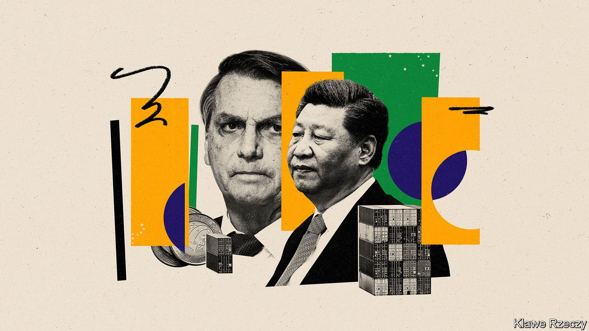
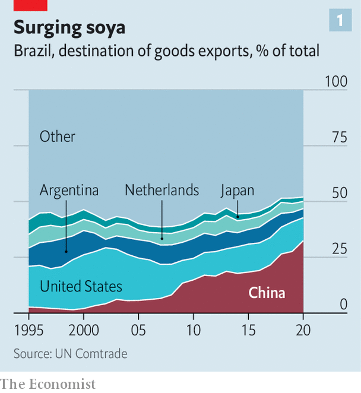
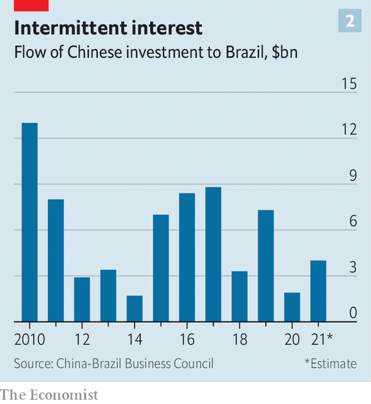

###### A lopsided romance

# Despite thriving trade, China’s relationship with Brazil is weakening 

##### President Jair Bolsonaro’s rhetoric has not helped 

 

> Feb 12th 2022 

ON A TRIP to China in 2004 Luiz Inácio Lula da Silva, then president of Brazil, took with him an entourage fit for a rock star: seven cabinet ministers, six state governors and more than 450 businessmen. Relationships were established and deals hashed out. Over the next five years China would become Brazil’s most important economic partner. By 2019 annual trade between the countries was worth $100bn.

The first state visit by Jair Bolsonaro, the current president, was far more muted. Mr Bolsonaro had spent much of his time on the campaign trail in 2018 railing against China, which he accused of wanting to “buy Brazil”. When he visited in 2019 he brought along four ministers, but no senior economic advisers. Although he spoke of how the countries were “completely aligned”, the trip was overshadowed by talk of whether or not he would allow Huawei, a Chinese telecoms firm, to build some of the 5G network in Brazil.


The relationship between Brazil and China has never been straightforward, but under Mr Bolsonaro it has never been worse. Despite his talk of alignment in 2019, he has continued to take swipes at China, as have members of his family, several of whom are in politics. Early in the pandemic his son, Eduardo, spoke of the “China virus”. Last year, without naming China, the president mused that covid-19 could be “chemical warfare”. China, for its part, may be keen to trade with Brazil, but it is increasingly wary of investing in the country—and in the rest of Latin America.

Mr Bolsonaro’s antagonism has not gone unnoticed by Chinese officials. In 2020 Li Yang, China’s consul general in Rio de Janeiro, wrote a comment piece for O Globo, a newspaper, in which he responded to Eduardo’s comments with unusual ferocity. The boss of Sinovac Biotech, a Chinese firm which provided covid vaccines to Brazil, was quoted by Reuters as telling diplomats that the president’s remarks were preventing a “fluid and positive” relationship between the two countries.

 


Sometimes China likes to remind Brazil of its power. Late last year Brazilian beef exports took a hit when China imposed a three-month ban on them after two cases of atypical mad-cow disease were found in different states. The value of beef exports slumped; the ban cost around $2bn in sales. Many thought the embargo was unusually long.

The row over beef notwithstanding, trade between Brazil and China has flourished, even through the pandemic. In 2021 China bought over 30% of Brazil’s physical exports, up from less than 20% five years earlier. Most of this was soyabeans, crude oil and iron ore, but shipments of meat and other higher-value goods have also grown in recent years, particularly since the trade war between the United States and China took off in 2017 (see chart 1).

Beefs with Bolsonaro

But other economic ties between Brazil and China appear to be weakening. China’s investment in Brazil peaked in 2010, according to the China-Brazil Business Council (CEBC) (see chart 2). In that year China invested $13bn in 12 projects. The CEBC estimates that last year it invested only around $4bn.

 


This hints at a wider trend. Although the presidents of Argentina and Ecuador recently went to Beijing in order to boost economic ties with China, economic agreements between China and Latin America have waned in recent years. In an address to the Community of Latin American and Caribbean States (CELAC), a regional organisation, in 2015, Xi Jinping, China’s president, pledged $250bn in investment in Latin America by 2025. But between 2015 and 2020 Chinese firms invested only $76bn in the region, according to researchers at Boston University. In December, at another meeting with CELAC, Mr Xi did not pledge any further investment. (Brazil did not attend, as Mr Bolsonaro had pulled out of CELAC in 2020.)

Brazil, in particular, makes foreign investment hard. The country’s rules and regulations are prodigious and ever-changing. Its currency, the real, is volatile; its labour laws are complicated and its tax system badly needs reform. Corruption and uncertainty over economic policy do not help. “If a Chinese company can survive in Brazil, it can do so anywhere,” says Qu Yuhui, a Chinese diplomat who was based in Brazil until recently.

Chinese investors focus on what they perceive as safe bets. Nearly half of the money they put into Brazil before 2020 went into electricity generation, which has the benefit of long-term contracts. Several Chinese power firms have established themselves in the country. Brazil benefits from Chinese expertise: both countries have ultra-high-voltage transmission lines that stretch thousands of kilometres.

The power industry, though, also generates challenges. Last year the CEO of State Grid Brazil, a subsidiary of one of the biggest Chinese state-owned electricity firms, described the difficulty of acquiring land for a huge transmission line between the Belo Monte dam in Pará, in the north, and the consumers of south-eastern Brazil. The effort involved negotiating individually with “3,337 property owners” and obtaining “204 inter-regional licences, including [for] rivers, lines, highways, railways, oil ducts, small airports, etc”.

Brazil ought to be doing more to lure foreign investment, yet its efforts tend to be sporadic, driven more by state-level politicians than by the federal government. The state of São Paulo, for example, set up a trade office in Shanghai in 2019. João Doria, the governor of São Paulo, credits it with helping him strike a deal with Sinovac for covid vaccines. But few Brazilian companies have set up offices in China, or even ventured to visit, says Tatiana Lacerda Prazeres, a trade consultant in China, and a former foreign-trade secretary of Brazil. “There is a perception among some top Brazilian officials, and even some businesses, that China is more dependent on Brazil than vice versa,” she says.

China’s large appetite for Brazilian commodities reinforces that attitude. But the view from China is quite different. Compared with other regions, Latin America has always been China’s “lowest priority”, in terms of diplomacy and investment, says Margaret Myers of the Inter-American Dialogue, an American think-tank. Asia and Africa remain more important.

Moreover, China’s appetites may be changing. Its drive towards “basic self-sufficiency” in grain, as laid out in its latest five-year-plan, includes an effort to boost soyabean production. Scepticism about the plan abounds. But even a small decrease in Chinese purchases would hurt Brazil, which sends 70% of its soyabean exports to China. If demand for new housing in Chinese cities were to drop, as some predict, that would diminish demand for Brazilian iron ore and other raw materials. (Though a slowdown in construction at home might also push Chinese infrastructure firms to seek opportunities abroad.)

Brazil’s presidential election in October will help determine the future of the relationship. Lula is mulling a run. He tops Mr Bolsonaro by a wide margin in most polls. If he were to become president again, there is little doubt that he would try to mend ties. Wooing Chinese investors, though, may be harder the second time around. ■

