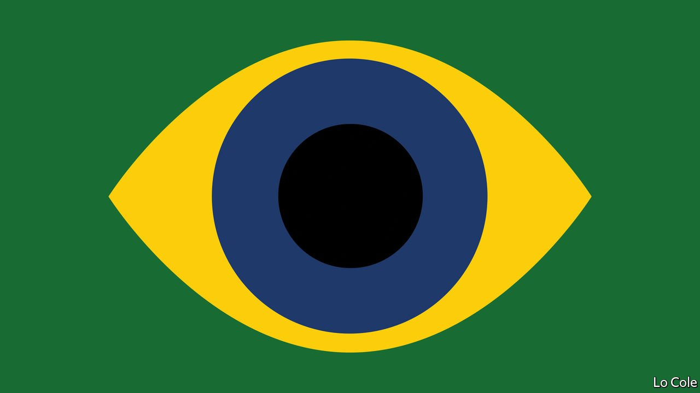

###### Bello

# How the “Cannibal Manifesto” changed Brazil 

##### It is 100 years since modernists vowed to transform the country’s culture 

 

> Feb 12th 2022 

A HUNDRED YEARS ago this weekend, a group of young artists and writers organised what they called the Modern Art Week in the new and grandiose municipal theatre in São Paulo. In fact, it lasted only for three evenings. It included a show of modernist painting, lectures, poetry recitals and music by Heitor Villa-Lobos, who was to become Brazil’s best-known composer. It has since come to be seen as the founding moment of modern Brazilian artistic culture. Its centenary has brought both commemoration and some criticism. It comes as the cultural tradition it represents is under assault from Jair Bolsonaro, Brazil’s populist president.

The event took place in São Paulo, then a fast-industrialising frontier city that was starting to rival Rio de Janeiro, the capital at the time, where the staid cultural establishment was based. The Brazilian modernists had their contradictions. The would-be revolutionaries were also dandies, the scions of the coffee-growing aristocracy, and they were close to the political oligarchy that ran São Paulo and Brazil. Even so, they were disrupters.


The week “was a declaration of cultural independence, that we are not simply a clumsy copy of something else”, says Eduardo Giannetti, a Brazilian philosopher. The modernists’ aims were later formalised in a Manifesto Antropófago (Cannibal Manifesto), written by one of the poets, Oswald de Andrade. This sought to address the dilemma of how to be a Brazilian modern artist when modernism was a European import. The answer: “Absorption of the sacred enemy. To transform him into a totem.” In other words, Brazilians would not simply reproduce other models but digest them and turn them into something that was their own. The group embraced a national identity that, at least in theory, included black and indigenous Brazilians and their beliefs, and tropical fauna and flora.

It was cultural nationalism, but of an open-minded, cosmopolitan and non-xenophobic kind. That was important. Across Latin America, modernist writers and artists were forging new national identities. As the innovative 1920s degenerated into the ideological conflicts of the 1930s, some would embrace communism and others creole fascism in its many variants. The Brazilian modernists would radicalise politically and be co-opted, too, by Getúlio Vargas, Brazil’s nation-builder, who ruled for much of 1930 to 1954, by turns an autocrat and a democrat.

Yet the Brazilian modernist tradition proved extraordinarily fertile. It encompassed Tarsila do Amaral, whose painting mixed cubism, surrealism and Brazilian myths. Oscar Niemeyer, an architect, took Le Corbusier’s functional rectangles and added Brazilian curves. The 1950s and 1960s brought bossa nova, a fusion of American jazz and Brazilian samba, and cinema nova, which drew on the techniques of Italian neo-realist film to cast a light on Brazil’s socio-political backwardness. A loose group of conceptual poets and artists, including Hélio Oiticica and Lygia Clark, deployed abstraction and performance art. Caetano Veloso and Gilberto Gil drew on British pop to create protest music challenging the military dictatorship that took power in 1964.

Some in Brazil think the week in 1922 is overhyped. Ruy Castro, a writer who perhaps not coincidently lives in Rio, claims it was the dictatorship that, on the event’s 50th anniversary, institutionalised it as a national legend. Some black and indigenous artists claim that it has little to say to them. Yet many Brazilians still see it as an inspiration. In 50 years’ time “I hope it will be remembered as an episode in the transformation of Brazil into a modern country,” says Valéria Piccoli, the chief curator of São Paulo’s Pinacoteca art museum.

For now, Brazilian artistic culture is on the defensive. Mr Bolsonaro’s government is one of “cultural asphyxia”, argues Ms Piccoli. The culture secretariat is trying to impose “a conservative, religious, reductionist vision”, she complains. One of the seven people in three years who have served as culture secretary proclaimed, “Brazilian art in the next decade will be heroic and national.” The incumbent, a soap-opera actor, has removed public funding from places that require vaccination for entry. And the government has slashed tax breaks for private cultural sponsorship, which has cut the Pinacoteca’s budget by 20%. Yet despite Mr Bolsonaro’s reactionary harrumphing, Brazilian visual art and music has become part of the global mainstream. That is perhaps the best tribute to the pioneers of 1922.

Read more from Bello, our columnist on Latin America: (Feb 5th 2022)

 (Jan 29th 2022)

 (Dec 11th 2021)

