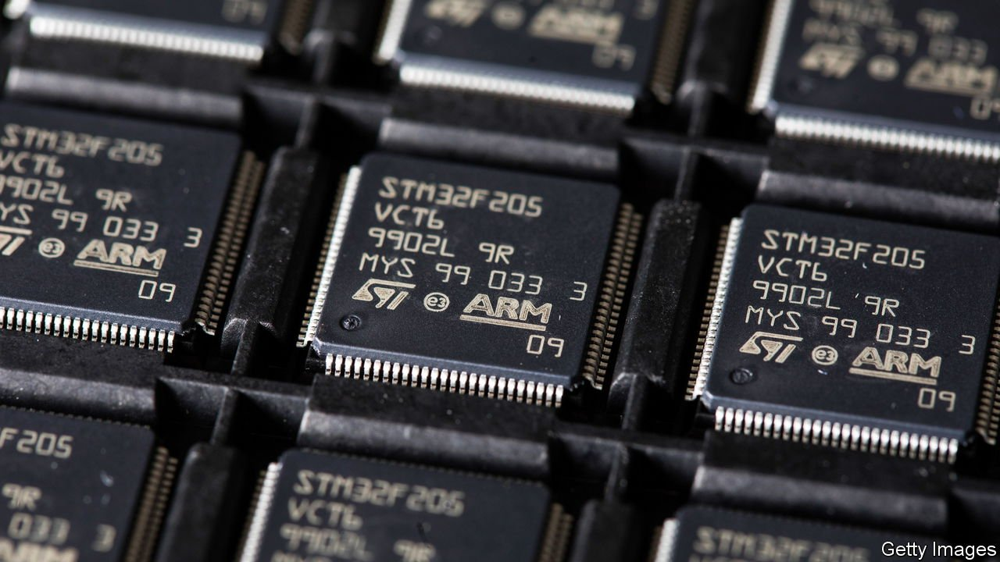
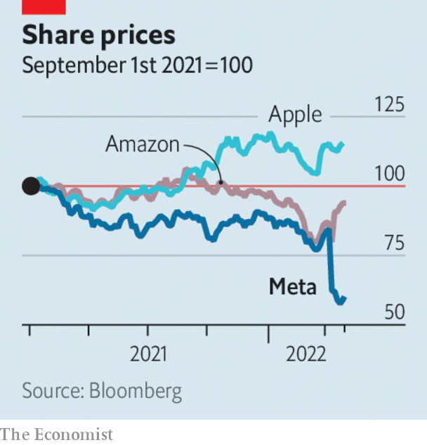

###### 

# Business this week 

#####  

 

> Feb 12th 2022 

 said it would seek to list Arm, a British chip designer that it bought in 2016, on the stockmarket, after a proposed sale of the business to Nvidia collapsed. Valued at as much as $60bn, the deal would have been the biggest ever in the semiconductor industry, but it ran into regulatory hurdles from the outset when antitrust concerns were raised in America, Britain and the EU. Companies that use Arm’s chip designs, including Microsoft and Qualcomm, had argued the acquisition would give too much market power to Nvidia, which is based in California.


Toshiba, another Japanese conglomerate under pressure to increase shareholder returns, ditched a plan to split into three companies and said it now proposed spinning off just its devices business, which includes semiconductors. The original plan was criticised by foreign investors. The new restructuring will avoid a complex vote among shareholders, making it easier for management to try to win over the naysayers.

BP made an annual headline profit of $12.8bn in 2021, its biggest in eight years. Similar to other energy giants, BP was boosted by soaring prices for oil and gas. Coming on the back of huge profits at Chevron, ExxonMobil and Shell, there are some calls in Britain and on the European continent to impose a windfall tax on energy companies.

Revenues at TUI, Europe’s largest tourism company, were five times higher in the last three months of 2021 than in the same quarter of 2020, but still well below those of 2019. Now that many travel restrictions have eased, TUI expects bookings this summer to come close to pre-pandemic levels.

 


In another sign of returning confidence in travel, Frontier, a low-cost airline in America, agreed to buy Spirit, a rival. The $6.6bn takeover is the biggest in the industry since the start of the pandemic.

Stockmarkets clawed back most of their losses from the worst trading day in a year, triggered by Meta’s warning about slower revenue growth. The share price of Facebook’s parent company tumbled by 26% on February 3rd, wiping $230bn off its market value. But the rout in tech stocks was not evenly spread. Amazon’s share price rebounded on the back of solid earnings. Disney also provided a fillip to investors by reporting a big rise in subscribers to its Disney+ channel, allaying fears that  has run out of steam.

How to ease easy money

Christine Lagarde, the president of the European Central Bank, tried to reassure markets that any tightening of monetary policy in the euro zone would not be rushed. Ms Lagarde triggered a sell-off in euro bonds recently when she signalled a shift to a more hawkish position at the ECB by refusing to rule out an interest-rate rise this year. Persistently high inflation is forcing central banks to think hard about quickening the pace of rate rises. The Bank of England recently lifted its benchmark rate to 0.5% having raised it to 0.25% in December.

America’s total household debt rose by $1trn during 2021 to reach $15.6trn at year’s end, the biggest annual increase since 2007. Car loans were a big factor; the loosening of covid restrictions has unleashed a pent-up demand for vehicles. Credit-card balances increased in the fourth quarter by the largest amount since record’s began.

America said it would remove the extra tariffs on Japanese steel imports imposed during the Trump administration (the levy on aluminium still applies). In a deal similar to the one struck with the EU last year, America and Japan pledged to work together to reduce overcapacity in steel manufacturing. To avoid tariffs, steel from Japan must be made entirely in that country to avoid Chinese elements sneaking into the production.

As America’s economy rebounded last year it sucked in more imports, pushing the overall trade deficit for goods and services to $859.1bn, a record. The trade deficit with China grew by 14.5% over the year, to $355.3bn.

A married couple were arrested in New York for allegedly conspiring to launder cryptocurrency that was stolen during a hack of Bitfinex, a virtual-currency exchange, in 2016. The Justice Department said that $3.6bn in bitcoin related to the hack has been seized so far, proving that law enforcement “can follow money through the blockchain”.

A tough business cycle

Peloton replaced its chief executive and said it would cut 2,800 jobs, after it reported another quarterly loss and lowered its sale forecast. The maker of internet-connected exercise bikes and workout programmes was one of the pandemic’s big winners, as svelte office-workers tried to stay lean and mean at home. Once they returned to gyms and parks, demand for Peloton’s pricey products dropped. The company’s stock has pedalled back from $163 a share in December 2020 to $40 today.

