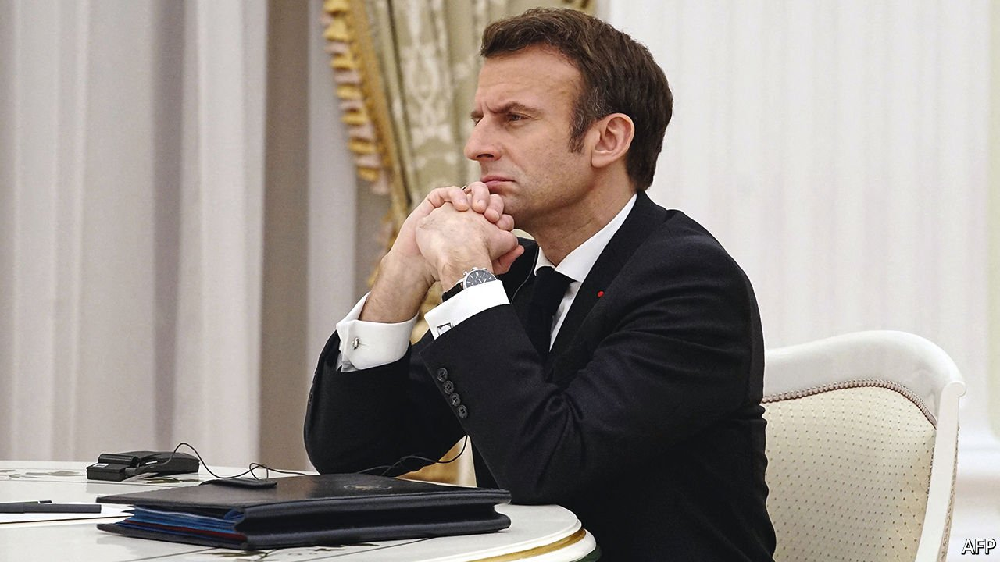
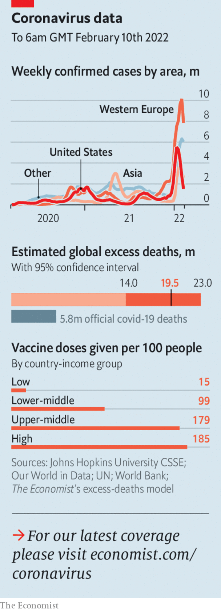

###### 

# Politics this week 

#####  

 

> Feb 12th 2022 

Despite a blizzard of diplomatic activity, America and Europe came no closer to ending . After talks in Moscow, Emmanuel Macron said Vladimir Putin had promised not to escalate the situation, but Russia denied that. In Washington, Joe Biden said a Russian invasion would prompt the cancellation of its Nord Stream 2 gas pipeline to Germany; Olaf Scholz, Germany’s new chancellor, was woollier. France, Germany, Russia and Ukraine were planning to meet in Berlin to discuss the Minsk accords on Ukraine’s breakaway region of Donbas, but that deal is unpopular with Ukrainians.


Poland’s finance minister resigned after a new tax package intended to benefit low earners instead cost some of them money. Poland’s share of the EU’s covid-19 recovery package is being held up over concerns about the rule of law.

Road rage

Jim Watson, the mayor of Canada’s capital, , declared a state of emergency after protests against a nationwide vaccine mandate for lorry-drivers turned violent. Justin Trudeau, the prime minister, and his family moved to a secret location. Protesters also blocked several big border crossings with America.

A bipartisan bill was introduced in the American Senate by Bob Menendez and Marco Rubio to counter the “growing meddling of Russia and China in Latin America and the Caribbean”. The presidents of Argentina and Ecuador have travelled to Beijing to strike economic deals with China; Argentina has now joined the Belt and Road Initiative. Britain’s government rejected a statement from China that supported Argentina’s claim to the Falkland islands.

In Argentina thousands of people protested against the provisional agreement the government has struck with the IMF. The tentative deal appears to have split the ruling Peronist coalition.

Women were allowed back into universities in Afghanistan for the first time since the Taliban took over the country in August. The group had long opposed education for women and girls, but has recently claimed to have changed its mind as long as classes are segregated. Many girls, however, remain barred from school.

A row over the right of women in the southern Indian state of Karnataka to wear the hijab to school sparked protests. The police responded with tear gas and the government declared that educational institutions in the state would be shut for three days. The protests spread to Kolkata, a big city in the east of India.

Officials from Iran, America and other world powers met in Vienna for a fresh round of negotiations to revive the nuclear deal they signed in 2015. , which pulled out of the deal in 2018, are said to be moving closer to an agreement, but big differences remain.

Israel investigated reports that the , to hack the phones of local activists, officials and businessmen. NSO Group, the Israeli firm that created Pegasus, has already been admonished for selling its software to authoritarian governments around the world.

Three Palestinian men were killed in an Israeli operation in the occupied West Bank. Israel said the men were from a “terrorist squad” that had carried out attacks on Israeli civilians and soldiers.

The president of Tunisia, Kais Saied, was criticised for scrapping the country’s top judicial watchdog. Mr Saied suspended parliament last year. Critics say he is quickly becoming a strongman.

Cyclone Batsirai has killed as many as 90 people in Madagascar and destroyed the homes of tens of thousands more. Less than a month ago another large storm killed 55 people on the island.

An official report blamed factional battles within South Africa’s ruling party, the African National Congress, for violent protests that claimed 354 lives last year after the jailing of Jacob Zuma, a former president accused of corruption. It warned of the danger arising from the “convergence of violent criminal conduct with mainstream politics”.

ECOWAS, west Africa’s regional bloc, said it will send troops to stabilise Guinea-Bissau after a failed coup that the government said was linked to drug-smuggling. The country is a hub for cocaine-trafficking from South America to Europe.

The end is nigh

Several American states governed by Democrats announced an end to or the easing of mask mandates, which have been politically fraught throughout the pandemic. California is lifting the requirement for people to mask up in most places, except for the unvaccinated, who will still be obliged to wear a covering in indoor public spaces.

Boris Johnson declared that all remaining covid restrictions could end this month in England, including the legal requirement to isolate after a positive test. The mandate to isolate has caused severe staff shortages, not least in the National Health Service.

 


, meanwhile, went the other way, tightening restrictions amid a surge in covid cases. Hong Kongers may meet only one other person in public at a time.

, with many spectators wondering who is American and who is Chinese. Eileen Gu, born and raised in California but opting to compete for China, won gold in the big-air event. Zhu Yi, also born in America and competing for China, fell badly during the team figure-skating event, depriving China of a medal.

Peng Shuai, a Chinese women’s tennis star, appeared at the Olympics to explain that there had been a “huge misunderstanding” over an online post in which she had claimed to have been forced into a sexual relationship with a former senior Chinese official. The Women’s Tennis Association said it still has concerns about Ms Peng’s well-being.

