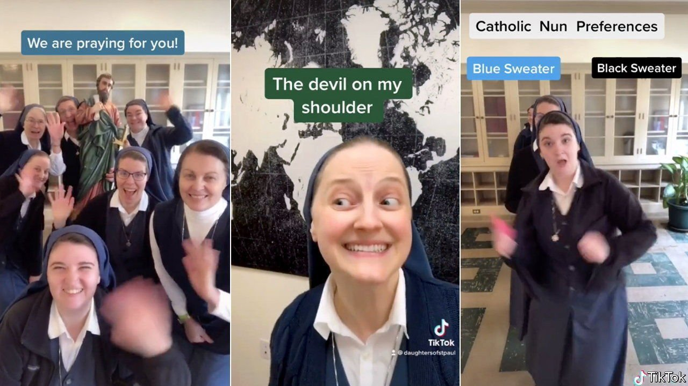

###### TikTok nuns

# A group of nuns goes viral for Jesus 

##### TikTok has made them popular outside the convent 

 

> Feb 12th 2022 

LAUGHTER WAS the first thing your correspondent noticed when he visited the Daughters of St Paul (also known as the “Media Nuns”) on the outskirts of Boston. It reverberated off the marble saints and through the convent’s hallways. The primary sources of the mirth are Sisters Orianne Pietra René, 31, and Danielle Lussier, 38. The two form a comedy duo. They giggle as they explain that their cars are named after saints (some share the same patron, which causes confusion). This cheerfulness explains their surprising popularity outside the convent. They have more than 155,000 followers on TikTok, a social-media app.

Their posts, which have gathered over 15.5m views, blend convent life with popular culture. Last year, for example, they posted their rendition of a viral song that spoofs a melodramatic exchange on Facebook about a rental property (a prospective tenant enquires about the property’s availability before turning hostile and threatening to call the attorney-general). The nunnified version turns it into a struggle against temptation, which culminates with the nun threatening the devil with Jesus. The post has 3.3m views.


The nuns quickly became an internet sensation, earning their own hashtag (#nuntok). The sisters are unfazed by their sudden popularity. They would rather pray, which they do a lot. They pray for every person who watches their videos. They pray for those who send them direct messages. They even pray for the trolls who leave nasty comments.

Fewer women are responding to the call of nunhood. There are about 41,000 nuns in America, down from 160,000 half a century ago. Young Americans are more secular and anti-institutional, making a life of chastity and poverty seem less appealing. But Sisters Pietra René and Lussier—who taught French and studied art, respectively—are proof that some still find it compelling.

They say TikTok is also helping people realise that nuns are normal people. Their online interactions have led to conversations about faith and even to friendships. A few fans have visited the nuns in person. “At the end of the day all we are asking is to be able to see one another as human beings,” Sister Pietra René says.

For exclusive insight and reading recommendations from our correspondents in America, , our weekly newsletter.

