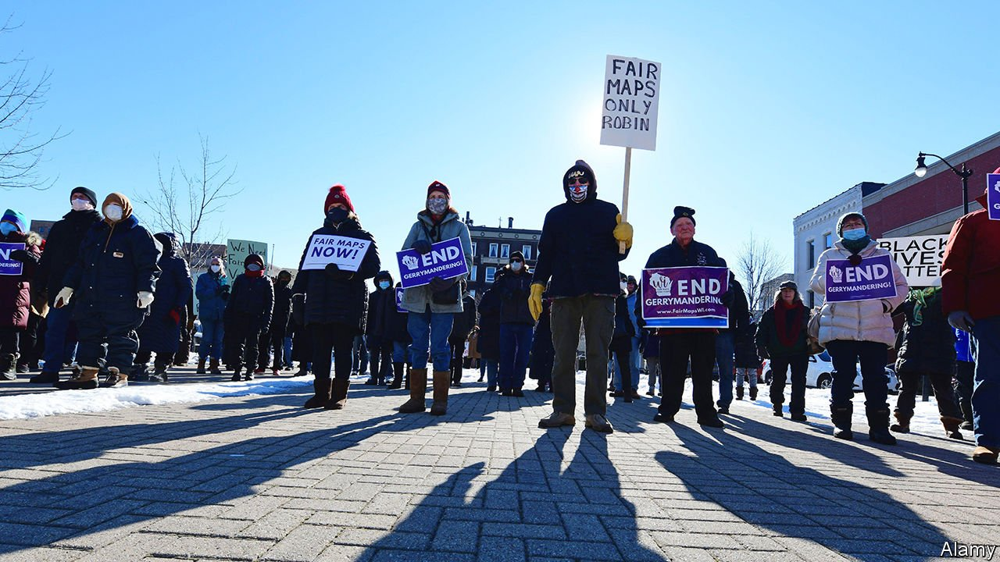
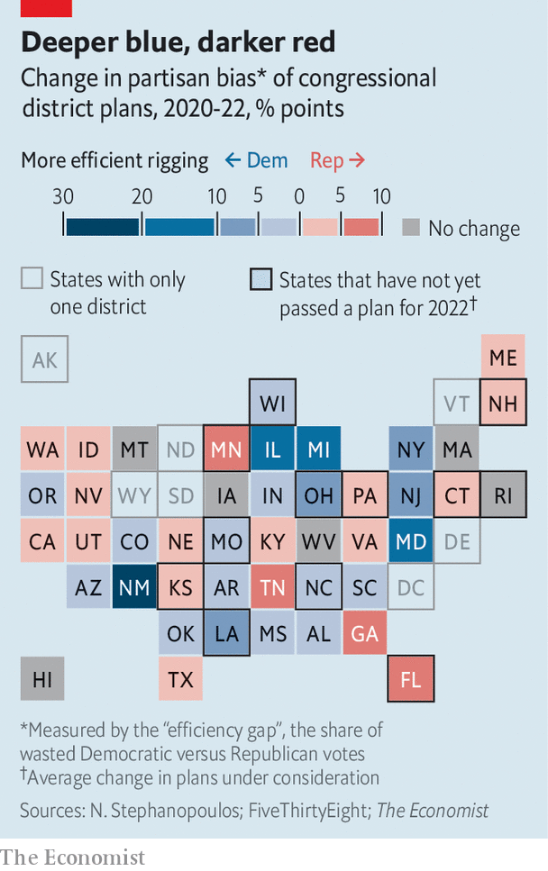
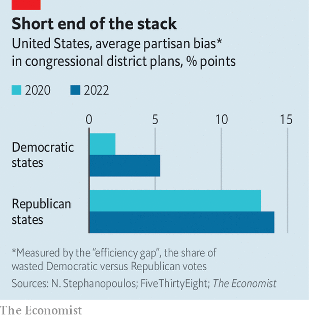

###### Congressional redistricting

# Democrats have fared surprisingly well in Congress’s new maps 

##### But the boundaries still favour Republicans 

 

> Feb 12th 2022 

: On February 7th the Supreme Court reinstated a congressional map in Alabama that a lower court had ruled was biased against African-American voters. The story has been updated to reflect this decision.

THE PROMISE of democracy is a system where leaders represent their voters, and where those voters can throw them out. But in America, the reverse can also be true: politicians in many states can choose which voters represent them. The constitution delegated the power of drawing the boundaries of electoral districts to state legislators; many abuse this power and “” districts in their party’s favour. Citizens in some states have amended their laws to give watchdog powers to the judiciary or require plans to be approved by an independent third party. But most Americans still live in states where politicians are incentivised to rig elections by drawing biased maps.

Because Republicans have lately controlled more state governments than Democrats, they have tended to do better in congressional redistricting. After redrawing maps in 2010, the Republicans lost the popular vote for the House of Representatives but still won a majority of its seats. In the national popular vote in 2012, Mitt Romney, the Republican candidate, lost to Barack Obama by 3.9 percentage points. But in the median House district—ranked by that year’s presidential results—it was Mr Romney who edged out Mr Obama by 0.3 points. In an equal system, those numbers should roughly match. In fact the House was biased against Democrats by four points in 2012, and again in 2016. In 2020 the median district was biased against  by two points.


But in 2022, after states redraw their congressional lines according to new population estimates from the 2020 census, this bias is almost certain to be much closer to zero. Democrats have made surprising gains in the redistricting process. Three main reasons explain their success.

One is gerrymandering of their own. Although Republicans have been notorious for abusing the process over the past decade, Democrats have caught on. Consider the new congressional map in New York, which Democrats have just signed into law. According to analysis by The Economist of election-results data collected by Five ThirtyEight, a data-journalism website, the state’s previous plan contained 18 districts where the average vote-share for Democratic presidential candidates over the past two contests was higher than the Republicans’. The new plan has 22.

The story is similar in New Mexico. Democrats control the state government there, too. Whereas the state’s previous congressional districts comprised one heavily Republican seat and two Democratic strongholds, lawmakers have rejigged the boundaries so that all now lean towards the Democrats.

That brings the Democrats’ net gains from redistricting in New York and New Mexico to five seats. Add to that the changes in Oregon and Illinois—blue states with minimal third-party oversight over redistricting—and the party comes out with an expected ten seats more than in 2020.

The Democrats have also benefited from reforms that keep districts fairer. Take Colorado. After the 2000 and 2010 censuses, state legislators there failed to agree on maps, so state courts drew the lines instead. In November 2018, fed-up Coloradans passed a ballot initiative that authorised an independent commission of residents—four Democrats, four Republicans and four “unaffiliated”—to redraw the state’s congressional boundaries. It joined Arizona and California (which began using similar models in 2000 and 2010, respectively) and Michigan (2018) as the only states using partisan-balanced commissions of citizens to draw district maps.

Colorado’s commissioners began meeting in March, and by the final months they were working as many as 40 hours each week to meet their October deadline. Simple rules guided them: create non-discriminatory, contiguous districts of equal size; maximise political competition; and preserve so-called communities of interest—neighbourhoods where voters have shared policy concerns and would benefit from being in the same district (examples include ethnic, racial and economic groups).

The commission’s maps do not require approval from the governor or the state legislature. This year the final map preserves the partisan leanings of Colorado’s seven existing districts, and adds one more Republican-leaning seat with the additional representative the state gained thanks to the increase in its population. The commission also made the Seventh District more competitive. The current representative there, Ed Perlmutter, a Democrat, announced last month that he would not seek re-election. In a climate that favours Republicans, he may have struggled to win the revised district anyway. The maps in Michigan ended up similarly balanced.

Lastly, there are the courts. Those in Ohio and North Carolina both struck down maps they said favoured Republicans too much, acting as partisan gerrymanders that violated state constitutions. In Ohio, Republicans drew a map which made 73% of the state’s districts lean towards Republicans—though the party won only 55% of the vote statewide. “By any rational measure,” Justice Michael Donnelly said in the court’s opinion, “that skewed result just does not add up.” Republicans in North Carolina passed a map which gave them the edge in 71% of seats, even though Donald Trump beat Mr Biden by only one point there in 2020. Neither state has yet approved a new map.

A lower court in Alabama also ruled that its new map is biased against African-Americans, but on February 7th the Supreme Court voted 5-4 to approve it for the 2022 election. The map provides for only one of seven districts where black voters will have a chance to elect a candidate of their choice, in a state where 27% of the voters are black. Plaintiffs say legislators could easily have drawn a second. The decision highlights the limits of a judicial approach to enforcing fair mapmaking—at least in the federal courts.

Cracking and packing

In all, across the 30 states that have passed maps so far, Democrats have gained 12 new seats where they make up more than half of voters in presidential elections. Yet the map as a whole may still be biased towards Republicans. The gap between Mr Biden’s margin nationally and in the new median is likely to be between half and a full percentage point rather than two points.

 


Further, some political scientists think a simple tally of seats is not enough to assess partisan balance fully. Nick Stephanopolous, a Harvard professor who helps with analysis at PlanScore, a website that checks maps for fairness, prefers to focus on the “efficiency gap”. This measures the share of Democratic and Republican votes that are “wasted” in each seat. Wasted votes are those that are cast for parties in excess of the margin they need in districts they win, plus every vote cast for the party in seats they lose. The measure can be thought of as quantifying both how many members of one party are “cracked” into losing districts and the number that are “packed” into safer ones (see map).

In the states that Joe Biden won in 2020, there is an efficiency gap of roughly five points favouring Democrats. That means roughly 5% more Republican votes than Democratic ones are wasted across them. That is an increase over the two-point gap in those states under previous lines, reflecting Democratic gains from the gerrymandering, reform and litigation efforts.

But in Republican states, the efficiency gap will be roughly 14 points (the precise number depends on what the final maps look like; our figure is based on the average across the likeliest plans under consideration). That is an increase over the 13-point efficiency gap in those states under the 2020 congressional map. In other words, the maps in both Democratic and Republican states have become more biased as a result of this decade’s redistricting. And the average Republican plan creates many more wasted votes than the average Democratic one (see chart). In states with independent redistricting commissions, by contrast, the absolute efficiency gap fell by nearly three points, meaning districts were less gerrymandered. It increased by three points elsewhere.

 


According to estimates of district partisanship produced by Mr Stephanopolous and shared with The Economist, more Republican states have also focused more on ring-fencing their current advantage. That has meant shifting seats with mild Republican advantages farther right, instead of focusing on drawing Democrats out of the ones they have. In Texas, for example, the Republican-dominated legislature packed Democrats into five new seats, but removed all but one competitive district. And it took the two new representatives the state was apportioned in 2020 and drew two new districts where Republicans are expected to win. This almost ensures that the state’s congressional delegation will stay Republican for the next decade.

Although rosier for Democrats, the 2022 round of redistricting reflects the arms-race nature of gerrymandering. “National partisan fairness is perfectly compatible”, Mr Stephanopolous says, “with extreme subnational partisan unfairness.” Bias in Republican states such as Texas and , and in Democratic states such as New Mexico and Oregon, still produces many wasted votes in congressional races, even if the number of seats parties are expected to win nationally is roughly fair. It is no puzzle who is hurt when politicians are able to select their own voters. ■

For more coverage of Joe Biden’s presidency, visit our dedicated  and follow along as we track shifts in his . For exclusive insight and reading recommendations from our correspondents in America, , our weekly newsletter.

