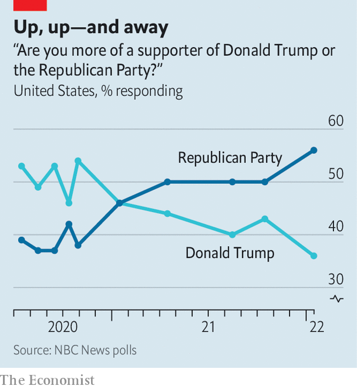

###### Party loyalties

# Is Donald Trump losing his grip on Republican voters? 

##### New polling and fundraising figures suggest slippage 

 

> Feb 12th 2022 

CRACKS ARE starting to show at the top of the Republican Party. The Republican National Committee last week censured Liz Cheney and Adam Kinzinger, two of Donald Trump’s chief critics in the House, for taking part in the congressional investigation of last year’s attack on the Capitol and aiding the “persecution of ordinary citizens engaged in legitimate political discourse”. On February 8th Mitch McConnell, the party’s Senate leader, hit back, calling the events of January 6th 2021 a “violent insurrection for the purpose of trying to prevent the peaceful transfer of power after a legitimately certified election from one administration to the next”.

A few days earlier Mike Pence took a similarly firm stance against his ex-boss’s claims of election-rigging. “I heard this week that President Trump said I had a right to overturn the election,” Mr Pence said. “President Trump is wrong…And frankly, there is no idea more un-American than the notion that any one person could choose the American president.”


These spats highlight a growing rift between some senior party figures over Mr Trump. And there are other signs that Mr Trump’s grip on Republicans is slipping.

According to an analysis by the New York Times of candidates’ reports to the Federal Election Commission (FEC), in the last quarter of 2021 all seven House Republicans who voted to impeach Donald Trump and are seeking re-election out-raised their primary opponents. One of them, Fred Upton from Michigan, raised $726,000 in the last quarter; Steve Carra, a challenger whom Mr Trump has endorsed, raised only $134,000.

To follow the money here is to peer into the psychology of Republican voters. Do they still support their former president? Some public-opinion polling points in the same direction as the FEC data, and suggests that Mr Trump is in his worst position since at least early 2019.

 


For the past two years pollsters working for NBC News have been asking Republican voters if they “consider [themselves] to be more of a supporter of Donald Trump or more of a supporter of the Republican Party”. At the end of October 2020, 54% of respondents who identified themselves as Republican said they were more a supporter of Mr Trump, whereas 38% said they were more loyal to the party. In their first poll this year, NBC finds a near-complete reversal of those patterns: 56% proclaim more support for the party and 36% say they are more for Mr Trump (see chart).

Figures released last week by Echelon Insights, a Republican-aligned polling firm and consultancy, also had troubling news for Mr Trump. Echelon asked Republican voters nationwide if they would prefer the former president or Ron DeSantis, the Florida governor, as their nominee for president in 2024. Among all Republicans, they found 57% preferred Mr Trump and 32% supported Mr DeSantis. Among Republicans who had heard of both candidates, Mr Trump’s lead shrank from 25 points to 16.

None of this means Republicans are done with their former president. A 16-point lead versus Mr DeSantis in the 2024 nomination would translate into a landslide primary victory. Most Republican voters still rate Mr Trump as popular, and he is by far the biggest fund-raiser on the right, able to direct money to loyal candidates and hold huge rallies for them. But attitudes do appear to be changing, if slowly. The seeds are being sown for the Republican Party to move on from Mr Trump. ■

For exclusive insight and reading recommendations from our correspondents in America, , our weekly newsletter.

