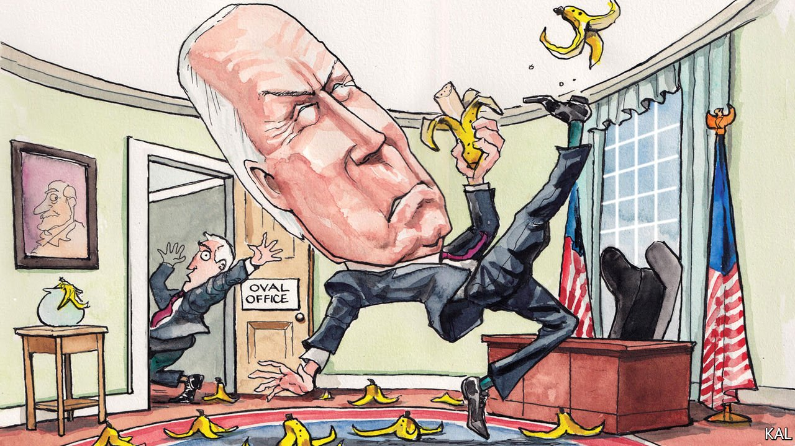

###### Lexington

# Messing up, Biden-style 

##### The administration’s errors have the president’s fingerprints all over them 

 

> Feb 12th 2022 

BORIS JOHNSON turns out to have been running a 10 Downing Street operation resembling himself: chaotic, rule-breaking, fond of a tipple. The prime minister could hardly have done otherwise. Governments invariably reflect the style and character of their leader. The Platonic city was a simulacrum of its ruler’s soul. The medieval body politic was synonymous with the king’s own body. American administrations, headquartered in a government office that (like Downing Street) is also a family home, are profoundly in this tradition.

George W. Bush’s White House was, like the man himself, cheerily upbeat and brutishly anti-intellectual, preferring action to deliberation. Barack Obama’s was cerebral, slick and self-regarding. Donald Trump’s administration makes the Johnson operation look like a Quaker tea party. Joe Biden’s is a huge improvement on it. Its members are, as he is, qualified for their jobs. They do not grift, leak and lie constantly. The ousting this week of Eric Lander, the chief science adviser, for using bullying language was the first hint of White House impropriety in 12 months. Moreover, the decency and professionalism of the president’s top team reflect especially well on his character because many of them have worked for him for years. They include Ron Klain, the chief of staff, and Jake Sullivan, the national security adviser. Despite its strengths, however, the administration is turning out to be error-prone in an unerringly consistent fashion.


Take its cardinal blunder, the chaotic withdrawal from Afghanistan last summer. It pointed to three weaknesses that are characteristic of the 79-year-old president. First, like many of his age and long experience, he has a tendency to hew to outdated positions. He justified his decision to withdraw the troops in terms of a reluctance to send more Americans to their deaths, for example, despite none having been killed fighting in Afghanistan for over a year. Second, and related, the president can seem rather detached from reality. Leaked notes of a White House meeting the day before the Taliban swept into Kabul suggest an administration embarrassingly out of touch with the unfolding disaster. It resolved to encourage its local Afghan staff “to begin to register their interest in relocation to the United States”.

Third, Mr Biden, who has bridled against smoother-talking critics for decades, tends to respond to any criticism with prickly defiance. The day after the last American troops withdrew from the wreckage of Kabul airport, leaving behind thousands of terrified Afghan collaborators and vast stocks of military hardware, he deemed the evacuation to have been an “extraordinary success”.

Most of the administration’s failings follow a similar pattern. Scarred by the inadequacy of the Obama stimulus package in 2009, Mr Biden pushed for a much larger fiscal boost last February despite warnings that it could be inflationary. After inflation duly took off, his administration maintained it was nothing to worry about even though opinion polls suggested most voters thought it was. In its doomed effort to persuade an unpersuadable 25% of the population to get vaccinated against covid-19, as Bill Galston of the Brookings Institution, a think-tank, has noted, it meanwhile neglected the urgently required next wave of covid-19 measures, including testing and therapeutics. Then it denied having done so.

Recalling his Senate career, Mr Biden appeared to believe that the bipartisanship he promised on the campaign trail was achievable. When it proved not to be, his administration pushed a compendium of partisan spending plans which hardly any voter under stood. After that failed, it intemperately blasted the moderate Democrat who had killed it, Senator Joe Manchin, reducing its chances of passing any future bill. Again and again, misjudgment has given way to detachment, then unwarranted defiance.

The spat with Mr Manchin also highlighted another characteristic flaw. Though elected as a moderate, Mr Biden has taken great pains to mollify the left. He would do better to pick a fight with it, as Mr Clinton did, and as he himself did during the campaign. He will not do so, it seems, out of an exaggerated fear of causing a Democratic rupture. And this straightforward misreading of the political mood has also spread through the administration. Having been tasked with handling Mr Biden’s outreach to progressives during the failed legislative negotiation, Mr Klain, like his boss a sometime moderate, stands accused of capitulating to them.

The president’s shortcomings are hardly news. Robert Gates’s famous claim that Mr Biden had been wrong on “nearly every major foreign-policy and national-security issue over the past four decades” was so crushing because it rang true. Mr Biden was against George H.W. Bush’s successful war with Iraq and for his son’s calamitous repeat of it. He did not look like a credible presidential candidate until the alternative was Donald Trump. Democratic insiders nonetheless convinced themselves that the quality of his loyal retainers would help compensate for his weaknesses. That they are instead being dragged down, as Mr Klain illustrates, points to a more structural problem. Most presidents have an adviser or two of sufficient stature to give them unwelcome advice. Leon Panetta tried, at least, to straighten out Mr Clinton; Rahm Emanuel and Mr Biden himself did the same for Mr Obama. Mr Biden, surrounded by staffers and, in Kamala Harris, a struggling vice-president, appears to have no one able to play that role.

To err is to be Biden

It is certainly possible to exaggerate the gravity of his flaws. No administration is perfect. And Mr Biden’s troubles are only partly his fault. Most of the price rises were beyond his control. The main problem with his legislative agenda is that hardly any Republican will consider backing it. But the slenderness of his prospects of success has made his failings appear all the more damaging. He had so little margin for error. And yet he is error-prone. It is hard to see how success can come of that. ■

Read more from Lexington, our columnist on American politics:

 (Feb 5th)

 (Jan 29th)

 (Jan 22nd)

For coverage of Joe Biden’s presidency, visit our dedicated  and follow along as we track shifts in his . For exclusive insight and reading recommendations from our correspondents in America, , our weekly newsletter.

