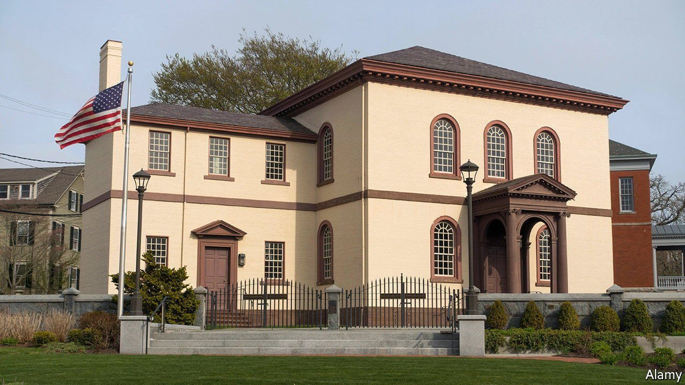

###### Another exodus?

# Rival Jewish congregations feud over America’s oldest synagogue 

##### A historic synagogue is at the centre of a power struggle 

 

> Feb 12th 2022 

TOURO SYNAGOGUE sits on a hill at an angle so that its ark faces Jerusalem, as tradition dictates. Stepping inside, one immediately senses its sacredness. But it is not just a shrine for Jews. It is also, as President John F. Kennedy once said, “one of the oldest symbols of liberty”. Touro sits at the intersection of religious freedom, American history (a trapdoor in the  bimah , or podium, may have been part of the Underground Railroad) and the history of Jews in America. For nearly a decade the oldest synagogue in the country has been at the centre of a dispute between its occupants, Congregation Jeshuat Israel (CJI), and its owners, Congregation Shearith Israel (CSI).

Jewish merchants came to Newport in around 1658 from Spain and Portugal, by way of the Caribbean and South America. They bought land for a cemetery two decades later. By 1763 the community was large enough to open a synagogue. In 1790 George Washington famously promised Touro’s members that religious “toleration” would give way to religious liberty.


By the 1820s most Jews had left Newport. Their scrolls and other sacred items were sent to New York’s CSI for safe keeping. But after the arrival of Jewish immigrants from eastern Europe, the synagogue reopened in 1883. The new members leased the synagogue from CSI for $1 a year and promised to maintain the building. The synagogue follows Sephardic traditions, as it did when it first opened, even though most members are Ashkenazi (with roots in Russia and eastern Europe).

The congregations clashed over CJI’s planned sale of rimonim (ceremonial bells to crown the Torah scroll) made by Myer Myers, a colonial silversmith, to a Boston museum for $7.4m. CJI hoped to create an endowment to help maintain the building. But CSI claimed that selling the artefact violated Jewish law as well as the lease agreement. CJI went to court seeking ownership of the building and its historical contents, including the bells. CSI then sued CJI, asserting it owned the synagogue and its artefacts. A federal court first gave control to Newport’s CJI, but an appeals court ruled in favour of the New York lot, saying religious groups’ contracts were enforceable just like any property contract.

The congregations also feuded over a proposed burial in the long-closed Touro cemetery. John Loeb, a businessman and former ambassador, has been a generous friend to the Newport congregation, which agreed he could be buried in the cemetery (the subject of a Longfellow poem). Last year a headstone was erected in memory of the still living Mr Loeb. Louis Solomon, CSI’s president, says “the whole problem is that they haven’t been transparent”. Mediators were unable to get the congregations to agree to a truce. CSI filed legal proceedings to evict CJI from Touro. Mr Solomon wrote to the members on February 3rd promising “no congregants are being evicted” and that the rabbi is welcome to stay.

Meir Soloveichik, CSI’s rabbi, sees his community as a steward of colonial Jewish artefacts. CSI wants to change the board overseeing activities at Touro. Louise Ellen Teitz, co-president of the Newport congregation, calls this a “hostile takeover”. She wants security for her small congregation in the form of a long-term lease. “This is the building and the place that we’ve worshipped for almost 140 years, which is longer than the original congregation.” ■

 A previous version of this article said that Congregation Shearith Israel sued Congregation Jeshuat Israel first. It is the other way around. Sorry.

For exclusive insight and reading recommendations from our correspondents in America, , our weekly newsletter.

