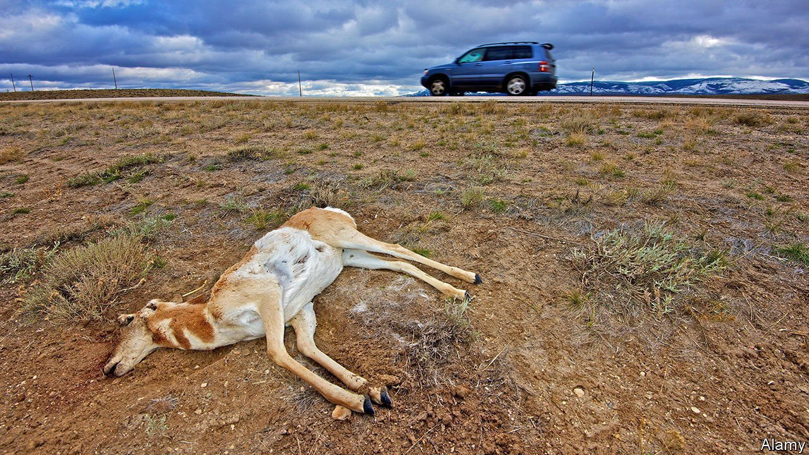

###### Street food

# Roadkill is now on the menu in Wyoming 

##### Crashes between cars and wildlife are too common. Salvaging roadkill can help 

 

> Feb 12th 2022 

A NEW DELICACY is available in Wyoming. It is fresh and cheap—but probably a little gamey. Last month it became legal for Wyomingites to collect roadkill that they accidentally hit themselves, or that they happened upon. Not all animals are fair game. Grizzly bears, some grey wolves and endangered species are off-limits.

Wyoming is not the only state that allows residents to collect roadkill. In fact, the Cowboy State is late to the party. Around 30 other states have some kind of roadkill-salvage programme, but the idea seems to have taken hold in the West only recently. Montana, Oregon, Idaho and Washington state have all jumped on the bandwagon since 2012. Officials are not sure how many Wyomingites will take part. But Montana’s Fish and Wildlife Commission issues roughly 1,000 roadkill-salvage permits each year.


Although some may cringe at the idea of hauling a deer carcass off the road and onto the dinner table (venison, anyone?), the law has several benefits. First, roadkill is a source of fresh meat for poor rural communities who may not otherwise be able to afford it. State officials in Alaska distribute roadkill to charities. PETA, a radical animal-rights group, argues that eating roadkill is healthier and more ethical than buying meat raised for slaughter. Second, allowing residents to harvest roadkill themselves may cut down on the time the creatures spend on the road. In large, sparsely populated states like Wyoming or Montana, it may take days for transport workers to collect a dead animal.

Lastly, roadkill-salvage programmes provide states with important data, says Fraser Shilling, director of the Road Ecology Centre at the University of California, Davis. Wyomingites must report the location of their find, showing officials where crashes with wildlife happen. Wyoming Game and Fish reckons there are 6,000 vehicle collisions with big game each year, accounting for about 15% of all crashes. Roadkill data may help the state figure out where to build highway overpasses or put up “wildlife crossing” warning signs.

Not everyone is licking their lips. Some opponents fret that people will end up eating rancid meat. “It’s really the burden of the person who chooses to collect roadkill if they eat it or not,” says Sara DiRienzo, of Wyoming Game and Fish. Others worry that the laws will embolden hunters to use the roadkill programme as cover for killing animals they should not.

After almost a decade of failing to pass the bill, Dan Zwonitzer, its frequent sponsor, credits his success to recent support from his right-wing colleagues in the legislature. State lawmakers from staunchly Republican rural Wyoming managed to turn the roadkill-harvest programme into a libertarian cause célèbre. “There were some complaints from people who had hit animals or had seen other people hit animals,” says Mr Zwonitzer, “and they were like, ‘Well, heck, it’s dead…I don’t want the government telling me I can’t take something I accidentally hit if the meat is good’.” He adds that he is not about to collect roadkill himself. But for those so inclined, there are cookbooks offering ways to serve up moose or mule deer. Bon appétit. ■

For exclusive insight and reading recommendations from our correspondents in America, , our weekly newsletter.

