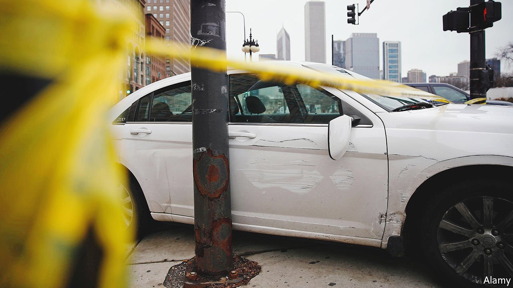

###### Carjacking

# What the carjacking wave says about American policing 

##### It is a fairly easy crime to get away with 

 

> Feb 12th 2022 

IN A CITY with an average of over two murders a day, the killing of eight-year-old Melissa Ortega in the Little Village neighbourhood of Chicago in late January still caused shock. The girl, who had come to Chicago from Mexico with her family less than a year before, was struck by bullets apparently intended for a young man emerging from a shop near where she and her mother were walking. The 16-year-old boy who has been charged with the murder, Emilio Corripio, was on probation, having pleaded guilty to two charges of carjacking and being in possession of a stolen vehicle.

The murder has stirred up a new wave of angst, not only about juvenile killings but also about carjackings. On February 7th Lori Lightfoot, Chicago’s mayor, declared that “there’s a very real and pervasive fear of carjacking across our city, our region and our state”, as she announced that the city’s carjacking task-force, launched in 2020, will expand its operation from 16 hours a day to 24. The spark, she suggested, was young people being out of school during the early stage of the pandemic, and drifting into crime out of boredom.


Most cities and the federal government do not count carjacking separately from other forms of car theft. But statistics gathered by police in Minneapolis, New Orleans, Oakland and Philadelphia, among others, show similar surges to that in Chicago. In Minneapolis, the crime increased more than six-fold from November 2019 to the following year, and has risen further since. The rise is worrying not only because carjacking is a horrifying crime itself; it may also be contributing to rising murder rates, since many stolen cars go on to be used in drive-by shootings. One in 66 teenagers arrested for carjacking is murdered in a typical year, according to the University of Chicago’s Crime Lab.

Ms Lightfoot is not alone in suggesting that closed schools may explain part of it. Jacob Frey, the mayor of Minneapolis, made the same argument in January. “With covid, a lot of the different things that had kept [young people] engaged, for lack of a better word, were shut down,” says Tom Dart, the sheriff of Cook County, which contains Chicago and most of its suburbs. Data gathered by the Crime Lab showed that arrests of juveniles for the crime more than doubled from 2019 to 2020, whereas the number of arrests of adults increased by only 7%. Many cars are abandoned fairly quickly after being stolen, suggesting that joyriding may be a motive.

Grand theft thought oh

But other factors are also at play, says Stephanie Kollmann, of Northwestern University. The availability of guns has increased since the pandemic began. Second-hand cars have gone up in price. Other sorts of robberies have become trickier, as people have stayed at home. And although a large number of arrests involve children, that does not necessarily mean that children are the main criminals. According to Mr Dart, gangs involved in carjacking often use children as getaway drivers, whereas older criminals tend to do the actual assault and use the car later in a crime or try to sell it. “The bad guys know that the penalties for juveniles are pretty close to non-existent,” he says, and so they use children to do the riskiest parts of the job.

It is, statistically speaking, a fairly easy crime to get away with. Only around 11% of carjackings in Chicago resulted in an arrest in 2020, according to the Crime Lab—far lower than the figures for robbery and burglary. Carjacking is hard to police, says Mr Dart, for various reasons. The victims rarely know the criminals. Now that wearing face-masks is normal, carjackers do not always stand out until the last minute. And proving that someone driving a stolen car was involved in stealing it is difficult. Most of the arrests come from forensic examination of recovered vehicles, rather than from catching criminals in the act.

Mr Dart hopes that technology will help change that. Most cars sold since 2015 come with GPS tracking systems, but it is often difficult for police officers to get access to these quickly. Firms insist on the victims making the request themselves and, even then, some are extremely reluctant to hand out the data.

In January Mr Dart wrote to car manufacturers demanding a more efficient system for police to request tracking information. “We know that these car manufacturers have tools in their box that they could utilise that can really, really help this,” he says. The advent of car immobilisers led to a huge decline in car theft a generation ago, he points out. Already, over the past year, greater use of tracking devices has led to an increase in the proportion of cars that are recovered, and a fall in the time to do that. Cars on average are now recovered in under 100 hours, compared with more than 200 in 2020.

Yet better technology will probably not be enough on its own to bring the current wave to an end. Some carjackers are so confident that they will not get caught that they post bragging videos of themselves driving stolen vehicles to their Snapchat pages. To be able to prevent carjackings, the police need to know in advance who is most likely to be involved and how to check on them.

Unfortunately, American police forces tend to be more reactive than proactive. Just 45% of homicides are cleared up in Chicago, a figure not much worse than in many big American cities. And murders usually involve people who know each other. In London 98% of murders were solved in 2021, and unsurprisingly, there were far fewer of them. A serious effort to counter carjacking, in Chicago and elsewhere, will require deep community policing and intelligence-gathering. ■

For exclusive insight and reading recommendations from our correspondents in America, , our weekly newsletter.

