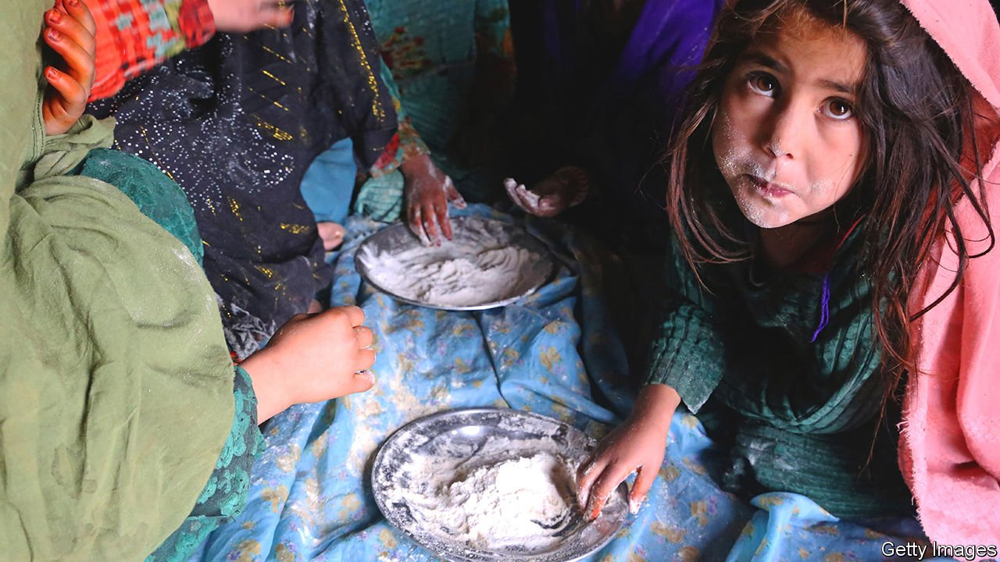
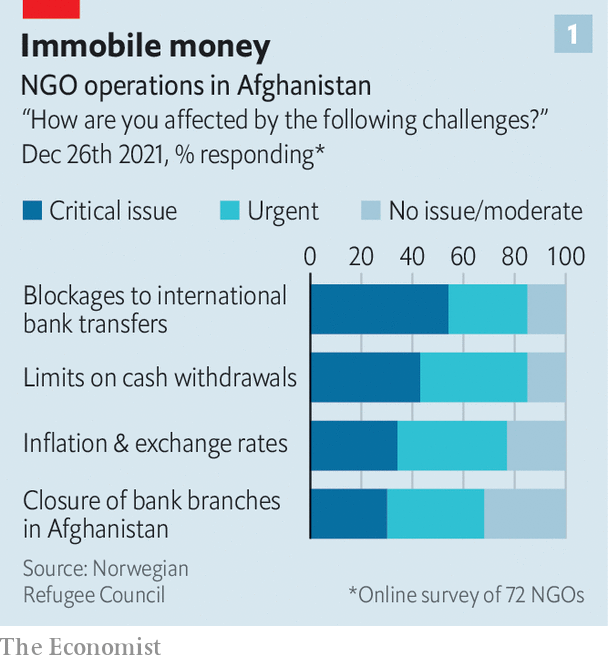
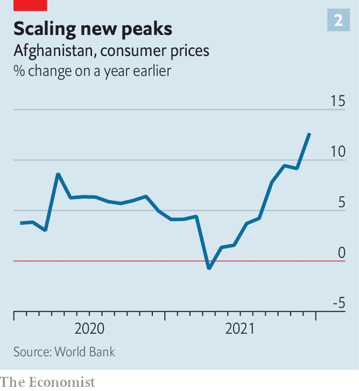

###### Aid limits

# A cash crunch is crippling Afghanistan 

##### Humanitarian aid is no substitute for a functioning economy 

 

> Feb 19th 2022 

THE International Rescue Committee, a big NGO, helps displaced Afghans with cash, clean water and tents to shelter in. It provides sanitation. It funds dozens of clinics. It helps people find jobs and arranges training for development projects. All this aid does not come cheap. Vicki Aken, who runs its operation in Afghanistan, reckons she needs between $1m and $2m every week to keep it going. But ever since the Taliban took over the country in August, foreign banks have refused to transfer money to Kabul, the country’s capital, fearing hefty fines, or worse, for breaching sanctions. Meanwhile, the Taliban, worried about running out of currency, have capped withdrawals from NGOs’ local accounts at $25,000 per month.

Instead, Ms Aken’s organisation is relying on the hawala network, an informal money-transfer system that originated in India. Used for centuries by pilgrims, migrants and merchants all around the Islamic world, it operates on the basis of trust: an agent in one country receives cash and a counterpart in another disburses it, even though no money actually crosses borders. Many other NGOs are doing the same. The surge in demand for hawala services has pushed fees up from around 2% early last year to between 4% and 13% today.


The withdrawal of American forces from Afghanistan six months ago was followed by another calamity: the withdrawal of American and other Western funding from Afghanistan, and the freezing of the government’s overseas assets. Until August foreign aid covered 75% of the state budget. Afghan banks could transact with those abroad. Businesses could obtain credit. All that stopped. The country’s financial system ground to a halt.

That has caused a liquidity crisis that is crippling the Afghan economy. The state has no money to pay for essential imports such as food, medicine or electricity. A private sector that grew over the past two decades is crumbling without cash to pay salaries or suppliers. Many factories in Kandahar have shut because of electricity shortages. A businessman in Kabul says he does not have the foreign currency for materials for his plastics firm. He has slashed his workers’ pay from around 450 afghanis ($4.90) to 300 afghanis per day.

At least 500,000 people have lost their jobs since August, roughly 5% of the workforce. Teachers and doctors have gone months without pay. Withdrawals from individual accounts have been capped at 30,000 afghanis per week. The money that remains locked up is losing value fast. The afghani has dropped by around 12% against the dollar since mid-August. Qamarulbanat Quraishy, a 24-year-old in Kabul with seven sisters and five brothers, says she is trying to cut costs by skipping meals. “I don’t think we can continue in this situation,” she says. She has run out of savings.

The country is facing an escalating humanitarian catastrophe. Aid agencies warn, loudly and repeatedly, of unimaginable misery. Almost the entire population could be living in abject poverty—under $1.90 a day—by the middle of the year. Some 60% of the country is at risk of acute hunger. Already some families have been reduced to eating dry flour. People are selling body parts and children.

The rest of the world has not ignored the crisis. Donors committed $1.8bn in humanitarian assistance in 2021. Last month the UN launched its largest-ever appeal for a single country, hoping to raise another $4.4bn. Getting donors to stump up the cash is not the problem. The difficulty is getting the money into the country, as Ms Aken’s example illustrates.

 


America and the UN have clarified that sanctions don’t apply to humanitarian work. But risk-averse banks remain unwilling to transfer funds into Afghanistan. Some 85% of NGOs say withdrawal limits and the inability to transfer money are seriously hampering their work, according to a recent survey by the Norwegian Refugee Council, another big NGO (see chart). The council itself has resorted to buying basic items, including blankets and food, in Pakistan and bringing them over the border by road. Even the UN is struggling. It has taken to stuffing bank notes in planes and flying them in. That is expensive, and moving so much cash around the country is risky.

On February 11th President Joe Biden crushed hopes of a recovery. Of the $9bn-odd of Afghanistan’s central-bank reserves held abroad, $7bn is in America (the rest is mostly in Europe). The White House said it would unfreeze that money, using half of it for aid and setting aside the other half pending judgment in cases involving the families of victims of the September 11th attacks, who are suing for compensation.

The decision has elicited criticism from all corners of Afghan society. The Taliban government has darkly threatened to “reconsider its policy” towards America if the executive order is not rescinded. Ordinary Afghans have taken to the streets, making the reasonable point that the Afghan people had nothing to do with the 9/11 attackers, most of whom were Saudi (although the terrorist group behind the attacks was sheltered by the Taliban last time they were in power). Shah Mehrabi, a member of the Afghan central bank’s board, describes the move as flagrantly unjust. Graeme Smith of the International Crisis Group, a think-tank, says the decision is akin to King Solomon literally cutting the baby in half.

 


Whatever the Biden administration does with the money—apart from keeping it frozen or returning it to Afghanistan—it is in effect seizing Afghanistan’s central-bank assets. Without funds to back its currency or repay commercial depositors of dollars, the bank and the banking system will lose what shreds of credibility were left. That could cause the sort of hyper inflation Germany saw in the 1920s and Zimbabwe in 2008-09, fears Khalid Payenda, Afghanistan’s finance minister until August. Inflation is soaring (see chart).

That will only exacerbate the country’s already grim situation. Humanitarian assistance is an expensive way to save people from indigence and, in any case, no amount of aid can replace a functioning economy. At some point global interest in Afghanistan will fade. “These aid levels aren’t going to stay so high forever,” says Ms Aken. What then? ■

