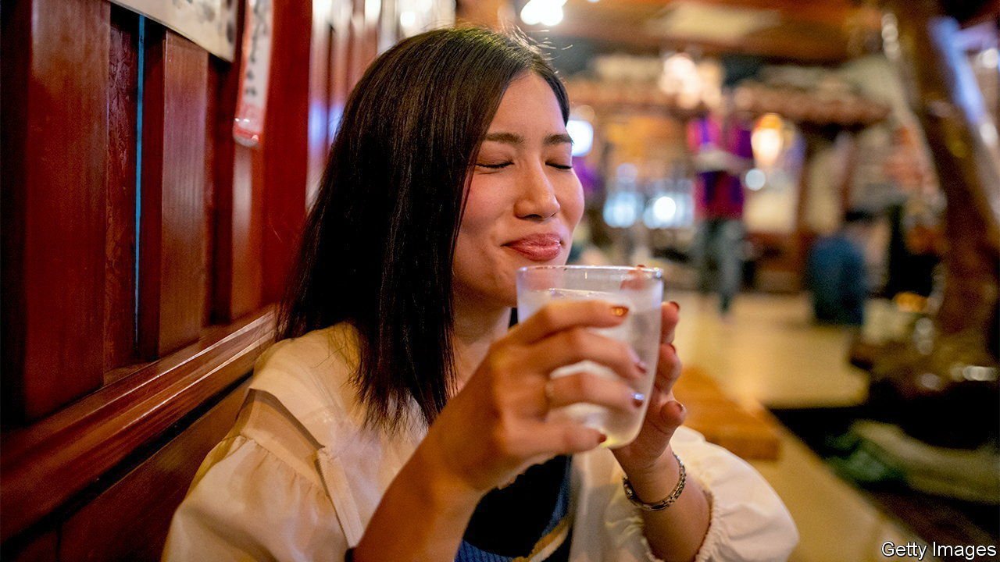

###### Awamori? Go on then

# Distillers in Okinawa are trying to reinvent the local firewater 

##### Weaker drinks may make for stronger sales 

 

> Feb 17th 2022 

THE EYES water as your correspondent enters Sakimoto Distillery. Large vats of rice bubble over open flames, filling the air with boozy fumes. The solution will be distilled into awamori, a liquor native to the islands of Okinawa, the most southern and western of Japan’s prefectures. Sakimoto Toshio, the distillery’s boss, pours out a sample of the stuff, which with an alcohol content of 60% is about half as strong again as a typical spirit. Your correspondent’s throat burns as it goes down.

Awamori was invented in Okinawa in the 15th century. It uses long-grain rice and, to stimulate fermentation, black koji mould, distinguishing it from shochu, a better-known Japanese spirit invented in nearby Kyushu, which uses white koji and short-grain rice or other starches. The punch it packs reflects local conditions: its strength helped preserve the drink on the hot, humid islands in the days before refrigeration. The throat-burning 60% variant emerged on Yonaguni, Japan’s westernmost island, where Sakimoto is based. Known as hanasake, it is said to have started life as a disinfectant for medical use on ships, and later came to play a role in rituals such as funerals. When locals actually drink it, they usually cut it with ice and water and have it with roast pork.


Awamori has lately fallen on hard times. Two-thirds of the 45 members of Okinawa Awamori Distillers Association were in the red in 2020. Production volumes that year dipped by nearly 20%, the fourth straight year of decline. Younger Japanese are drinking less booze, and they prefer softer stuff or mixed drinks.

That has forced the industry to experiment. Japan’s external trade organisation has sought to market shochuand awamorias premium drinks for discerning foreign tipplers, but few are biting (or sipping). Distillers have released flavoured awamori drinks, organised awamori festivals and enlisted influencers to appeal to younger consumers—with mixed results. Nakamura Shunki, a researcher at Okinawa’s manufacturing promotion office, reckons it helps if the drink looks Instagrammable.

Mr Sakimoto has got the idea. He launched a collaboration with Rebun, Japan’s northernmost island, which supplies mineral water to make a “limited edition” awamori. The “PR effect” of bringing together Japan’s extreme north and west has helped sales, he says. Wisely, he also watered it down: its alcohol content is a more palatable 43%.

