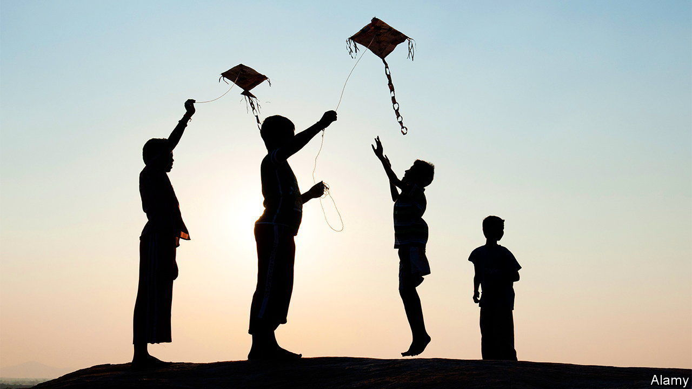
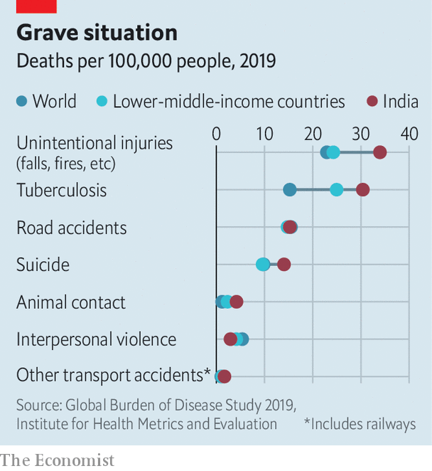

###### A million ways to die in the east

# India’s Omicron wave recedes, but not the risk of premature death 

##### Indians die of preventable causes in alarming numbers 

 

> Feb 17th 2022 

LISTEN CAREFULLY and a gentle sound can be heard across India: a collective sigh of relief. The third wave of covid-19 to hit the country is ebbing fast. On February 15th Mumbai, where cases rose first, reported zero deaths for the first time in over a month. Unlike the second wave last year, which was fuelled by the Delta variant and killed over 2m people in just a few weeks, according to The Economist’s estimates, the Omicron outbreak passed without enormous loss of life. Official numbers suggest its peak daily toll, in early February, was only a quarter of last year’s.

Indians, like people around the world, are allowing themselves the hope that the worst of the pandemic may be over. Yet there remain a million more mundane ways to die in India, few of which attract the attention or resources of an exciting new disease.


Consider the fate of Pratikkumar Dubey of Ahmedabad, a big city in the prosperous state of Gujarat. On January 14th, a day celebrated as Makar Sankranti, a kite-flying festival marking the sun’s passage into Capricorn, the 28-year-old was riding his motorbike down a busy street when the string from a fallen kite caught him in the throat. Known as manja, the twine is dusted with powdered glass for a fighting edge. Effective at cutting rival kite strings, it can also slash skin, which is why several states ban its use. Mr Dubey was one of four people killed in motorbike-manja encounters in India that day.

Or take the innocent chore of commuting. Before the pandemic, an average of nine people died every day on the suburban rail network in Mumbai, India’s commercial capital. In normal times the heaving system moves 7.5m passengers daily. By way of comparison, the London Underground moves 5m commuters a day, of whom only two per year die in accidents.

 


On India’s railways overall, the annual death toll of around 25,000 is about 25 times that of China, a country with a similar population and a busier rail network. Travelling by road is even riskier. Although the government puts the death count from traffic accidents at around 150,000 in a normal year, independent estimates suggest the true figure is closer to 220,000, three times the number in China. About a third of victims are motorbike riders.

India also offers more exotic exits. Tiger, elephant, lion and leopard attacks claim perhaps 500 human lives in a bad year. Less advertised are the immensely greater risks of dying from rabies or from snake bites. Of the 300 snake species found in India, the 60 that are highly venomous do away with nearly 60,000 people every year, the highest per-capita rate in the world. The weather can be deadly, too. Lightning strikes kill over 140 times as many people in India—2,876 in 2019—as they do in America. Many victims are farmers wading in rice paddies. But last July a single bolt killed 16 youths taking selfies atop the ramparts of a fort.

India also suffers some deadly social ills. The overall murder rate is lower than America’s. But an average of 92 Indians are killed each year after being accused of witchcraft. The country’s suicide rate, at 12.9 per 100,000 people in 2019, is lower than average for countries in its income group (14.1) but high for its region (10.2) and above the global average (9), according to the World Health Organisation.

What is striking is that the rate for women (11.1) is among the highest in the world, reflecting a disturbing level of domestic misery. So-called “dowry deaths” remain common: women are killed or driven to suicide by in-laws who think the dowry they brought when they married was too small. The shocking number of Indians who die every year from falling into sewers—142 in 2020—has a telltale twist, too. Most victims are men at the bottom of the caste hierarchy, condemned to the drudgery of cleaning other people’s waste.

As everywhere, the vast majority of the 10m Indians who die each year succumb to more ordinary ailments, the leading one being plain old heart trouble. Life expectancy in India today, at 69.6 years, is just three years short of the world average. But it is worth considering what that number might be if India’s government were to pay as much attention to addressing, say, tuberculosis, which has killed some 2m people in the past five years, or air pollution, whose five-year death toll is estimated to exceed 8m, as it has to covid. ■

Dig deeper

All our stories relating to the pandemic can be found on our . You can also find trackers showing ,  and the virus’s spread across .

