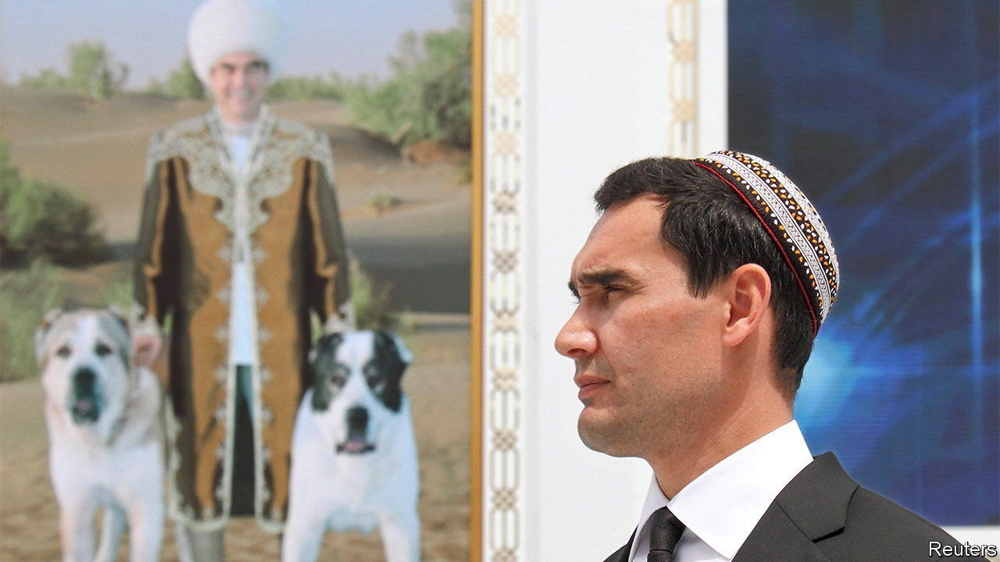

###### Cut-rate khanate

# Turkmenistan’s despot finds a worthy successor: his son 

##### A horse-obsessed personality cult becomes a dynasty 

 

> Feb 17th 2022 

IT IS TRUE that he is two years past his country’s official retirement age. But at 64 Gurbanguly Berdymukhamedov, Turkmenistan’s president, is still a spring chicken by the standards of his contemporaries. Islam Karimov ruled Uzbekistan until his death at 78 in 2016. Nursultan Nazarbayev, the former president of Kazakhstan, was the same age before he made way, in 2019, for a younger leader. Vladimir Putin, Russia’s 69-year-old president, shows no sign of slowing down.

So it was a shock when, in a speech on February 11th marking his 15th anniversary as president, Mr Berdymukhamedov announced the “difficult decision” he had made. It was time, he said, to give “young leaders” a chance, as long as they “have been brought up in a spiritual environment and in accordance with the demanding needs of modern times”. A snap election will be held on March 12th.


The crushing of anything resembling an opposition, the suppression of even mild dissent, and the fact that the president won the last poll with 98% of the vote suggest that such youths might be hard to find. But the ruling party did not have far to search. It immediately nominated as its candidate Serdar Berdymukhamedov, the president’s 40-year-old son. The stage has been set for Central Asia’s first hereditary succession since the era of the Khans.

The younger Berdymukhamedov (pictured), an engineer by training, has long been groomed for the role. After stints in the foreign ministry and as a diplomat, he became a member of the rubber-stamp parliament in 2016. He rose swiftly to become a regional governor, before being propelled into the cabinet as minister for industry in 2020. Last year he was elevated to the position of deputy prime minister. Yet it was not until September that he gained a crucial qualification by turning 40, the minimum age for a president.

Serdar will have a full inbox once he takes over. The economy is in grim shape. Food shortages plague the country. The market value of the currency is six times lower than the official rate. And it is over-reliant on gas for exports and China for trade. The heir apparent may struggle in less obvious ways, too. His father is a flamboyant leader, known for macho stunts that prop up his cult of personality. By contrast, Serdar is a wooden speaker who dislikes being in the public eye.

Helpfully, the outgoing president is not planning to retreat to a life of fishing and horse-breeding. He will retain the chairmanship of the upper house of parliament. Yet the reason for his retirement remains unclear; the only explanation offered was that he had lived longer than the Prophet Muhammad (Turkmenistan is mostly Muslim). The true cause is probably ailing health: a long disappearance from public view in 2019 sparked speculation that he was being treated for a serious condition. The idea may be to allow Serdar time to consolidate power while his father is still around to protect him. In any case, the president has made it clear that the change represents continuity rather than reform. Or as he put it in his farewell speech, quoting a Turkmen proverb, “The traditions of the fathers are priceless, and whoever loves them loves the motherland!” ■

