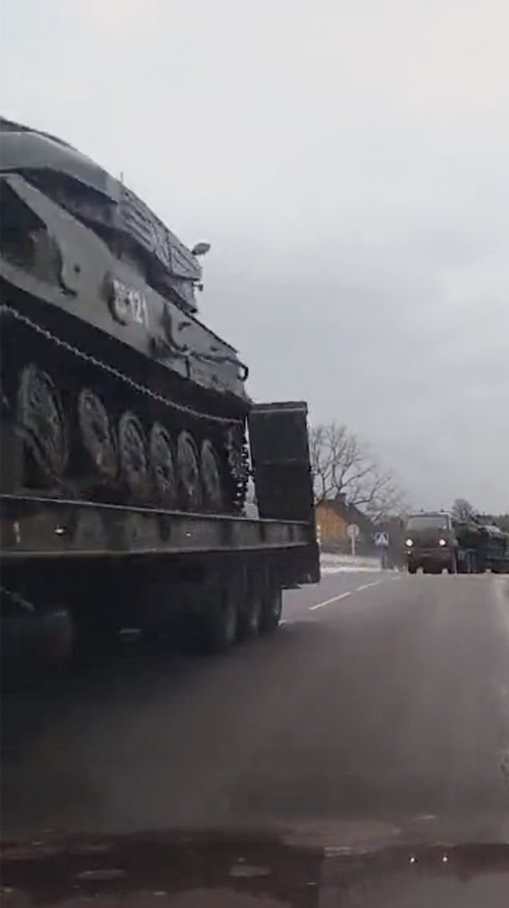
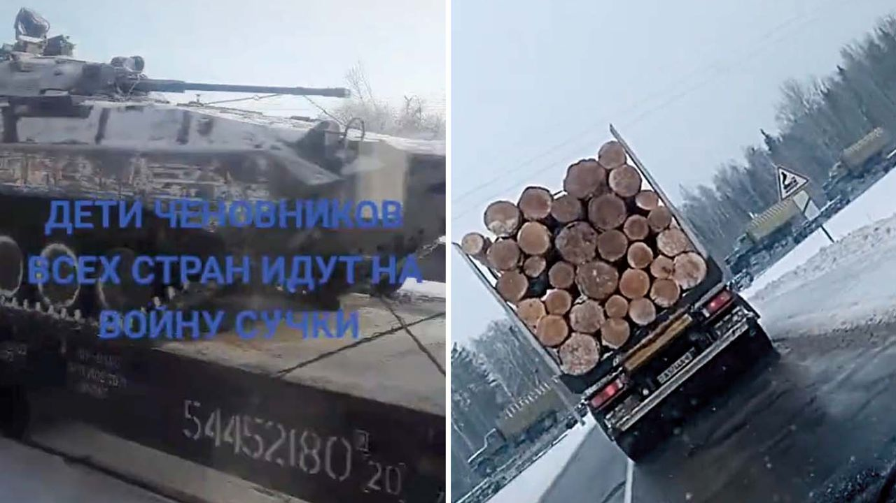
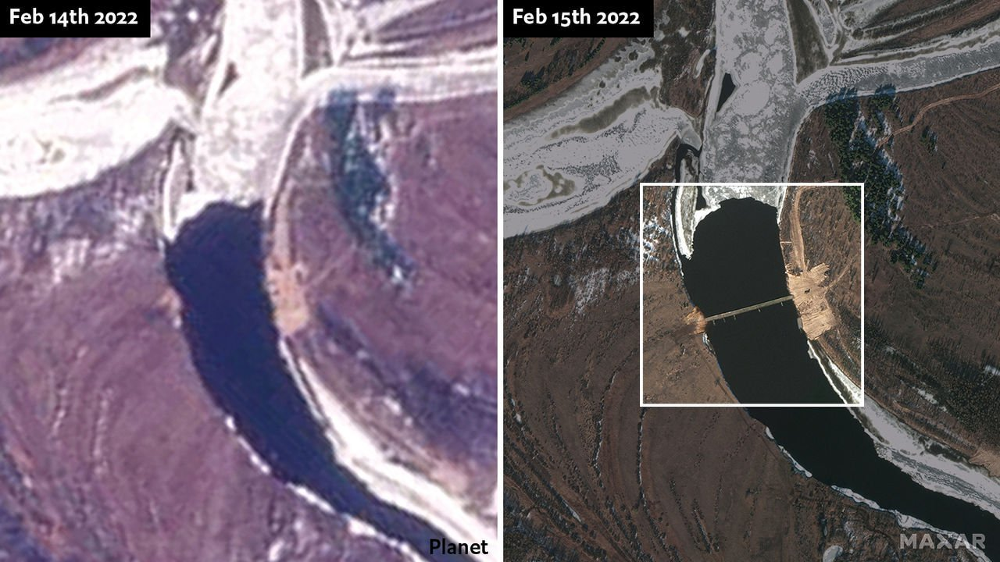
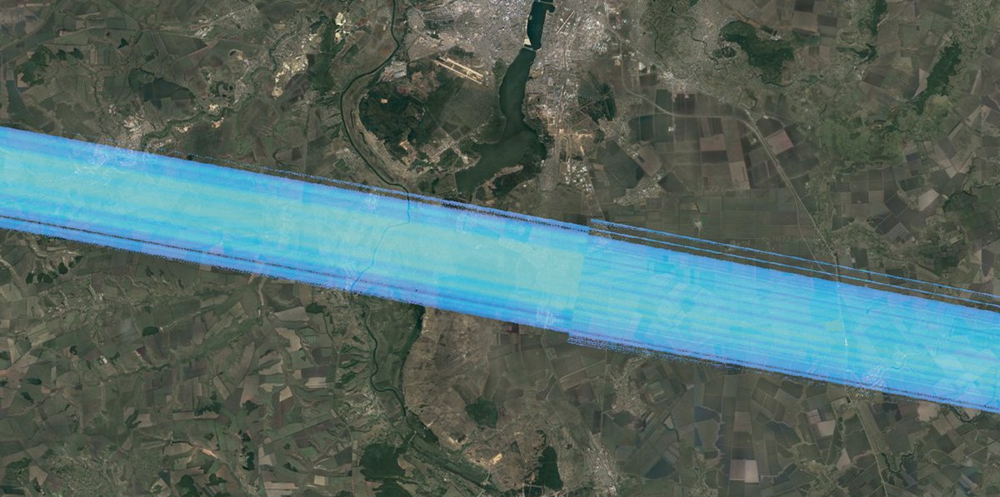

###### OSINT

# A new era of transparent warfare beckons 

##### Russia’s manoeuvres are a coming-out party for open-source intelligence 

> Feb 19th 2022 


ON FEBRUARY 4TH one of the four satellites operated by Maxar, a company based in Colorado which photographs more than 3m square kilometres of the Earth every day, took pictures of a Russian military camp in Rechitsa, Belarus. Rows of military vehicles were laid out neatly over a thick carpet of snow less than 50km from the border with Ukraine. On February 14th a sister satellite took another picture of Rechitsa. The snow had gone; so, too, had most of the vehicles (see above).

Since the start of the cold war, America and its NATO allies have scrutinised Russian military deployments and movements using expensive and often exotic means of keeping tabs on other people’s territory such as spy satellites and surveillance flights as well as human agents—means that nobody else could muster.


But civilian observers increasingly have their own tools. Journalists, academics, think-tankers, activists and amateur enthusiasts have access to a range of open-source intelligence, or OSINT, capabilities that have expanded hugely over the past decade, and that let them reach their own conclusions about what the world’s armed forces are doing. Images and other data from commercial satellites, videos posted on social media, ship- and aircraft-tracking websites and other publicly available, if sometimes arcane, sources can reveal goings on in inaccessible places like Rechitsa in unprecedented detail, and sometimes nearly in real time. Russia’s military build-up on the borders of Ukraine is a coming-out party for the possibilities OSINT now offers.

As Stephen Wood of Maxar notes, this is partly because the satellites in the private sector have improved “dramatically”. His firm’s satellites can take photographs that are sharp enough to make out objects as small as 30cm. The number of providers has jumped sharply, too. (The Economist has relied on both Maxar and Planet, a company in California,  over recent weeks.) But what has been especially powerful in this crisis is the combination of timely, accurate satellite pictures with the social-media posts that are pouring out of Russia.

 


Consider the case of the missing equipment at Rechitsa. The satellite imagery does not show where the weapons and vehicles have gone, only that they are missing. But there are other clues. Russian drivers are avid users of dashboard-mounted cameras. In recent weeks, these have captured reams of footage of tanks and other equipment on the move by road and rail. Much of that is uploaded to TikTok, a Chinese app on which users can post short video clips (images of tanks being sped past the Russian borderlands are often set to thumping music).

One such video, uploaded on February 13th, shows a convoy of armoured vehicles, including a Shilka anti-aircraft system, on a road that runs south-east from the town of Mazyr to Naroulia. Two days later an open-source analyst who tweets under the name @danspiun, noticed that an emblem on the Shilka, though indistinct, suggested the vehicles belonged to Russia’s 5th Tank Brigade—one of the units previously seen arriving at Rechitsa. A glance at a map shows that Mazyr and Naroulia lie farther south, closer to the Ukrainian border. In other words, at least some of the units that left Rechitsa appear to have been moved not back to their bases, but into still more threatening positions. This fits with the statement by Ben Wallace, Britain’s defence secretary, that Russian forces are moving from “holding areas” to “front-footed deployed areas”.


Yelnya, a base 125km from Russia’s border with Belarus, is normally home to the 144th Guards Motorised Rifle Division. In November last year it began to fill up with equipment from the 41st Combined Arms Army, a grouping that typically includes several divisions and is based more than 3,000km away in Siberia. By late January Yelnya was not only crammed with armour, but occupied by troops: satellite pictures showed that heating had melted the snow on roofs, and booted feet had turned the surrounding ground to muddy slush.

Then some moved on. At first, this was difficult to see because Yelyna, like much of Europe at this time of year, is often covered in clouds. But neither clouds nor darkness are a problem for synthetic-aperture radar (SAR) satellites that illuminate what they are looking at with radio waves.

 


The Sentinel-1 SAR satellites operated by the European Space Agency (ESA) take pictures of every spot on the continent every six days. The results are grainy and lower in resolution than pictures made using visible wavelengths by the likes of Maxar and Planet. But some man-made structures reflect radar waves particularly well. Images taken by Sentinel-1 from January 23rd to February 11th showed a hubbub of purple blobs—the colourised radar returns from equipment—fading away as Yelnya emptied out (see below left).

Where did the 41st Combined Arms Army’s stuff go? Again, probably towards the Ukrainian border. One clip on TikTok showed armoured vehicles at a station in Bryansk, around 35km from Ukraine. Cross-referencing an eight-figure number emblazoned on the train with a website that tracks railway movements showed that the train originated in—you guessed it—Yelnya.

In recent days, the Russian army has moved equipment around at a frenzied pace, possibly to give the appearance of a withdrawal—something which the defence ministry said was under way on February 14th. Michael Kofman of CNA, an American think-tank, calls it a “deployment shell game” in which units are shuffled around confusingly “without altering the overall picture”. Some troops are leaving Crimea, he says, but more are arriving in other places along the border.

 


And they are doing the sort of thing that armies do before wars. On February 14th another analyst scanning low-resolution satellite data noticed a change on the banks of the Pripyat river in Belarus, less than 6km from the Ukrainian border. It was, he surmised, preparatory work for a bridge. Pictures released on February 15th showed that a crossing had appeared. (This was not a complete shock—an obscure press release on February 11th had announced that a bridge was going up over the Pripyat, though it did not say when or where.) Then on February 16th SAR images indicated the bridge had been taken down. Perhaps it was a drill.

 


Good OSINT requires constant searching for these sorts of hints—and knowing where to look. One answer is a practice known as “tipping and cueing”: clues gleaned from one sensor, often a lower-resolution one, are used to guide a sharper one that can see what’s what. The tipping is often done with low-resolution satellite pictures—cheaper and more plentiful than the high-resolution stuff—but there are more ingenious ways to do it, too.

In recent years, analysts have noticed that some sorts of powerful military radar discombobulate the Sentinel-1 satellites’ radar, producing a distinctive interference pattern in their returns. Ollie Ballinger, a lecturer at University College London, built a tool called the Radar Interference Tracker which allows anyone to search for such interference. In September the tool detected interference likely coming from Pogonovo, a key Russian base close to the Ukrainian border, a discovery which suggested the possibility of air-defence systems there (see below).

 


For all the insight that it yields, OSINT is not a panacea. Satellites may be providing unprecedented volumes of data, but they can only image so much in a day—and high-resolution data are still scarce. Intelligence analysts have long known that overhead pictures, while very useful, never show everything. They also know that the amount that they do show can be bewitching—beguilingly concrete in a way that can mislead the inexperienced.

Modern armed forces appreciate the role that open sources have begun to play in crises, and can use this to their advantage. An army might, for instance, deliberately show a convoy of tanks headed in the opposite direction to their intended destination, in the knowledge that the ensuing TikTok footage will be dissected by researchers. The location signals broadcast by ships can be spoofed, placing them miles from their true locations.

“People seem to think that OSINT will present them with the full scale of the build-up,” writes Konrad Muzyka of Rochan Consulting, whose research has formed the basis for The Economist’s maps of Russian deployments. “I am under no illusion. We are only seeing a fraction of what is really going on.” Even so, to see that fraction, and to see it by means which do not rely on the word and whim of governments, is a radical departure from the crises of the past. If war comes to Europe, it will be transparent as never before. ■


All of our recent coverage of the Ukraine crisis can be found . 


